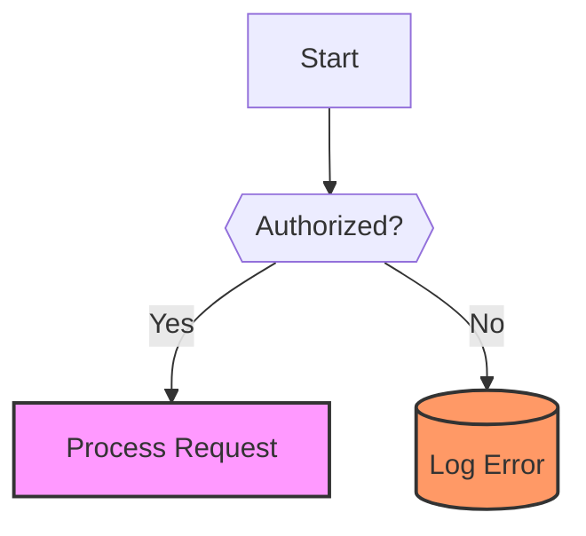
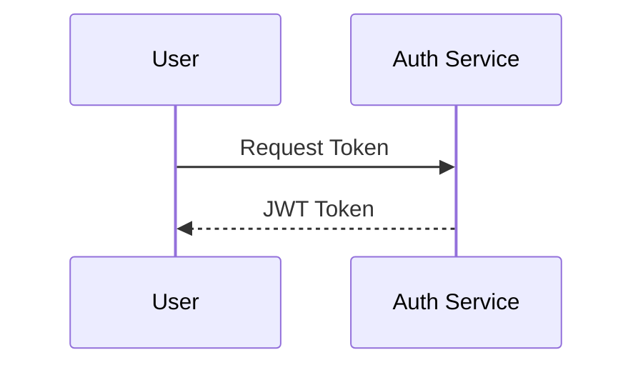
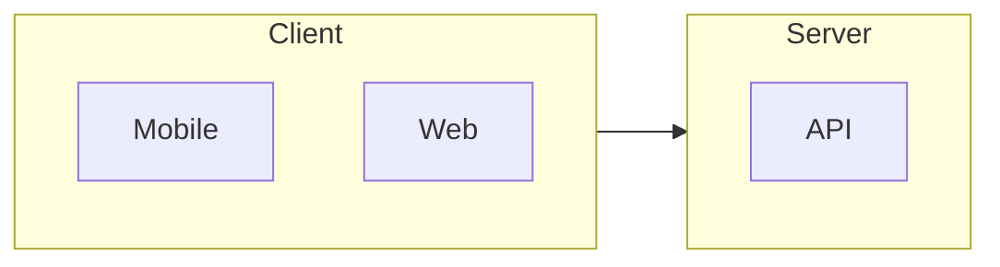

# Mermaid Syntax & Best Practices

Use this reference as a template and guide for generating high-quality, robust Mermaid diagrams.

## Core Rules for AI Generation
- **Syntax Robustness:** Always wrap labels in double quotes if they contain special characters (parentheses, brackets, etc.) to prevent renderer crashes.
  - *Correct:* `A["User (Admin)"]`
  - *Incorrect:* `A[User (Admin)]`
- **Reserved Words:** Avoid using reserved words (e.g., `end`, `graph`, `subgraph`) as node IDs.
- **Accessibility:** Always include `accTitle` and `accDescr` for screen readers.

## Diagram Selection Guide
| Use Case | Recommended Type | Layout |
| :--- | :--- | :--- |
| **Logic/Algorithms** | `flowchart` | `TD` (Top-Down) |
| **Data Pipelines/Process** | `flowchart` | `LR` (Left-Right) |
| **API/Interactions** | `sequenceDiagram` | N/A |
| **Database Schema** | `erDiagram` | N/A |
| **State Machines** | `stateDiagram-v2` | N/A |

## Flowchart (Best Practices)
Use `classDef` for consistent styling instead of inline styles.

## Sequence Diagram
Use `participant` aliases for cleaner code.

## Styling and Theming
Prefer logical grouping using `subgraph` to manage complexity.

