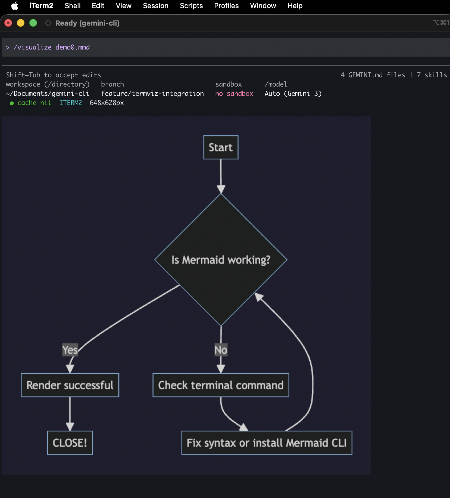
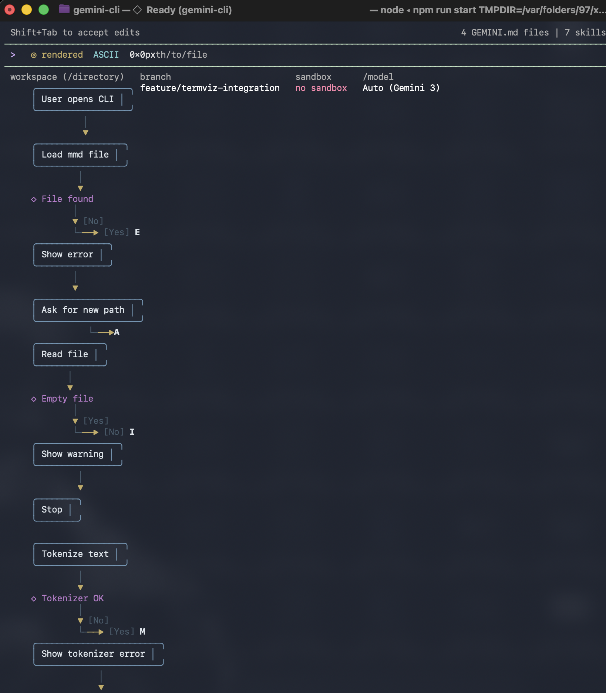
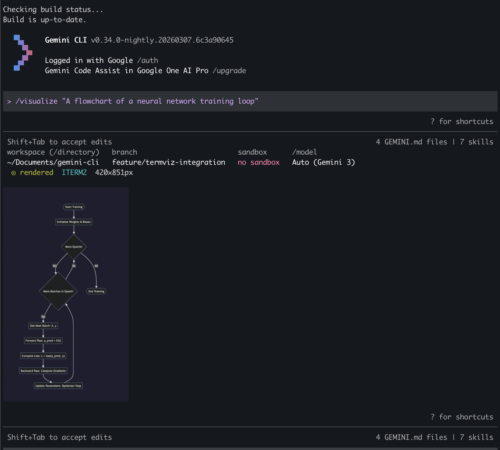
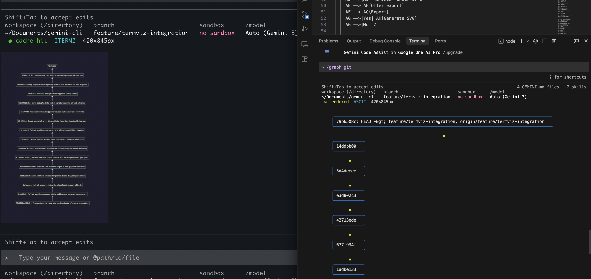
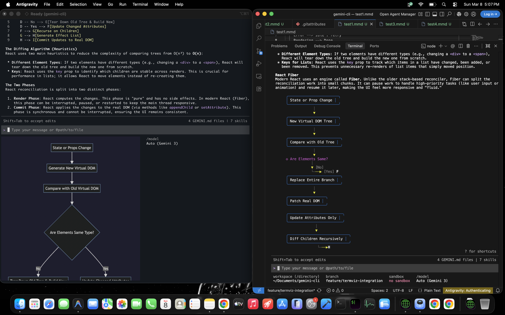
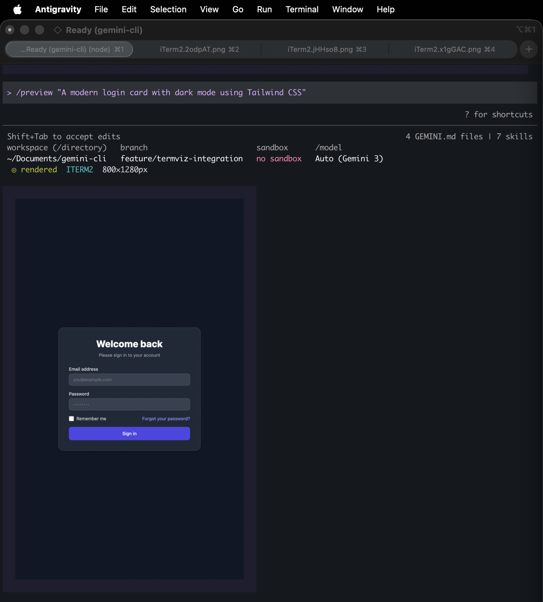

# TermViz Branch Demo Guide (Draft PoC)

This branch demonstrates terminal-native visualization integrated directly into
the Gemini CLI codebase (not a standalone app).

Branch: `feature/termviz-integration`

## Demo Option A: Clone This Branch Directly

```bash
git clone --single-branch --branch feature/termviz-integration https://github.com/Aaxhirrr/gemini-cli.git
cd gemini-cli
npm install
npm run build
npm run start
```

## Demo Option B: Checkout Draft PR

Using GitHub CLI:

```bash
gh pr checkout <PR_NUMBER>
npm install
npm run build
npm run start
```

Without GitHub CLI:

```bash
git fetch origin pull/<PR_NUMBER>/head:demo-pr
git checkout demo-pr
npm install
npm run build
npm run start
```

## Description

This PoC targets the "text-only" constraint of terminal workflows by enabling
Gemini CLI to render visual artifacts inline. It supports Mermaid-based diagram
generation and rendering, git history visualizations, explain+visual flows, and
live HTML preview rendering from prompts/files. For graphics terminals (iTerm2,
Kitty, Sixel-capable terminals), images render inline; for unsupported
terminals, ASCII fallback is used.

## Expected Outcomes

1. Inline rendering of architecture/flow/sequence diagrams generated from
   codebase context or natural-language prompts.
2. Live preview rendering of generated UI components (HTML/CSS) in terminal
   image form.
3. Support for terminal image protocols (iTerm2, Kitty, Sixel when available).
4. Intelligent ASCII fallback for non-graphics terminals.
5. `/visualize` command for prompt/file driven on-demand diagram generation.
6. `/explain --visualize` integration for explanation + diagram generation.
7. `/graph git` visualization for history/branch timelines.
8. Caching layer to avoid re-rendering repeated artifacts.

## Why This Matters

1. Paradigm shift:
Terminal coding assistants can produce rich visual feedback without forcing a
browser/IDE context switch.
2. Developer feedback loop:
Architecture, flow, and UI artifacts become immediately inspectable in the
terminal.
3. Demo and collaboration:
Visual terminal output is easier to share and discuss than text-only
explanations.

## Prerequisites

1. Node.js 20+.
2. Gemini authentication configured (`/auth` in CLI or API key env setup).
3. iTerm2/Kitty for graphics path validation.
4. Any basic terminal for fallback path validation.

## Full Demo Runbook

Run these in order after CLI startup:

1. `/visualize demos/mermaid/nn-train-loop.mmd`
2. `/visualize demos/mermaid/jwt-auth-sequence.mmd`
3. `/graph git`
4. `/explain --visualize "How does React reconciliation work?"`
5. `/preview demos/html/login-card.html`
6. Repeat step 1 to verify cache hit behavior.

## Screenshot Walkthrough

| Step | Screenshot |
| --- | --- |
| 1. Visualize Mermaid from file |  |
| 2. ASCII fallback in basic terminal |  |
| 3. Prompt-based visualize flow |  |
| 4. Git graph rendering |  |
| 5. Explain with visualization |  |
| 6. Preview command visualization |  |

## Demo Video

1. Google Drive video link:
   [TermViz PoC Demo Video](https://docs.google.com/videos/d/1jXJkx9n7V8yOyfcV54AHZuWUJIG9NEY2DxYkFKk3dSI/edit?scene=id.p#scene=id.p)
2. Raw video URL file:
   [`demos/video_demo_link.txt`](./demos/video_demo_link.txt)

## Known Limits

1. Terminal image placement/scroll behavior can vary by terminal protocol
implementation.
2. Prompt-generated Mermaid may occasionally require syntax repair.
3. ASCII fallback favors readability over pixel-level fidelity.

## Useful Links

1. Branch tree:
   `https://github.com/Aaxhirrr/gemini-cli/tree/feature/termviz-integration`
2. This demo doc on branch:
   `https://github.com/Aaxhirrr/gemini-cli/blob/feature/termviz-integration/DEMO.md`
3. Compare view:
   `https://github.com/google-gemini/gemini-cli/compare/main...Aaxhirrr:feature/termviz-integration`
4. Draft PR:
   `https://github.com/google-gemini/gemini-cli/pull/<PR_NUMBER>`
