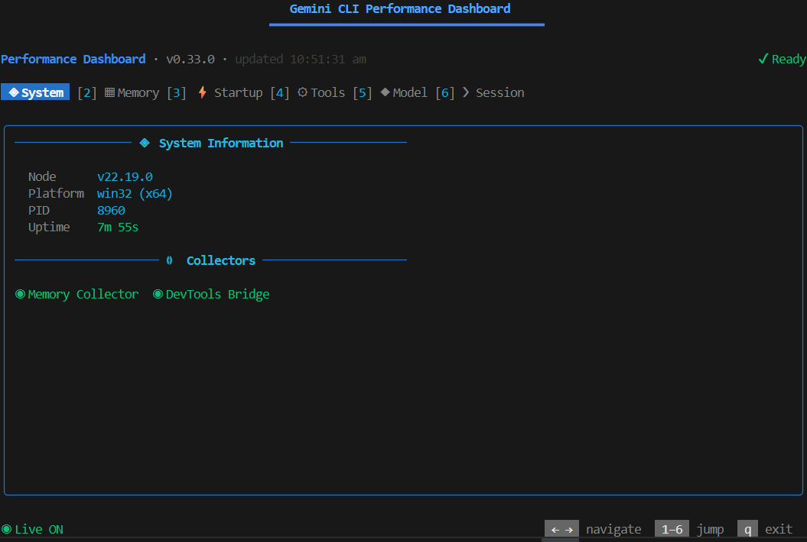
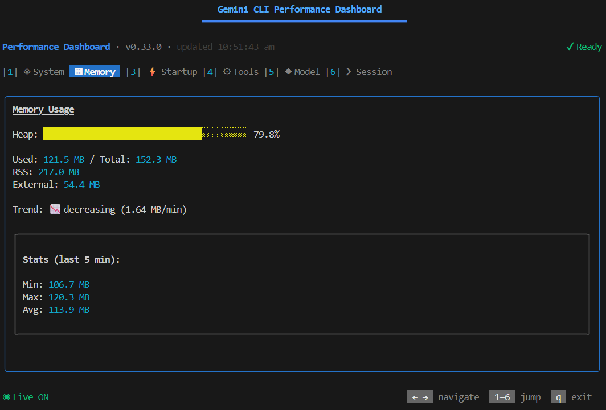
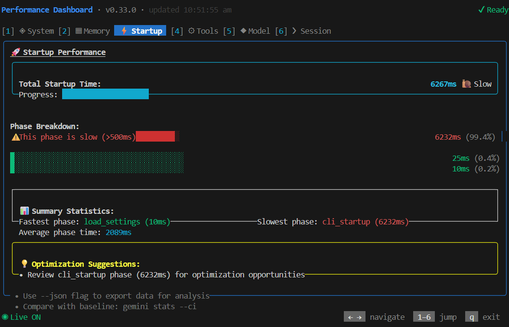
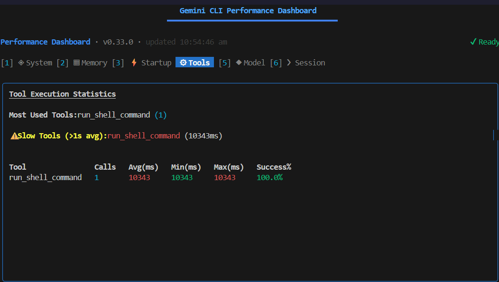
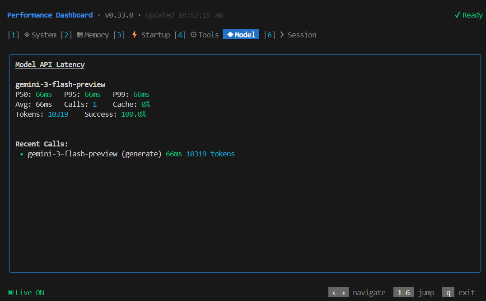
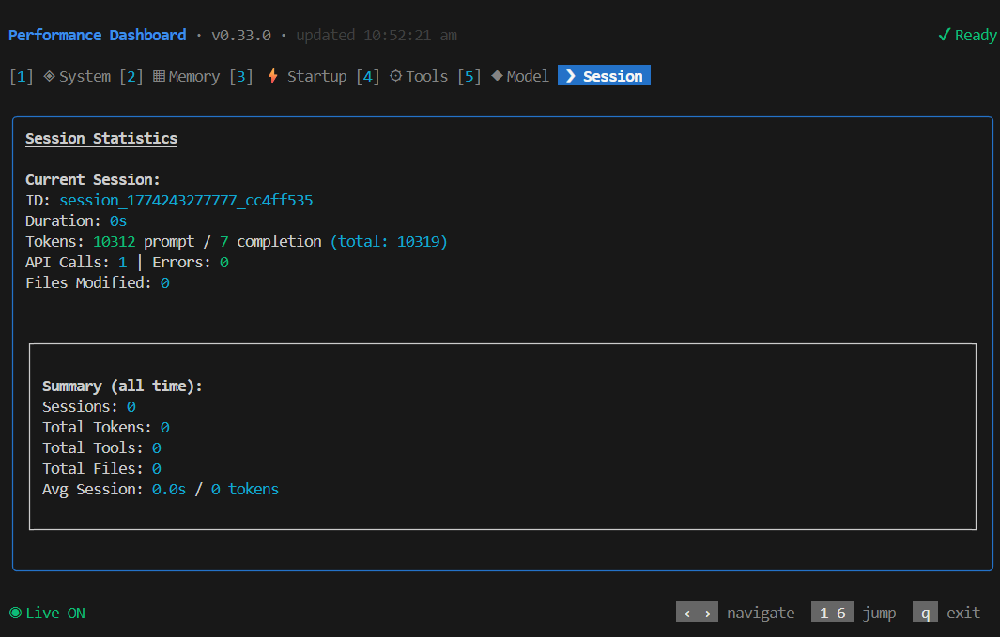

# Gemini CLI Performance Dashboard (GSoC 2026)

## 🎯 Description

The **Gemini CLI Performance Dashboard** is an in-CLI observability tool
designed to provide developers and open-source contributors with deep visibility
into the Gemini CLI's runtime behavior.

**What problem it solves:** As the Gemini CLI grows in complexity, tracking
performance regressions, memory leaks, and model latencies becomes challenging.
This dashboard acts as a native profiling tool directly within the terminal,
bridging the gap between raw metric logs and actionable insights without needing
external GUI applications.

**Why it is useful for the Organization:**

- Helps maintainers quickly spot performance regressions during CI/CD.
- Identifies heavy/slow tools in the ecosystem.
- Helps contributors optimize startup times and track memory consumption
  locally.
- Provides immediate session statistics (tokens, tool call frequency).

## 📸 Demo




 


## ✨ Features

- **In-CLI Interface**: A native, highly responsive TUI dashboard built with
  React and Ink.
- **System Metrics**: Node process stats, platform info, PID, and uptime
  tracking.
- **Memory Profiling**: Real-time memory usage monitoring (Heap, RSS) to catch
  memory spikes.
- **Startup Timeline**: Breakdown of boot sequence (e.g., config loading, module
  resolution) to optimize CLI responsiveness.
- **Tool Statistics**: Execution timing, success rates, and frequency tracking
  for registered LLM tools.
- **Model Latency Tracking**: Tracks API response times to detect model
  degradation.
- **Session Stats**: Consolidates tokens used, files modified, and duration for
  the current run.

## 🏗️ Architecture

The dashboard is composed of:

- **Metric Collector Layer**: Hooks into Gemini CLI lifecycle events to gather
  raw performance data.
- **Aggregator Module**: Processes, normalizes, and stores runtime data (tokens,
  memory, latency).
- **TUI Renderer**: Built with React + Ink for real-time, terminal-native
  visualization.
- **Event Bus**: Streams metrics to UI components efficiently and precisely.

## 🛠️ Tech Stack

- **Node.js**: Powers the core CLI environment.
- **React (Ink)**: Enables rapid, component-based terminal UI development.
- **TypeScript**: Provides strict type safety across collectors and UI
  components.
- **Gemini CLI Internal APIs**: Used for hooking into tool usage and model
  interactions.

## 📁 Project Structure

```text
src/
  ├── ui/
  │   ├── components/      # UI components (Ink charts, tables)
  │   ├── hooks/           # CLI lifecycle hooks and external state management
  │   └── dashboard.tsx    # Main entry point for the TUI
  ├── metrics/             # Data collectors and aggregators (Startup, Memory, Tools)
  ├── utils/               # CLI and formatting helpers
```

## 🚀 Installation Steps

1. Clone the repository and navigate to the CLI package:
   ```bash
   git clone https://github.com/google/gemini-cli.git
   cd gemini-cli
   ```
2. Install dependencies:
   ```bash
   npm install
   ```
3. Build the CLI and dashboard components:
   ```bash
   npm run build
   ```

## 💻 Usage

The performance dashboard can be launched during any active Gemini CLI session
using internal commands, or run in a standalone observation mode.

**To run the tool:**

```bash
gemini /perf
```

_Alternatively, use `/stats` for a static summary._

**Example output/interaction:**

- You will see a multi-tabbed interface.
- Use arrow keys (`←`, `→`) or numbers (`1`-`6`) to navigate between:
  - `[1] System`
  - `[2] Memory`
  - `[3] Startup`
  - `[4] Tools`
  - `[5] Model`
  - `[6] Session`
- Press `q` or `Esc` to safely exit the dashboard and return to the chat
  session.

## 🤝 Contribution

This project is currently in the prototype phase for **GSoC 2026**. Future work
includes:

- **Persistent logging**: Storing metrics across multiple CLI runs.
- **Exporting metrics**: Outputting traces as JSON/CSV or OpenTelemetry formats.
- **Alert system**: Automatically warning developers of regressions.
- **Plugin support**: Allowing custom metrics from the community.

## ⚠️ Limitations

- Currently tracks only in-session metrics (no persistent storage between runs).
- Limited support for profiling external/third-party plugins.

---

_Built by Kumaran N as part of the Google Summer of Code (GSoC) prototype
phase._
