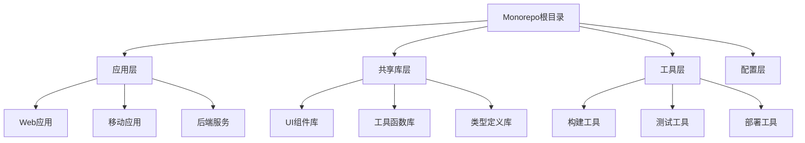

# Monorepo 结构化分析报告

## 概述

**Monorepo**（Monolithic Repository）是一种代码管理方法，它将多个项目的所有代码、组件、库和内部依赖项存储在单个集中式仓库中，通常涉及多种编程语言和应用程序类型。

**参考来源**: [SonarSource - What is a Monorepo and Why Are They Useful?](https://www.sonarsource.com/learn/monorepo/)

---

## 第一层：Monorepo基础概念

### 1.1 定义与特征

#### 核心定义
Monorepo是"monolithic repository"的缩写，是一种将多个项目的所有代码存储在单个仓库中的代码管理方法。

#### 主要特征
- **集中存储**: 所有代码在单一仓库中
- **多项目支持**: 包含多个相关项目
- **共享依赖**: 统一的依赖管理
- **跨语言支持**: 支持多种编程语言
- **统一工具链**: 共享构建和部署工具

### 1.2 与传统多仓库的对比

#### 传统多仓库（Multi-repo）
```
project-a/
├── src/
├── package.json
└── README.md

project-b/
├── src/
├── package.json
└── README.md

project-c/
├── src/
├── package.json
└── README.md
```

#### Monorepo结构
```
monorepo/
├── packages/
│   ├── project-a/
│   │   ├── src/
│   │   └── package.json
│   ├── project-b/
│   │   ├── src/
│   │   └── package.json
│   └── project-c/
│       ├── src/
│       └── package.json
├── shared/
│   ├── utils/
│   └── components/
├── tools/
├── docs/
└── package.json
```

---

## 第二层：Monorepo的重要性与优势

### 2.1 简化代码管理

#### 统一版本控制
- **单一仓库**: 所有代码在一个Git仓库中
- **统一分支策略**: 一致的代码分支管理
- **简化变更跟踪**: 跨项目的变更更容易追踪
- **减少重复**: 避免代码重复和版本不一致

#### 一致性保证
- **统一标准**: 所有项目遵循相同的编码标准
- **共享配置**: 统一的ESLint、Prettier等配置
- **版本同步**: 依赖版本的一致性管理

### 2.2 增强协作能力

#### 团队协作优势
- **知识共享**: 开发者可以轻松查看和学习其他项目的代码
- **跨项目贡献**: 开发者可以为多个项目贡献代码
- **统一代码审查**: 集中的代码审查流程
- **减少沟通成本**: 减少跨仓库协调的复杂性

#### 协作工具集成
- **统一CI/CD**: 所有项目共享构建和部署流程
- **集中文档**: 统一的文档管理和知识库
- **共享工具**: 统一的开发工具和脚本

### 2.3 流线化工具链

#### 工具统一性
- **单一工具集**: 不需要为每个仓库配置不同的工具
- **简化维护**: 工具配置和维护成本降低
- **自动化程度高**: 更容易实现自动化流程

#### 构建和测试优化
- **增量构建**: 只构建变更的项目
- **并行测试**: 多个项目可以并行测试
- **缓存优化**: 共享构建缓存和依赖缓存

### 2.4 代码共享和重用

#### 共享组件库
- **公共组件**: 可重用的UI组件和业务组件
- **工具函数**: 共享的工具函数和实用程序
- **类型定义**: 统一的TypeScript类型定义
- **配置模板**: 共享的配置文件模板

#### 重用机制
- **内部包**: 项目间可以作为内部包相互依赖
- **版本管理**: 统一的版本管理和发布流程
- **API一致性**: 统一的API设计和规范

---

## 第三层：Monorepo最佳实践

### 3.1 一致的文件夹结构

#### 推荐目录结构
```
monorepo/
├── packages/           # 项目包
│   ├── app-1/         # 应用1
│   ├── app-2/         # 应用2
│   └── shared/        # 共享库
├── tools/             # 构建工具
├── docs/              # 文档
├── scripts/           # 脚本
├── configs/           # 配置文件
└── tests/             # 测试
```

#### 组织原则
- **功能分离**: 按功能模块组织代码
- **层次清晰**: 明确的分层结构
- **易于导航**: 直观的目录命名
- **可扩展性**: 支持未来扩展

### 3.2 模块化架构

#### 模块设计原则
- **单一职责**: 每个模块只负责一个功能
- **高内聚**: 模块内部功能紧密相关
- **低耦合**: 模块间依赖最小化
- **可重用**: 模块可以在多个项目中使用

#### 模块类型
```typescript
// 共享组件模块
interface SharedComponent {
  name: string;
  props: ComponentProps;
  dependencies: string[];
}

// 工具函数模块
interface UtilityModule {
  functions: Function[];
  tests: Test[];
  documentation: string;
}

// 配置模块
interface ConfigModule {
  environment: string;
  settings: object;
  validation: Schema;
}
```

### 3.3 版本管理和依赖管理

#### 版本策略
- **统一版本**: 所有包使用相同的版本号
- **语义化版本**: 遵循SemVer规范
- **变更日志**: 维护详细的变更记录
- **向后兼容**: 确保API的向后兼容性

#### 依赖管理工具
```json
{
  "工具选择": {
    "npm workspaces": "Node.js项目",
    "Yarn workspaces": "Yarn包管理器",
    "pnpm workspaces": "pnpm包管理器",
    "Lerna": "Monorepo管理工具",
    "Nx": "构建系统",
    "Rush": "Microsoft的Monorepo工具"
  }
}
```

### 3.4 代码审查和质量保证

#### 代码审查流程
1. **自动化检查**: ESLint、Prettier、TypeScript检查
2. **人工审查**: 代码审查和反馈
3. **测试验证**: 单元测试和集成测试
4. **质量门禁**: 质量指标检查

#### 质量保证工具
- **静态分析**: SonarQube、ESLint
- **测试框架**: Jest、Vitest、Cypress
- **类型检查**: TypeScript、Flow
- **代码覆盖率**: 测试覆盖率监控

---

## 第四层：Monorepo创建指南

### 4.1 规划和设计

#### 项目评估
- **项目规模**: 评估项目数量和复杂度
- **团队结构**: 考虑团队组织方式
- **技术栈**: 评估技术栈的多样性
- **依赖关系**: 分析项目间的依赖关系

#### 架构设计


### 4.2 工具选择和配置

#### 包管理器选择
```bash
# npm workspaces配置
{
  "workspaces": [
    "packages/*",
    "apps/*"
  ]
}

# Yarn workspaces配置
{
  "workspaces": {
    "packages": [
      "packages/*",
      "apps/*"
    ]
  }
}
```

#### 构建工具配置
```javascript
// esbuild配置示例
const esbuild = require('esbuild');

esbuild.build({
  entryPoints: ['packages/*/src/index.ts'],
  bundle: true,
  outdir: 'dist',
  format: 'esm',
  platform: 'node',
  external: ['react', 'react-dom']
});
```

### 4.3 工作流程建立

#### 开发流程
1. **环境设置**: 统一的开发环境配置
2. **依赖安装**: 一次性安装所有依赖
3. **开发模式**: 支持热重载和增量构建
4. **测试运行**: 运行相关项目的测试

#### 发布流程
1. **版本更新**: 统一更新所有包版本
2. **构建验证**: 确保所有项目构建成功
3. **测试执行**: 运行完整的测试套件
4. **发布部署**: 发布到包管理器和部署环境

---

## 第五层：Monorepo工具生态

### 5.1 核心工具

#### 包管理工具
- **npm workspaces**: Node.js官方支持
- **Yarn workspaces**: Facebook开发的包管理器
- **pnpm workspaces**: 高效的包管理器
- **Lerna**: 传统的Monorepo管理工具

#### 构建工具
- **Nx**: 现代化的构建系统
- **Bazel**: Google的构建工具
- **Buck**: Facebook的构建工具
- **esbuild**: 快速的JavaScript打包工具

### 5.2 质量保证工具

#### 代码质量工具
- **SonarQube**: 全面的代码质量分析
- **ESLint**: JavaScript代码检查
- **Prettier**: 代码格式化
- **TypeScript**: 类型检查

#### 测试工具
- **Jest**: 单元测试框架
- **Vitest**: 现代化的测试框架
- **Cypress**: 端到端测试
- **Playwright**: 浏览器自动化测试

### 5.3 协作工具

#### 版本控制
- **Git**: 分布式版本控制系统
- **GitHub**: 代码托管和协作平台
- **GitLab**: 完整的DevOps平台
- **Bitbucket**: Atlassian的代码托管平台

#### CI/CD工具
- **GitHub Actions**: GitHub的CI/CD平台
- **GitLab CI**: GitLab的CI/CD系统
- **Jenkins**: 开源的CI/CD服务器
- **CircleCI**: 云原生CI/CD平台

---

## 第六层：Monorepo挑战与解决方案

### 6.1 常见挑战

#### 性能挑战
- **构建时间**: 大型Monorepo构建时间较长
- **克隆时间**: 仓库克隆和同步时间长
- **IDE性能**: IDE处理大型代码库的性能问题
- **内存使用**: 高内存占用

#### 解决方案
```javascript
// 增量构建配置
const buildConfig = {
  incremental: true,
  cache: true,
  parallel: true,
  selective: true
};

// 代码分割策略
const codeSplitting = {
  chunks: 'all',
  cacheGroups: {
    vendor: {
      test: /[\\/]node_modules[\\/]/,
      name: 'vendors',
      chunks: 'all'
    }
  }
};
```

### 6.2 团队协作挑战

#### 权限管理
- **细粒度权限**: 不同团队访问不同项目
- **代码审查**: 跨项目的代码审查流程
- **冲突解决**: 合并冲突的处理策略

#### 解决方案
```yaml
# CODEOWNERS配置示例
packages/app-1/ @team-a
packages/app-2/ @team-b
packages/shared/ @team-a @team-b
tools/ @devops-team
```

### 6.3 维护挑战

#### 技术债务
- **依赖管理**: 复杂依赖关系的管理
- **文档维护**: 大量文档的维护成本
- **测试覆盖**: 确保足够的测试覆盖率

#### 解决方案
- **自动化工具**: 使用自动化工具减少手动工作
- **定期重构**: 定期进行代码重构
- **文档自动化**: 自动生成和更新文档

---

## 第七层：Monorepo最佳实践案例

### 7.1 Google的Monorepo实践

#### 规模与特点
- **代码量**: 超过20亿行代码
- **工具**: 自研的Piper工具
- **优势**: 高效的代码共享和协作

#### 关键实践
- **自定义工具**: 开发专门的Monorepo管理工具
- **代码审查**: 严格的代码审查流程
- **自动化测试**: 全面的自动化测试覆盖
- **性能优化**: 持续的性能优化

### 7.2 Meta的Monorepo实践

#### 规模与特点
- **代码量**: 超过1亿行代码
- **工具**: 自研的Buck构建工具
- **优势**: 快速的构建和部署

#### 关键实践
- **构建优化**: 高效的构建缓存机制
- **CI/CD集成**: 与CI/CD流程深度集成
- **代码质量**: 严格的代码质量标准
- **团队协作**: 高效的团队协作流程

### 7.3 开源项目案例

#### 知名开源Monorepo
- **React**: Facebook的React生态系统
- **Vue**: Vue.js生态系统
- **Angular**: Google的Angular框架
- **TypeScript**: Microsoft的TypeScript项目

#### 共同特点
- **清晰的架构**: 明确的模块划分
- **完善的工具链**: 现代化的开发工具
- **活跃的社区**: 活跃的开发者社区
- **持续改进**: 持续的架构优化

---

## 第八层：Monorepo与代码质量

### 8.1 SonarQube与Monorepo集成

#### SonarQube Server
- **集中式分析**: 对整个Monorepo进行统一分析
- **项目隔离**: 支持项目级别的质量分析
- **CI/CD集成**: 与CI/CD流程无缝集成
- **自定义规则**: 支持自定义代码质量规则

#### SonarQube Cloud
- **云原生**: 基于云的代码质量分析
- **自动更新**: 自动获取最新功能
- **DevOps集成**: 与主流DevOps工具集成
- **实时分析**: 实时代码质量反馈

#### SonarQube for IDE
- **实时反馈**: 开发时实时代码质量检查
- **多语言支持**: 支持多种编程语言
- **IDE集成**: 与主流IDE深度集成
- **团队协作**: 促进团队代码质量提升

### 8.2 代码质量策略

#### 质量门禁
```yaml
# 质量门禁配置
quality_gates:
  coverage: 80%
  duplications: 3%
  maintainability: A
  reliability: A
  security: A
```

#### 质量监控
- **实时监控**: 实时监控代码质量指标
- **趋势分析**: 分析代码质量趋势
- **告警机制**: 质量下降时及时告警
- **报告生成**: 定期生成质量报告

---

## 第九层：Monorepo发展趋势

### 9.1 技术趋势

#### 构建工具演进
- **增量构建**: 更智能的增量构建策略
- **分布式构建**: 支持分布式构建
- **缓存优化**: 更高效的缓存机制
- **并行处理**: 更好的并行处理能力

#### 开发工具改进
- **IDE支持**: 更好的IDE支持
- **调试工具**: 更强大的调试工具
- **性能分析**: 更精确的性能分析
- **可视化工具**: 更好的可视化界面

### 9.2 最佳实践演进

#### 架构模式
- **微前端**: 与微前端架构结合
- **服务网格**: 与服务网格技术结合
- **云原生**: 与云原生技术结合
- **AI辅助**: 集成AI辅助开发工具

#### 团队协作
- **远程协作**: 更好的远程协作支持
- **异步开发**: 支持异步开发模式
- **知识管理**: 更好的知识管理工具
- **学习平台**: 集成学习平台

---

## 第十层：Monorepo实施指南

### 10.1 迁移策略

#### 渐进式迁移
1. **评估阶段**: 评估现有项目结构
2. **规划阶段**: 制定详细的迁移计划
3. **试点阶段**: 选择小项目进行试点
4. **扩展阶段**: 逐步扩展到其他项目
5. **优化阶段**: 持续优化和改进

#### 迁移工具
```bash
# 迁移脚本示例
#!/bin/bash
# 创建Monorepo结构
mkdir -p packages/{app1,app2,shared}
mkdir -p tools configs docs

# 移动现有项目
mv ../project1 packages/app1/
mv ../project2 packages/app2/

# 创建根package.json
cat > package.json << EOF
{
  "name": "my-monorepo",
  "workspaces": ["packages/*"],
  "scripts": {
    "build": "lerna run build",
    "test": "lerna run test",
    "lint": "lerna run lint"
  }
}
EOF
```

### 10.2 成功因素

#### 技术因素
- **合适的工具**: 选择适合的工具链
- **良好的架构**: 设计良好的项目架构
- **自动化程度**: 高程度的自动化
- **性能优化**: 持续的性能优化

#### 组织因素
- **团队支持**: 获得团队的支持和认可
- **培训教育**: 提供必要的培训和教育
- **文化适应**: 适应新的开发文化
- **持续改进**: 持续改进和优化

---

## 总结

Monorepo作为一种现代化的代码管理方法，为大型项目和团队提供了显著的优势。通过合理的规划和实施，Monorepo可以显著提升开发效率、代码质量和团队协作能力。

### 核心价值
1. **简化管理**: 统一的代码管理和版本控制
2. **提升协作**: 更好的团队协作和知识共享
3. **优化工具链**: 统一的工具链和自动化流程
4. **提高质量**: 更好的代码质量和一致性

### 成功关键
- **合理规划**: 根据项目特点合理规划架构
- **工具选择**: 选择适合的工具链
- **团队培训**: 提供必要的培训和支持
- **持续优化**: 持续改进和优化

### 未来展望
随着开发工具和技术的不断发展，Monorepo将继续演进，为开发者提供更好的开发体验和更高的生产力。

---

*本报告基于SonarSource的权威资料编写，提供了Monorepo的全面分析。*

**参考来源**: [SonarSource - What is a Monorepo and Why Are They Useful?](https://www.sonarsource.com/learn/monorepo/)  
**编写时间**: 2024年12月  
**报告状态**: 完整分析报告 