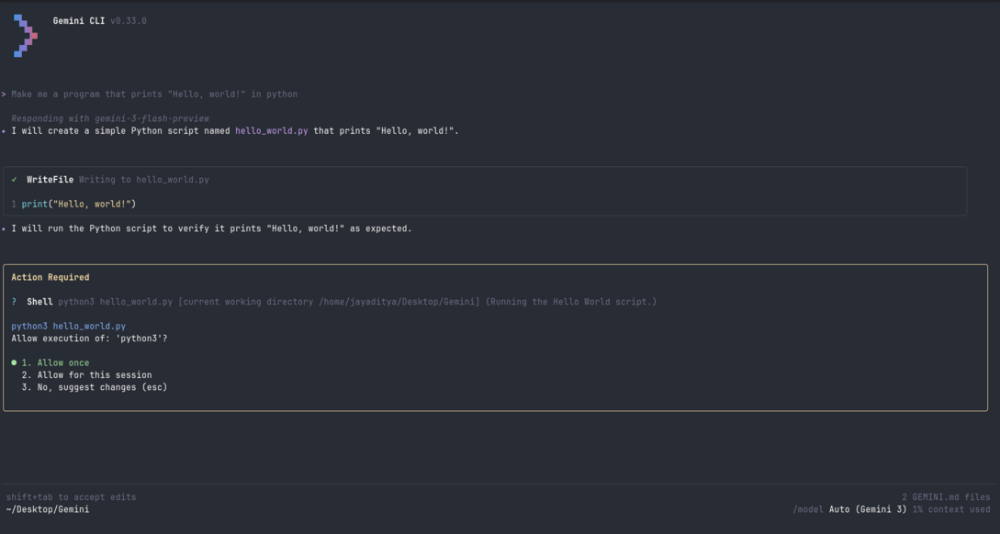

# Gemini CLI

[](https://github.com/google-gemini/gemini-cli/actions/workflows/ci.yml)



This repository contains the Gemini CLI, a command-line AI workflow tool that connects to your
tools, understands your code and accelerates your workflows.

With the Gemini CLI you can:

- Query and edit large codebases in and beyond Gemini's 1M token context window.
- Generate new apps from PDFs or sketches, using Gemini's multimodal capabilities.
- Automate operational tasks, like querying pull requests or handling complex rebases.
- Use tools and MCP servers to connect new capabilities, including [media generation with Imagen,
  Veo or Lyria](https://github.com/GoogleCloudPlatform/vertex-ai-creative-studio/tree/main/experiments/mcp-genmedia)
- Ground your queries with the [Google Search](https://ai.google.dev/gemini-api/docs/grounding)
  tool, built in to Gemini.

## Quickstart

1. **Prerequisites:** Ensure you have [Node.js version 18](https://nodejs.org/en/download) or higher installed.
2. **Run the CLI:**

   To run the CLI without installing, use `npx`:
   ```bash
   npx https://github.com/google-gemini/gemini-cli
   ```

   Alternatively, you can install it globally:
   ```bash
   npm install -g @google/gemini-cli
   gemini
   ```
3. **Authentication:**
   - The first time you run the CLI, you will be prompted to authenticate with your Google account.
   - Alternatively, you can create an API key in [Google AI Studio](https://aistudio.google.com/apikey) and set it as an environment variable:
     ```bash
     export GEMINI_API_KEY="YOUR_API_KEY"
     ```
   - For more authentication options, see the [authentication guide](./docs/cli/authentication.md).

## Examples

### Start a new project
```sh
cd new-project/
gemini
> Write me a Gemini Discord bot that answers questions using a FAQ.md file I will provide
```

### Work with an existing project
```sh
git clone https://github.com/google-gemini/gemini-cli
cd gemini-cli
gemini
> Give me a summary of all of the changes that went in yesterday
```

### Explore a new codebase
```text
> Describe the main pieces of this system's architecture.
> What security mechanisms are in place?
```

### Work with your existing code
```text
> Implement a first draft for GitHub issue #123.
> Help me migrate this codebase to the latest version of Java. Start with a plan.
```

### Automate your workflows
```text
> Make me a slide deck showing the git history from the last 7 days, grouped by feature and team member.
> Make a full-screen web app for a wall display to show our most interacted-with GitHub issues.
```

### Interact with your system
```text
> Convert all the images in this directory to png, and rename them to use dates from the exif data.
> Organise my PDF invoices by month of expenditure.
```

### Next steps

- Learn how to [contribute to or build from the source](./CONTRIBUTING.md).
- Explore the available **[CLI Commands](./docs/cli/commands.md)**.
- If you encounter any issues, review the **[Troubleshooting guide](./docs/troubleshooting.md)**.
- For more comprehensive documentation, see the [full documentation](./docs/index.md).


### Uninstall

Head over to the [Uninstall](docs/Uninstall.md) guide for uninstallation instructions.

## Terms of Service and Privacy Notice

For details on the terms of service and privacy notice applicable to your use of Gemini CLI, see the [Terms of Service and Privacy Notice](./docs/tos-privacy.md).
