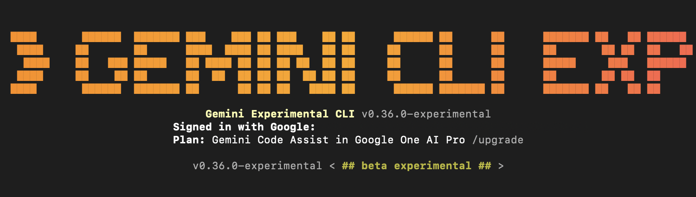

<div align="center">



# Gemini CLI — Experimental Fork

[](.)
[](./LICENSE)
[](.)
[](https://github.com/google-gemini/gemini-cli)

> **This is not the official Gemini CLI.** This is an experimental fork that
> changes how the agent navigates codebases at a protocol level. Use at your own
> risk. Things will break. That is expected.

</div>

---

## What Makes This Different

The official Gemini CLI uses a standard **ReAct loop** (Reason → Act → Observe)
where codebase navigation resolves through file I/O — grep, read_file, glob —
iterating 4–10 turns per navigation query, burning tokens and time proportional
to codebase size.

This fork introduces **G+ReAct** — Graph-Index-Augmented ReAct.

```
Standard ReAct                          G+ReAct
──────────────────────────────────      ──────────────────────────────────
Reason: "find set_stance"               Reason: "find set_stance"
Act:    grep_search("set_stance")       Act:    graph_search("set_stance")
Obs:    50 matches, 12 files            Obs:    { file, line, callers,
Reason: "narrow down"                            callees } in ~130ms
Act:    read_file(...)                  Reason: "done navigating"
Act:    read_file(...)
...  (6–10 more turns)
```

A SQLite-backed code index (`.gemini/gemini.idx`) is built once with `/idx` and
then **auto-refreshed every session start and every hour**. Every agent — main
model and subagents — queries the graph before touching the filesystem.

Early benchmark on a medium-sized codebase:

| Metric                          | Standard | G+ReAct |
| ------------------------------- | -------- | ------- |
| `read_file` calls per nav query |          |         |
| Graph tool calls                |          |         |
| Subagent duration               |          |         |
| Total tokens                    |          |         |
| Cache hit rate                  |          |         |
| Avg lookup latency              |          |         |

For the full technical breakdown of the implementation, the loop mechanics, and
how G+ReAct differs from standard ReAct at the code level, read
**[idx_readme.md](./idx_readme.md)**.

---

## Key Changes vs Official CLI

| Area                  | Official CLI                 | This Fork                                    |
| --------------------- | ---------------------------- | -------------------------------------------- |
| Codebase navigation   | grep + read_file loop        | `graph_search` / `graph_query` — single turn |
| Subagent tool access  | grep, ls, read_file only     | Graph tools available to all agents          |
| GEMINI.md on re-index | Overwritten                  | Smart write — prepends only missing lines    |
| Index freshness       | Manual `/idx`                | Auto-refresh at session start + every 1hr    |
| Loop convergence      | O(files matching grep) turns | O(1) turns for symbol navigation             |
| Startup banner        | Default diamond icon         | — you can see it above                       |

---

## ⚠️ Beta Disclaimer

This fork is in **active development and beta stage**. You should:

- Expect breaking changes between versions
- Not use this in production workflows without understanding the changes
- Take full responsibility for any issues arising from use of this experimental
  build
- Treat the graph index as a best-effort cache — it can be stale or incomplete

**Large repository notice:** The current beta is **not suitable for very large
codebases** (e.g. PyTorch, Linux kernel, or similar projects with tens of
thousands of files). The regex-based parser has known coverage gaps on complex
Python patterns and C extensions, and indexing time at that scale has not been
validated. Tested and reasonable on small-to-medium repositories (up to a few
thousand files). Large-repo support is planned for a future release.

You have been warned. Now install it.

---

## Installation

This fork is **source-only**. There is no npm package. Build and link it
yourself:

```bash
# 1. Clone
git clone https://github.com/[repo-coming-soon]/gemini-cli-experimental
cd gemini-cli-experimental

# 2. Install dependencies
npm install

# 3. Build
npm run build

# 4. Link globally — makes gemini_experimental available on your PATH
cd packages/cli
npm link
```

That's it. The command is `gemini_experimental`, not `gemini`. Your existing
`gemini` installation (if any) is untouched.

```bash
gemini_experimental --version
# 0.36.0-nightly.20260317.2f90b4653-exp2
```

---

## Getting Started with Code Indexing

Once installed, navigate to your project directory and initialize the graph
index:

```bash
cd your-project/
gemini_experimental

# Inside the CLI — run once to build the index
/idx
```

After that, the index auto-refreshes every time you start a session and every
hour while a session is running. You never need to manually run `/idx` again
unless you want to force an immediate re-index.

**Query the graph directly:**

```bash
> Where is the processPayment function defined?
> What calls validateUser?
> Trace the full call chain from handleRequest
```

The agent will use `graph_search` and `graph_query` instead of scanning files.

---

## 🔐 Authentication

This fork uses the same authentication as the official CLI. All three options
work:

### Option 1 — Sign in with Google (recommended)

Best for individual developers. Free tier: 60 req/min, 1,000 req/day.

```bash
gemini_experimental
# Choose "Sign in with Google" and follow the browser flow
```

### Option 2 — Gemini API Key

```bash
export GEMINI_API_KEY="YOUR_API_KEY"
gemini_experimental
```

Get your key at
[aistudio.google.com/apikey](https://aistudio.google.com/apikey).

### Option 3 — Vertex AI (Enterprise)

```bash
export GOOGLE_API_KEY="YOUR_API_KEY"
export GOOGLE_GENAI_USE_VERTEXAI=true
gemini_experimental
```

For full auth documentation see the
[upstream auth guide](./docs/get-started/authentication.md).

---

## Usage

Everything from the official CLI works. The fork adds:

| Command                | What it does                                                  |
| ---------------------- | ------------------------------------------------------------- |
| `/idx`                 | Build or rebuild the code graph index for the current project |
| `graph_search("name")` | Find where a symbol is defined — file, line, args             |
| `graph_query("name")`  | Trace full caller/callee chain for a symbol                   |

Standard CLI commands (`/help`, `/chat`, `/clear`, `/bug`, etc.) are unchanged.

```bash
# Start in current directory
gemini_experimental

# Non-interactive
gemini_experimental -p "What calls the authenticate function?"

# Specific model
gemini_experimental -m gemini-2.5-flash
```

---

## How the Index Works

```
/idx  →  GraphService.indexProject()
           ├── walks all files under project root
           ├── skips unchanged files (hash-based manifest)
           ├── parses functions, classes, call edges into SQLite
           └── writes GEMINI.md (smart: never overwrites existing content)

Session start  →  autoIndex.ts
                   ├── checks .gemini/gemini.idx exists
                   ├── setImmediate: re-index in background after UI renders
                   └── setInterval(1hr).unref(): hourly refresh, won't block exit
```

The index file lives at `.gemini/gemini.idx`. Add `.gemini/` to your
`.gitignore` — it is a local cache, not source code.

**Full technical implementation details → [idx_readme.md](./idx_readme.md)**

---

## Based On

This is a fork of the official
[google-gemini/gemini-cli](https://github.com/google-gemini/gemini-cli) (Apache
2.0). The core ReAct loop, authentication, tool infrastructure, and MCP support
are upstream. The graph index, G+ReAct routing, auto-indexing, and smart
GEMINI.md write are additions in this fork.

Upstream documentation: [geminicli.com/docs](https://geminicli.com/docs)

---

## Contributing

This is experimental research-grade software. If you find issues or want to
extend the graph index:

- Open an issue describing what broke and on what codebase
- PRs welcome — especially for language coverage beyond Python (C++, Go, Rust
  call edge parsing)
- Read [idx_readme.md](./idx_readme.md) before touching anything in
  `graphService.ts` or `graphTools.ts`

---

<div align="center">

**Not affiliated with Google. Not the official Gemini CLI.** **Fork responsibly.
Index everything.**

</div>

---

---

# Original Gemini CLI README

> Everything below is the upstream README from
> [google-gemini/gemini-cli](https://github.com/google-gemini/gemini-cli),
> preserved in full. All credit to the Google Gemini team.

---

[](https://github.com/google-gemini/gemini-cli/actions/workflows/ci.yml)
[](https://github.com/google-gemini/gemini-cli/actions/workflows/chained_e2e.yml)
[](https://www.npmjs.com/package/@google/gemini-cli)
[](https://github.com/google-gemini/gemini-cli/blob/main/LICENSE)


Gemini CLI is an open-source AI agent that brings the power of Gemini directly
into your terminal. It provides lightweight access to Gemini, giving you the
most direct path from your prompt to our model.

Learn all about Gemini CLI in our [documentation](https://geminicli.com/docs/).

## 🚀 Why Gemini CLI?

- **🎯 Free tier**: 60 requests/min and 1,000 requests/day with personal Google
  account.
- **🧠 Powerful Gemini 3 models**: Access to improved reasoning and 1M token
  context window.
- **🔧 Built-in tools**: Google Search grounding, file operations, shell
  commands, web fetching.
- **🔌 Extensible**: MCP (Model Context Protocol) support for custom
  integrations.
- **💻 Terminal-first**: Designed for developers who live in the command line.
- **🛡️ Open source**: Apache 2.0 licensed.

## 📦 Installation

See
[Gemini CLI installation, execution, and releases](./docs/get-started/installation.md)
for recommended system specifications and a detailed installation guide.

### Quick Install

#### Run instantly with npx

```bash
npx @google/gemini-cli
```

#### Install globally with npm

```bash
npm install -g @google/gemini-cli
```

#### Install globally with Homebrew (macOS/Linux)

```bash
brew install gemini-cli
```

#### Install globally with MacPorts (macOS)

```bash
sudo port install gemini-cli
```

#### Install with Anaconda (for restricted environments)

```bash
conda create -y -n gemini_env -c conda-forge nodejs
conda activate gemini_env
npm install -g @google/gemini-cli
```

## Release Cadence and Tags

See [Releases](./docs/releases.md) for more details.

### Preview

```bash
npm install -g @google/gemini-cli@preview
```

### Stable

```bash
npm install -g @google/gemini-cli@latest
```

### Nightly

```bash
npm install -g @google/gemini-cli@nightly
```

## 📋 Key Features

### Code Understanding & Generation

- Query and edit large codebases
- Generate new apps from PDFs, images, or sketches using multimodal capabilities
- Debug issues and troubleshoot with natural language

### Automation & Integration

- Automate operational tasks like querying pull requests or handling complex
  rebases
- Use MCP servers to connect new capabilities, including
  [media generation with Imagen, Veo or Lyria](https://github.com/GoogleCloudPlatform/vertex-ai-creative-studio/tree/main/experiments/mcp-genmedia)
- Run non-interactively in scripts for workflow automation

### Advanced Capabilities

- Ground your queries with built-in
  [Google Search](https://ai.google.dev/gemini-api/docs/grounding) for real-time
  information
- Conversation checkpointing to save and resume complex sessions
- Custom context files (GEMINI.md) to tailor behavior for your projects

### GitHub Integration

Integrate Gemini CLI directly into your GitHub workflows with
[**Gemini CLI GitHub Action**](https://github.com/google-github-actions/run-gemini-cli):

- **Pull Request Reviews**: Automated code review with contextual feedback and
  suggestions
- **Issue Triage**: Automated labeling and prioritization of GitHub issues based
  on content analysis
- **On-demand Assistance**: Mention `@gemini-cli` in issues and pull requests
  for help with debugging, explanations, or task delegation
- **Custom Workflows**: Build automated, scheduled and on-demand workflows
  tailored to your team's needs

## 🔐 Authentication Options

Choose the authentication method that best fits your needs:

### Option 1: Sign in with Google (OAuth login using your Google Account)

**✨ Best for:** Individual developers as well as anyone who has a Gemini Code
Assist License.

**Benefits:**

- **Free tier**: 60 requests/min and 1,000 requests/day
- **Gemini 3 models** with 1M token context window
- **No API key management** - just sign in with your Google account
- **Automatic updates** to latest models

```bash
gemini
```

```bash
# Set your Google Cloud Project (for paid Code Assist License)
export GOOGLE_CLOUD_PROJECT="YOUR_PROJECT_ID"
gemini
```

### Option 2: Gemini API Key

**✨ Best for:** Developers who need specific model control or paid tier access

```bash
# Get your key from https://aistudio.google.com/apikey
export GEMINI_API_KEY="YOUR_API_KEY"
gemini
```

### Option 3: Vertex AI

**✨ Best for:** Enterprise teams and production workloads

```bash
export GOOGLE_API_KEY="YOUR_API_KEY"
export GOOGLE_GENAI_USE_VERTEXAI=true
gemini
```

For Google Workspace accounts and other authentication methods, see the
[authentication guide](./docs/get-started/authentication.md).

## 🚀 Getting Started

### Basic Usage

```bash
# Start in current directory
gemini

# Include multiple directories
gemini --include-directories ../lib,../docs

# Use specific model
gemini -m gemini-2.5-flash

# Non-interactive
gemini -p "Explain the architecture of this codebase"

# Structured output
gemini -p "Explain the architecture of this codebase" --output-format json

# Streaming
gemini -p "Run tests and deploy" --output-format stream-json
```

### Quick Examples

```bash
# Start a new project
cd new-project/
gemini
> Write me a Discord bot that answers questions using a FAQ.md file I will provide

# Analyze existing code
git clone https://github.com/google-gemini/gemini-cli
cd gemini-cli
gemini
> Give me a summary of all of the changes that went in yesterday
```

## 📚 Documentation

### Getting Started

- [**Quickstart Guide**](./docs/get-started/index.md)
- [**Authentication Setup**](./docs/get-started/authentication.md)
- [**Configuration Guide**](./docs/reference/configuration.md)
- [**Keyboard Shortcuts**](./docs/reference/keyboard-shortcuts.md)

### Core Features

- [**Commands Reference**](./docs/reference/commands.md)
- [**Custom Commands**](./docs/cli/custom-commands.md)
- [**Context Files (GEMINI.md)**](./docs/cli/gemini-md.md)
- [**Checkpointing**](./docs/cli/checkpointing.md)
- [**Token Caching**](./docs/cli/token-caching.md)

### Tools & Extensions

- [**Built-in Tools Overview**](./docs/reference/tools.md)
  - [File System Operations](./docs/tools/file-system.md)
  - [Shell Commands](./docs/tools/shell.md)
  - [Web Fetch & Search](./docs/tools/web-fetch.md)
- [**MCP Server Integration**](./docs/tools/mcp-server.md)
- [**Custom Extensions**](./docs/extensions/index.md)

### Advanced Topics

- [**Headless Mode (Scripting)**](./docs/cli/headless.md)
- [**IDE Integration**](./docs/ide-integration/index.md)
- [**Sandboxing & Security**](./docs/cli/sandbox.md)
- [**Trusted Folders**](./docs/cli/trusted-folders.md)
- [**Enterprise Guide**](./docs/cli/enterprise.md)
- [**Telemetry & Monitoring**](./docs/cli/telemetry.md)
- [**Local development**](./docs/local-development.md)

### Troubleshooting & Support

- [**Troubleshooting Guide**](./docs/resources/troubleshooting.md)
- [**FAQ**](./docs/resources/faq.md)
- Use `/bug` command to report issues directly from the CLI.

### Using MCP Servers

Configure MCP servers in `~/.gemini/settings.json` to extend Gemini CLI with
custom tools:

```text
> @github List my open pull requests
> @slack Send a summary of today's commits to #dev channel
> @database Run a query to find inactive users
```

See the [MCP Server Integration guide](./docs/tools/mcp-server.md) for setup
instructions.

## 🤝 Contributing

We welcome contributions! Gemini CLI is fully open source (Apache 2.0), and we
encourage the community to:

- Report bugs and suggest features.
- Improve documentation.
- Submit code improvements.
- Share your MCP servers and extensions.

See our [Contributing Guide](./CONTRIBUTING.md) for development setup, coding
standards, and how to submit pull requests.

Check our [Official Roadmap](https://github.com/orgs/google-gemini/projects/11)
for planned features and priorities.

## 📖 Resources

- **[Official Roadmap](./ROADMAP.md)**
- **[Changelog](./docs/changelogs/index.md)**
- **[NPM Package](https://www.npmjs.com/package/@google/gemini-cli)**
- **[GitHub Issues](https://github.com/google-gemini/gemini-cli/issues)**
- **[Security Advisories](https://github.com/google-gemini/gemini-cli/security/advisories)**

### Uninstall

See the [Uninstall Guide](./docs/resources/uninstall.md) for removal
instructions.
