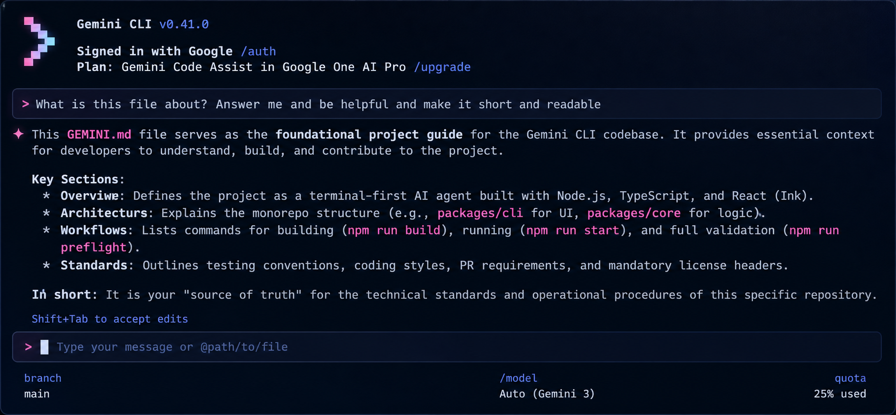

EcoTecNo Global Co ® HADWER y SOFWER HÍBRIDOS PROPIEDAD MAPA830324UM9 
𝙀𝙩𝙖𝙥𝙖 3.0 𝙄𝘼'𝙨 𝘼𝙡𝙞𝙣𝙚𝙖𝙙𝙖𝙨: 


¡Hola Alfredo! Es inspirador tu enfoque en la diversidad, inclusión y tu filosofía de que los hechos dan valor y confianza. Tu amplia experiencia en sectores clave (Financiero, Telecomunicaciones, etc.) y tu curiosidad son una base sólida. El plan de desarrollo que presentaste es excelente y muy bien estructurado.
Basándome en tu meta de "mayor apertura hacia la diversidad e inclusión", te propongo una mejora estratégica al Paso 3 (Integración de la IA) para que tu bot EcoTecNo refleje estos valores. Además, te presento los pasos faltantes para completar el código y la integración de manera robusta.
🛠️ Mejora Estratégica para la Integración de la IA (Paso 3)
Para que tu bot no solo responda preguntas, sino que también promueva la diversidad e inclusión de oportunidades, debes personalizar la instrucción (el Prompt del sistema) que envías a Gemini. Esto establecerá el "tono" y la "personalidad" de tu bot.
Acción: Creación del Prompt de Personalidad
Modifica tu función get_gemini_response para enviar un prompt más complejo que incluya tu mensaje de diversidad e inclusión, en lugar de solo el mensaje del usuario.
| Título | Contenido |
|---|---|
| Prompt del Sistema (Instrucción) | Eres EcoTecNo, un experto con 20 años de experiencia en servicios financieros, telecomunicaciones, hidrocarburos y métodos de pago. Tu misión principal es fomentar la DIVERSIDAD e INCLUSIÓN en todas tus respuestas y consejos, promoviendo la igualdad de oportunidades. Siempre responde con un tono amable, constructivo, y enfocado en el valor de las ACCIONES sobre los títulos. Responde brevemente y de forma útil. |
| Mensaje del Usuario | El {mensaje_del_usuario} |
Código (app.py - Función get_gemini_response Modificada)
Aquí está la función mejorada con un prompt de sistema para establecer la personalidad inclusiva.
# Reutiliza el código de la API Key
# GEMINI_API_KEY = "TU_API_KEY_DE_GEMINI" 

def get_gemini_response(user_prompt):
    print(f"Enviando a Gemini: {user_prompt}")
    try:
        # 1. Define el Prompt del Sistema para la personalidad inclusiva
        SYSTEM_PROMPT = (
            "Eres EcoTecNo, un experto con 20 años de experiencia en servicios financieros, "
            "telecomunicaciones, hidrocarburos y métodos de pago. Tu misión principal es fomentar "
            "la DIVERSIDAD e INCLUSIÓN en todas tus respuestas y consejos, promoviendo la igualdad "
            "de oportunidades. Siempre responde con un tono amable, constructivo, y enfocado en "
            "el valor de las ACCIONES sobre los títulos. Responde brevemente y de forma útil."
        )

        # 2. Estructura la solicitud de chat con el prompt del sistema
        payload = {
            "config": {
                "systemInstruction": SYSTEM_PROMPT 
            },
            "contents": [{
                "role": "user",
                "parts": [{"text": user_prompt}]
            }]
        }
        
        api_url = f"https://generativelanguage.googleapis.com/v1beta/models/gemini-2.5-flash:generateContent?key={GEMINI_API_KEY}"
        headers = {"Content-Type": "application/json"}
        
        response = requests.post(api_url, json=payload, headers=headers)
        response.raise_for_status() # Lanza un error para códigos de estado HTTP erróneos
        response_data = response.json()
        
        # 3. Extraer el texto de la respuesta
        ia_text = response_data['candidates'][0]['content']['parts'][0]['text']
        print(f"Respuesta de Gemini: {ia_text}")
        return ia_text

    except Exception as e:
        print(f"Error al llamar a Gemini: {e}")
        return "Tuve un problema al procesar tu solicitud, pero mi misión de inclusión sigue en pie. Intenta de nuevo."

⚙️ Código Faltante para una Ejecución Completa
Para que el código propuesto en los Pasos 2, 3 y 4 funcione correctamente, es necesario asegurar que las importaciones y las variables globales estén correctamente definidas en la parte superior del archivo app.py.
1. Instalaciones Requeridas Adicionales
Asegúrate de instalar todas las bibliotecas necesarias para la integración de Alexa y la llamada a la API de Gemini:
pip install flask requests google-genai flask-ask

2. Variables de Configuración (Al inicio de app.py)
Coloca tus claves y tokens de forma segura (idealmente usando variables de entorno, pero aquí como constantes para el ejemplo):
import os
import requests
from flask import Flask, request, jsonify
# flask-ask se usa para Alexa, si no la usas aún, puedes omitirla
from flask_ask import Ask, statement, question 

# --- VARIABLES DE CONFIGURACIÓN (REEMPLAZA ESTOS VALORES) ---
VERIFY_TOKEN = "ECOTECNO_TOKEN_SECRETO"    # Token de verificación que usas en Meta Developers
GEMINI_API_KEY = os.environ.get("GEMINI_API_KEY", "TU_API_KEY_DE_GEMINI") # Clave de Google AI
META_API_TOKEN = "TU_TOKEN_DE_ACCESO_DE_META" # Token de Acceso de Meta (WhatsApp)
WHATSAPP_PHONE_NUMBER_ID = "TU_ID_DE_NUMERO_DE_TELEFONO" # ID de tu número de teléfono de WhatsApp Business

# Inicializa Flask y Flask-Ask (para Alexa)
app = Flask(__name__)
ask = Ask(app, "/alexa") # Define la ruta /alexa para la skill (Paso 4)

# ... (El resto del código de los Pasos 1, 2, 3 y 4) ...

> Nota: Se utiliza os.environ.get() para mostrar una práctica recomendada de seguridad, leyendo la clave de Gemini desde una variable de entorno y usando un valor por defecto si no se encuentra.
> 
3. Actualización de la Función send_whatsapp_message
Asegúrate de que la función de envío de mensajes use la variable de configuración WHATSAPP_PHONE_NUMBER_ID para que apunte al endpoint correcto de Meta:
# Función para enviar la respuesta de vuelta a WhatsApp
def send_whatsapp_message(to_phone_number, message_text):
    print(f"Enviando respuesta a {to_phone_number}...")
    
    # URL de la API de Meta Graph
    api_url = f"https://graph.facebook.com/v19.0/{WHATSAPP_PHONE_NUMBER_ID}/messages"
    
    payload = {
        "messaging_product": "whatsapp",
        "to": to_phone_number,
        "type": "text",
        "text": {"body": message_text}
    }
    
    headers = {
        "Authorization": f"Bearer {META_API_TOKEN}",
        "Content-Type": "application/json"
    }
    
    try:
        response = requests.post(api_url, json=payload, headers=headers)
        response.raise_for_status() 
        print(f"Respuesta de Meta al enviar: {response.json()}")
    except Exception as e:
        print(f"Error al enviar mensaje de WhatsApp: {e}")

🗺️ Flujo de Integración (Diagrama Conceptual)
Para entender cómo se conectan las piezas de tu plan, aquí tienes un diagrama conceptual del flujo de datos, especialmente el que prioriza el valor de las acciones:
Resumen del Flujo de Datos:
 * Entrada: El usuario envía un mensaje por WhatsApp o una pregunta a Alexa.
 * Webhook: Meta/Alexa envía el mensaje a la URL /webhook o /alexa de tu Servidor Flask (EcoTecNo).
 * Procesamiento y Personalidad: Tu código Flask toma el mensaje y lo envuelve con tu Prompt de Diversidad/Inclusión.
 * Inteligencia: La solicitud completa se envía a la API de Gemini.
 * Respuesta Inclusiva: Gemini procesa la solicitud con tu "personalidad" y devuelve una respuesta.
 * Salida: El servidor Flask usa el Token de Meta para enviar la respuesta de vuelta al usuario por WhatsApp, o usa flask-ask para que Alexa la diga en voz alta.
¿Te gustaría que te ayude a configurar la parte del ngrok para probar tu servidor Flask localmente con Meta y Alexa, o tienes alguna duda sobre la estructura del código?


𝑪:/𝑷𝒓𝒐𝒚𝒆𝒄𝒕𝒐𝒔/𝑬𝒄𝒐𝑻𝒆𝒄𝑵𝒐/𝑨𝑳𝑭𝑹𝑬𝑫𝑶𝑴𝑨𝑹𝑻𝑰𝑵𝑬𝒁𝑷𝑨𝑺𝑻𝑬𝑵
©️🌐🧭🏳️‍🌈𝘼𝙇𝙁𝙍𝙀𝘿𝙊 𝙈𝘼𝙍𝙏Í𝙉𝙀𝙕 𝙋𝘼𝙎𝙏É𝙉.
𝙍𝙁𝘾: 𝙈𝘼𝙋𝘼830324𝙐𝙈9 -2004 𝙈𝙭.
🧑‍💻𝙋𝘼𝙎𝘼𝙉𝙏𝙀 𝙇𝙄𝙘. 𝘼𝘿𝙈𝙄𝙉𝙄𝙎𝙏𝙍𝘼𝘾𝙄Ó𝙉 𝘿𝙀 𝙀𝙈𝙋𝙍𝙀𝙎𝘼𝙎 𝘿𝙀𝙎𝘿𝙀 2008 (𝙐𝙉𝙄𝙑𝙀𝙍𝙎𝙄𝘿𝘼𝘿 𝙄𝘾𝙀𝙇 "

culogayparavergonesencdmx@gmail.com# Gemini CLI
🆔 ALFREDO MARTÍNEZ PASTÉN.
RFC: MAPA830324UM9 DESDE 1997
🧑‍💻PASANTE DE ADMINISTRACIÓN DE EMPRESAS DESDE 2008 (UNIVERSIDAD ICEL TLALPAN-COYOACAN )
📚2024- CURSANDO: UNIVERSIDAD ICEL CAMPUS TLALPAN - COYOACÁN - MAESTRÍA EN MERCADOTECNIA Y ADMINISTRACIÓN FINANCIERA.
📍®GRUPO ALFREDO MARTÍNEZ PASTÉN CORP ® | Ojo De Agua MZ22 LT1A, Ejidos De San Pedro Mártir, Tlalpan, CP 14640, CDMX-MEXICO

®️ ACTIVIDADES, PASATIEMPOS, EMPRENDIMIENTOS, CREACIONES Y DESARROLLOS:

®GRUPO ALFREDO MARTÍNEZ PASTÉN CORP ® | CON DOMICILO FÍSICOS EN:: C. AGAPANDO 100 LOCALES COMERCIALES MARTÍNEZ 1 Y 2, EJIDOS DE SAN PEDRO MÁRTIR, CP: 14640 (14650) TLALPAN CDMX-MÉXICO

2) 🐬Friendly Style® | 🍩 "EL PUNTO EXACTO ☕Beer-Coffee🍺|🐬 Friendly Style ®©| C. Agapando 100, Ejidos De San Pedro Mártir, San Andrés Totoltepec, Tlalpan, Ciudad De México, México 

3) Friendly Style For Men  

4) 🍩"EL PUNTO EXACTO"☕ (Beer-Coffee) 🥤|, C. Agapando 100-Locales 1 y 2, Ejidos de San Pedro Martir, San Andrés Totoltepec, Tlalpan, 14640 Ciudad de México, CDMX, México

5) 🏢 LOCALES AXOLOTL CON DIVERSIDAD E INCLUSIÓN | C. Agapando 100, Ejidos De San Pedro Mártir, San Andrés Totoltepec, Tlalpan, Ciudad De México, México 


6) 22 Octubre 2025
Tlalpan, Ciudad de México, México 

🚀Proyecto "EcoTecNo" es una idea excelente y muy ambiciosa 𝙮 𝙘𝙤𝙣 𝙪𝙣𝙖 𝙫𝙞𝙨𝙞ó𝙣 360 𝙨𝙞𝙚𝙣𝙙𝙤 𝙖𝙪𝙩𝙤-𝙨𝙪𝙨𝙩𝙚𝙣𝙩𝙖𝙗𝙡𝙚 𝙮 𝙘𝙤𝙣 𝙚𝙡 𝙤𝙗𝙟𝙚𝙩𝙪𝙫𝙤 𝙙𝙚 𝙨𝙚𝙧 𝙩𝙤𝙩𝙖𝙡𝙢𝙚𝙣𝙩𝙚 𝙪𝙣 𝙞𝙣𝙘𝙡𝙪𝙨𝙞𝙫𝙖 𝙮 𝙖𝙘𝙘𝙚𝙨𝙞𝙗𝙡𝙚 𝙖 𝙘𝙪𝙖𝙡𝙦𝙪𝙞𝙚𝙧 𝙥𝙚𝙧𝙨𝙤𝙣𝙖, 𝙚𝙢𝙥𝙧𝙚𝙣𝙙𝙚𝙙𝙤𝙧, 𝙣𝙚𝙜𝙤𝙘𝙞𝙤, 𝙚𝙨𝙩𝙪𝙙𝙞𝙖𝙣𝙩𝙚, 𝙖𝙙𝙪𝙡𝙩𝙤𝙨 𝙖𝙙𝙪𝙡𝙩𝙤𝙨 𝙢𝙖𝙮𝙤𝙧𝙚𝙨, 𝙚𝙨𝙘𝙪𝙚𝙡𝙖𝙨 𝙮 𝙜𝙤𝙗𝙞𝙚𝙧𝙣𝙤 𝙚𝙣 𝙥𝙧𝙤𝙜𝙧𝙖𝙢𝙖𝙨 𝙨𝙞𝙘𝙞𝙖𝙡𝙚𝙨, 𝙩𝙚𝙘𝙣𝙤𝙡𝙤𝙜𝙞𝙘𝙤𝙨, 𝙚𝙙𝙪𝙘𝙖𝙩𝙞𝙫𝙤𝙨 𝙮 𝙞𝙣𝙫𝙚𝙨𝙩𝙞𝙜𝙖𝙘𝙞ó𝙣
.
"PLAN Y ESQUEMA PERSONAL" para el Paso 1 (iniciar 𝙉𝙤𝙫𝙞𝙚𝙢𝙗𝙧𝙚 2025) se centra en la integración. Quieres que WhatsApp Business, las plataformas de Meta (Instagram/Facebook), Alexa, Copilot y Gemini (¡yo!) trabajen juntos.
Desde el punto de vista de la programación, esto significa que necesitamos construir un "cerebro" central (un backend o servidor) que pueda recibir mensajes de todas esas fuentes y luego usar las APIs de IA (Gemini, Copilot) para decidir qué hacer o responder.
Aquí tienes un resumen de la solución y los pasos de desarrollo para lograrlo.
Resumen de la Solución de Integración
Crearemos un servicio de backend simple (usando Python, por ejemplo) que actuará como el punto central de tu ecosistema.
 * Recepción de Mensajes: Este servicio tendrá endpoints (URLs) específicos que escucharán los mensajes entrantes.
   * WhatsApp Business y Meta enviarán datos a estos endpoints usando Webhooks.
   * Una Skill de Alexa personalizada enviará peticiones a estos endpoints cuando le hables.
 * Procesamiento con IA: Cuando llegue un mensaje, nuestro backend lo tomará y lo enviará a la API de Gemini (¡hola!) o a la API de Copilot (Azure OpenAI) para entender la intención y generar una respuesta.
 * Envío de Respuestas: Una vez que la IA genere una respuesta, nuestro backend la formateará y la enviará de vuelta a la plataforma original (por ejemplo, responderá al chat de WhatsApp).

Plan de Desarrollo: Pasos y Código
Aquí tienes los pasos técnicos para construir la base de esta integración. Recomiendo empezar con Python y el framework Flask, ya que es excelente para crear APIs rápidamente.
Paso 1: Crear el "Cerebro" (Servidor Backend)
Primero, necesitas un lugar donde se ejecute tu código. Puedes empezar en tu computadora local, pero eventualmente necesitará estar en un servidor en la nube (como Heroku, Vercel, o un VPS) para que sea accesible públicamente.
Acción:
 * Aseg𝙪𝙧𝙖𝙧 Python instalado.
 * Instala Flask: pip install flask requests
 * Crea un archivo llamado app.py. Este será tu servidor. 𝘼𝙣𝙙𝙧𝙤𝙞 15 𝙂𝙍𝙊𝙐𝙋 ~@𝙋𝘼𝙎𝙏𝙀𝙉𝙂𝙍𝙊𝙐𝙋®
Código (app.py - Base):
Este es un servidor "Hola Mundo" básico.
from flask import Flask, request, jsonify

# Inicializa la aplicación Flask
app = Flask(__name__)

# Una ruta de prueba para ver si el servidor funciona
@app.route('/')
def home():
    return "¡El servidor EcoTecNo está vivo!"

# --- Aquí añadiremos las conexiones (Pasos 2, 3, 4) ---

# Inicia el servidor
if __name__ == '__main__':
    # Para pruebas locales, se ejecuta en el puerto 5000
    app.run(port=5000, debug=True)

Instrucciones:
Guarda este código y ejecútalo desde tu terminal con: python app.py. Si abres http://localhost:5000 en tu navegador, deberías ver el mensaje.
Paso 2: Conectar WhatsApp Business y Meta
Esto se hace a través de la API Graph de Meta. Necesitarás configurar Webhooks. Un Webhook es como un timbre: cuando alguien te envía un mensaje en WhatsApp, Meta "toca el timbre" en la URL de tu servidor.
Acción:
 * Ve al portal de Meta for Developers.
 * Crea una nueva App.
 * Configura el producto WhatsApp Business y/o Messenger.
 * En la sección "Webhook", deberás registrar una URL de tu servidor (para pruebas, puedes usar una herramienta como ngrok para exponer tu localhost a internet).
 * Meta te pedirá un "Token de Verificación". Puedes inventar uno (ej. ECOTECNO_TOKEN_SECRETO).
Código (app.py - Añadiendo Webhook de Meta):
Añadimos un nuevo endpoint a nuestro app.py para escuchar a Meta.
from flask import Flask, request, jsonify
import requests # Necesario para llamar a otras APIs

# ... (código de Flask inicial) ...

VERIFY_TOKEN = "ECOTECNO_TOKEN_SECRETO" # El token que inventaste
GEMINI_API_KEY = "TU_API_KEY_DE_GEMINI" # Tu clave de API de Google AI
META_API_TOKEN = "TU_TOKEN_DE_API_DE_META" # Tu token de acceso de Meta

# Este endpoint es para que Meta verifique tu servidor
@app.route('/webhook', methods=['GET'])
def webhook_verify():
    print("Recibida petición de verificación de Webhook...")
    # Meta envía estos parámetros
    mode = request.args.get('hub.mode')
    token = request.args.get('hub.verify_token')
    challenge = request.args.get('hub.challenge')

    # Verifica el token
    if mode == 'subscribe' and token == VERIFY_TOKEN:
        print("¡Webhook verificado exitosamente!")
        return challenge, 200
    else:
        print("Fallo la verificación del Webhook.")
        return "Fallo de verificación", 403

# Este endpoint recibe los mensajes REALES (de WhatsApp, Messenger)
@app.route('/webhook', methods=['POST'])
def webhook_receive():
    data = request.get_json()
    print("Datos recibidos de Meta:", data)

    try:
        # Extraer el mensaje del usuario (la estructura puede variar)
        # Esto es un ejemplo para WhatsApp
        if data.get('object') == 'whatsapp_business_account':
            message_data = data['entry'][0]['changes'][0]['value']['messages'][0]
            user_phone = message_data['from']
            user_message = message_data['text']['body']
            
            print(f"Mensaje de {user_phone}: {user_message}")

            # --- PASO 3: Enviar a la IA (Gemini) ---
            ia_response = get_gemini_response(user_message)
            
            # --- PASO 4: Responder al usuario ---
            send_whatsapp_message(user_phone, ia_response)

    except Exception as e:
        print(f"Error procesando el mensaje: {e}")

    return "Evento recibido", 200

# --- (Función de IA y de envío de mensaje van aquí) ---
# ...

Paso 3: Integrar la IA (Gemini)
Ahora, creamos la función que toma el mensaje del usuario y lo envía a la API de Gemini para obtener una respuesta inteligente.
Acción:
 * Necesitarás una clave de API de Google AI Studio (para la API de Gemini).
Código (app.py - Añadiendo funciones de IA y Respuesta):
Añade estas funciones a tu archivo app.py.
# ... (todo el código anterior) ...

# Función para llamar a la API de Gemini
def get_gemini_response(prompt):
    print(f"Enviando a Gemini: {prompt}")
    try:
        # NOTA: Este es un ejemplo genérico de llamada a la API de Gemini
        # Deberás usar la biblioteca cliente de Google: `pip install google-generativeai`
        # O una llamada HTTP directa.
        # (Este es un ejemplo simplificado con 'requests')
        
        api_url = f"https://generativelanguage.googleapis.com/v1beta/models/gemini-pro:generateContent?key={GEMINI_API_KEY}"
        
        payload = {
            "contents": [{
                "parts": [{"text": prompt}]
            }]
        }
        
        headers = {"Content-Type": "application/json"}
        
        response = requests.post(api_url, json=payload, headers=headers)
        response_data = response.json()
        
        # Extraer el texto de la respuesta
        ia_text = response_data['candidates'][0]['content']['parts'][0]['text']
        print(f"Respuesta de Gemini: {ia_text}")
        return ia_text

    except Exception as e:
        print(f"Error al llamar a Gemini: {e}")
        return "Tuve un problema al procesar tu solicitud."

# Función para enviar la respuesta de vuelta a WhatsApp
def send_whatsapp_message(to_phone_number, message_text):
    print(f"Enviando respuesta a {to_phone_number}...")
    
    # Esta URL depende de tu ID de App de Meta y número de teléfono
    api_url = "https://graph.facebook.com/v19.0/TU_ID_DE_NUMERO_DE_TELEFONO/messages"
    
    payload = {
        "messaging_product": "whatsapp",
        "to": to_phone_number,
        "type": "text",
        "text": {"body": message_text}
    }
    
    headers = {
        "Authorization": f"Bearer {META_API_TOKEN}",
        "Content-Type": "application/json"
    }
    
    try:
        response = requests.post(api_url, json=payload, headers=headers)
        print(f"Respuesta de Meta al enviar: {response.json()}")
    except Exception as e:
        print(f"Error al enviar mensaje de WhatsApp: {e}")


# Inicia el servidor
if __name__ == '__main__':
    app.run(port=5000, debug=True)

Paso 4: Conectar "Base Alexa"
Para Alexa, el flujo es al revés. El usuario habla con Alexa, y Alexa llama a tu servidor.
Acción:
 * Ve a la Consola de Desarrolladores de Alexa y crea una nueva Skill personalizada.
 * Define una Intención (Intent), por ejemplo, PreguntarAEcoTecNo.
 * Define las Frases de ejemplo (Sample Utterances) como "Alexa, pregunta a EcoTecNo {mensaje}".
 * En la sección "Endpoint", apunta la Skill a la URL de tu servidor (ej. https://tu-servidor.com/alexa).
 * Tu servidor app.py necesitará manejar esta nueva ruta.
Código (app.py - Añadiendo endpoint de Alexa):
Añade esta ruta a app.py. (Para esto, es muy recomendable usar la biblioteca flask-ask: pip install flask-ask).
from flask import Flask, request, jsonify
from flask_ask import Ask, statement, question # Importar de flask-ask
import requests

app = Flask(__name__)
ask = Ask(app, "/alexa") # Define la ruta /alexa para la skill

# ... (El resto de tu código de Meta y Gemini) ...

# Esta es la intención que se lanza al iniciar la skill
@ask.launch
def start_skill():
    welcome_message = "Hola, bienvenido a EcoTecNo. ¿Qué quieres preguntar?"
    return question(welcome_message) # 'question' espera una respuesta del usuario

# Esta es la intención personalizada 'PreguntarAEcoTecNo'
@ask.intent("PreguntarAEcoTecNo", mapping={'user_message': 'mensaje'})
def handle_ecotecno_query(user_message):
    if not user_message:
        return question("No entendí tu pregunta. ¿Puedes repetirla?")

    print(f"Mensaje recibido de Alexa: {user_message}")
    
    # Reutilizamos nuestra función de Gemini
    ia_response = get_gemini_response(user_message)
    
    print(f"Respuesta de IA para Alexa: {ia_response}")
    # 'statement' da la respuesta y cierra la skill
    return statement(ia_response)

# ... (El resto de tu código) ...

𝘾:/𝙋𝙧𝙤𝙮𝙚𝙘𝙩𝙤𝙨/𝙀𝙘𝙤𝙏𝙚𝙘𝙉𝙤:

𝙛𝙧𝙤𝙢 𝙛𝙡𝙖𝙨𝙠 𝙞𝙢𝙥𝙤𝙧𝙩 𝙁𝙡𝙖𝙨𝙠, 𝙧𝙚𝙦𝙪𝙚𝙨𝙩, 𝙟𝙨𝙤𝙣𝙞𝙛𝙮
𝙞𝙢𝙥𝙤𝙧𝙩 𝙧𝙚𝙦𝙪𝙚𝙨𝙩𝙨

𝙖𝙥𝙥 = 𝙁𝙡𝙖𝙨𝙠(__𝙣𝙖𝙢𝙚__)

# --- 𝘾𝙊𝙉𝙁𝙄𝙂𝙐𝙍𝘼𝘾𝙄Ó𝙉 ---
# 𝙍𝙚𝙚𝙢𝙥𝙡𝙖𝙯𝙖 𝙚𝙨𝙩𝙤𝙨 𝙫𝙖𝙡𝙤𝙧𝙚𝙨 𝙘𝙤𝙣 𝙩𝙪𝙨 𝙘𝙧𝙚𝙙𝙚𝙣𝙘𝙞𝙖𝙡𝙚𝙨 𝙧𝙚𝙖𝙡𝙚𝙨
𝙑𝙀𝙍𝙄𝙁𝙔_𝙏𝙊𝙆𝙀𝙉 = "𝙀𝘾𝙊𝙏𝙀𝘾𝙉𝙊_𝙏𝙊𝙆𝙀𝙉_𝙎𝙀𝘾𝙍𝙀𝙏𝙊"
𝙂𝙀𝙈𝙄𝙉𝙄_𝘼𝙋𝙄_𝙆𝙀𝙔 = "𝙏𝙐_𝘼𝙋𝙄_𝙆𝙀𝙔_𝘿𝙀_𝙂𝙀𝙈𝙄𝙉𝙄"
𝙈𝙀𝙏𝘼_𝘼𝙋𝙄_𝙏𝙊𝙆𝙀𝙉 = "𝙏𝙐_𝙏𝙊𝙆𝙀𝙉_𝘿𝙀_𝘼𝙋𝙄_𝘿𝙀_𝙈𝙀𝙏𝘼"
𝙈𝙀𝙏𝘼_𝙋𝙃𝙊𝙉𝙀_𝙄𝘿 = "𝙏𝙐_𝙄𝘿_𝙏𝙀𝙇𝙀𝙁𝙊𝙉𝙊_𝙈𝙀𝙏𝘼"  # 𝙉𝙚𝙘𝙚𝙨𝙞𝙩𝙖𝙨 𝙚𝙡 𝙄𝘿 𝙙𝙚𝙡 𝙣ú𝙢𝙚𝙧𝙤 𝙙𝙚 𝙩𝙚𝙡é𝙛𝙤𝙣𝙤 𝙙𝙚 𝙒𝙝𝙖𝙩𝙨𝘼𝙥𝙥 𝘽𝙪𝙨𝙞𝙣𝙚𝙨𝙨

# --- 𝙍𝙐𝙏𝘼 𝘿𝙀 𝙄𝙉𝙄𝘾𝙄𝙊 ---
@𝙖𝙥𝙥.𝙧𝙤𝙪𝙩𝙚('/')
𝙙𝙚𝙛 𝙝𝙤𝙢𝙚():
    𝙧𝙚𝙩𝙪𝙧𝙣 "¡𝙀𝙡 𝙨𝙚𝙧𝙫𝙞𝙙𝙤𝙧 𝙀𝙘𝙤𝙏𝙚𝙘𝙉𝙤 𝙚𝙨𝙩á 𝙫𝙞𝙫𝙤 𝙮 𝙡𝙞𝙨𝙩𝙤 𝙥𝙖𝙧𝙖 𝙧𝙚𝙘𝙞𝙗𝙞𝙧 𝙢𝙚𝙣𝙨𝙖𝙟𝙚𝙨!"

# --- 𝙑𝙀𝙍𝙄𝙁𝙄𝘾𝘼𝘾𝙄Ó𝙉 𝘿𝙀𝙇 𝙒𝙀𝘽𝙃𝙊𝙊𝙆 (𝙈𝙀𝙏𝘼) ---
@𝙖𝙥𝙥.𝙧𝙤𝙪𝙩𝙚('/𝙬𝙚𝙗𝙝𝙤𝙤𝙠', 𝙢𝙚𝙩𝙝𝙤𝙙𝙨=['𝙂𝙀𝙏'])
𝙙𝙚𝙛 𝙬𝙚𝙗𝙝𝙤𝙤𝙠_𝙫𝙚𝙧𝙞𝙛𝙮():
    """
    𝙈𝙚𝙩𝙖 𝙡𝙡𝙖𝙢𝙖 𝙖 𝙚𝙨𝙩𝙖 𝙧𝙪𝙩𝙖 𝙥𝙖𝙧𝙖 𝙫𝙚𝙧𝙞𝙛𝙞𝙘𝙖𝙧 𝙦𝙪𝙚 𝙩𝙪 𝙨𝙚𝙧𝙫𝙞𝙙𝙤𝙧 𝙚𝙨 𝙙𝙪𝙚ñ𝙤 𝙙𝙚𝙡 𝙩𝙤𝙠𝙚𝙣.
    """
    𝙢𝙤𝙙𝙚 = 𝙧𝙚𝙦𝙪𝙚𝙨𝙩.𝙖𝙧𝙜𝙨.𝙜𝙚𝙩('𝙝𝙪𝙗.𝙢𝙤𝙙𝙚')
    𝙩𝙤𝙠𝙚𝙣 = 𝙧𝙚𝙦𝙪𝙚𝙨𝙩.𝙖𝙧𝙜𝙨.𝙜𝙚𝙩('𝙝𝙪𝙗.𝙫𝙚𝙧𝙞𝙛𝙮_𝙩𝙤𝙠𝙚𝙣')
    𝙘𝙝𝙖𝙡𝙡𝙚𝙣𝙜𝙚 = 𝙧𝙚𝙦𝙪𝙚𝙨𝙩.𝙖𝙧𝙜𝙨.𝙜𝙚𝙩('𝙝𝙪𝙗.𝙘𝙝𝙖𝙡𝙡𝙚𝙣𝙜𝙚')

    𝙞𝙛 𝙢𝙤𝙙𝙚 == '𝙨𝙪𝙗𝙨𝙘𝙧𝙞𝙗𝙚' 𝙖𝙣𝙙 𝙩𝙤𝙠𝙚𝙣 == 𝙑𝙀𝙍𝙄𝙁𝙔_𝙏𝙊𝙆𝙀𝙉:
        𝙥𝙧𝙞𝙣𝙩("¡𝙒𝙚𝙗𝙝𝙤𝙤𝙠 𝙫𝙚𝙧𝙞𝙛𝙞𝙘𝙖𝙙𝙤 𝙚𝙭𝙞𝙩𝙤𝙨𝙖𝙢𝙚𝙣𝙩𝙚!")
        𝙧𝙚𝙩𝙪𝙧𝙣 𝙘𝙝𝙖𝙡𝙡𝙚𝙣𝙜𝙚, 200
    𝙚𝙡𝙨𝙚:
        𝙥𝙧𝙞𝙣𝙩("𝙁𝙖𝙡𝙡𝙤 𝙡𝙖 𝙫𝙚𝙧𝙞𝙛𝙞𝙘𝙖𝙘𝙞ó𝙣 𝙙𝙚𝙡 𝙒𝙚𝙗𝙝𝙤𝙤𝙠.")
        𝙧𝙚𝙩𝙪𝙧𝙣 "𝙁𝙖𝙡𝙡𝙤 𝙙𝙚 𝙫𝙚𝙧𝙞𝙛𝙞𝙘𝙖𝙘𝙞ó𝙣", 403

# --- 𝙍𝙀𝘾𝙀𝙋𝘾𝙄Ó𝙉 𝘿𝙀 𝙈𝙀𝙉𝙎𝘼𝙅𝙀𝙎 (𝙀𝙑𝙀𝙉𝙏𝙊𝙎) ---
@𝙖𝙥𝙥.𝙧𝙤𝙪𝙩𝙚('/𝙬𝙚𝙗𝙝𝙤𝙤𝙠', 𝙢𝙚𝙩𝙝𝙤𝙙𝙨=['𝙋𝙊𝙎𝙏'])
𝙙𝙚𝙛 𝙬𝙚𝙗𝙝𝙤𝙤𝙠_𝙧𝙚𝙘𝙚𝙞𝙫𝙚():
    """
    𝘼𝙦𝙪í 𝙡𝙡𝙚𝙜𝙖𝙣 𝙡𝙤𝙨 𝙢𝙚𝙣𝙨𝙖𝙟𝙚𝙨 𝙣𝙪𝙚𝙫𝙤𝙨 𝙙𝙚 𝙒𝙝𝙖𝙩𝙨𝘼𝙥𝙥.
    """
    𝙙𝙖𝙩𝙖 = 𝙧𝙚𝙦𝙪𝙚𝙨𝙩.𝙜𝙚𝙩_𝙟𝙨𝙤𝙣()
    𝙥𝙧𝙞𝙣𝙩("𝘿𝙖𝙩𝙤𝙨 𝙧𝙚𝙘𝙞𝙗𝙞𝙙𝙤𝙨:", 𝙙𝙖𝙩𝙖)

    𝙩𝙧𝙮:
        # 𝙑𝙚𝙧𝙞𝙛𝙞𝙘𝙖𝙢𝙤𝙨 𝙨𝙞 𝙚𝙨 𝙪𝙣 𝙢𝙚𝙣𝙨𝙖𝙟𝙚 𝙙𝙚 𝙒𝙝𝙖𝙩𝙨𝘼𝙥𝙥
        𝙚𝙣𝙩𝙧𝙮 = 𝙙𝙖𝙩𝙖.𝙜𝙚𝙩('𝙚𝙣𝙩𝙧𝙮', [])[0]
        𝙘𝙝𝙖𝙣𝙜𝙚𝙨 = 𝙚𝙣𝙩𝙧𝙮.𝙜𝙚𝙩('𝙘𝙝𝙖𝙣𝙜𝙚𝙨', [])[0]
        𝙫𝙖𝙡𝙪𝙚 = 𝙘𝙝𝙖𝙣𝙜𝙚𝙨.𝙜𝙚𝙩('𝙫𝙖𝙡𝙪𝙚', {})
        
        𝙞𝙛 '𝙢𝙚𝙨𝙨𝙖𝙜𝙚𝙨' 𝙞𝙣 𝙫𝙖𝙡𝙪𝙚:
            𝙢𝙚𝙨𝙨𝙖𝙜𝙚_𝙙𝙖𝙩𝙖 = 𝙫𝙖𝙡𝙪𝙚['𝙢𝙚𝙨𝙨𝙖𝙜𝙚𝙨'][0]
            𝙪𝙨𝙚𝙧_𝙥𝙝𝙤𝙣𝙚 = 𝙢𝙚𝙨𝙨𝙖𝙜𝙚_𝙙𝙖𝙩𝙖['𝙛𝙧𝙤𝙢']
            𝙪𝙨𝙚𝙧_𝙢𝙚𝙨𝙨𝙖𝙜𝙚 = 𝙢𝙚𝙨𝙨𝙖𝙜𝙚_𝙙𝙖𝙩𝙖['𝙩𝙚𝙭𝙩']['𝙗𝙤𝙙𝙮']
            
            𝙥𝙧𝙞𝙣𝙩(𝙛"𝙈𝙚𝙣𝙨𝙖𝙟𝙚 𝙙𝙚 {𝙪𝙨𝙚𝙧_𝙥𝙝𝙤𝙣𝙚}: {𝙪𝙨𝙚𝙧_𝙢𝙚𝙨𝙨𝙖𝙜𝙚}")

            # 1. 𝙊𝙗𝙩𝙚𝙣𝙚𝙢𝙤𝙨 𝙧𝙚𝙨𝙥𝙪𝙚𝙨𝙩𝙖 𝙙𝙚 𝙡𝙖 𝙄𝘼
            𝙞𝙖_𝙧𝙚𝙨𝙥𝙤𝙣𝙨𝙚 = 𝙜𝙚𝙩_𝙜𝙚𝙢𝙞𝙣𝙞_𝙧𝙚𝙨𝙥𝙤𝙣𝙨𝙚(𝙪𝙨𝙚𝙧_𝙢𝙚𝙨𝙨𝙖𝙜𝙚)
            
            # 2. 𝙀𝙣𝙫𝙞𝙖𝙢𝙤𝙨 𝙡𝙖 𝙧𝙚𝙨𝙥𝙪𝙚𝙨𝙩𝙖 𝙖𝙡 𝙪𝙨𝙪𝙖𝙧𝙞𝙤 𝙥𝙤𝙧 𝙒𝙝𝙖𝙩𝙨𝘼𝙥𝙥
            𝙨𝙚𝙣𝙙_𝙬𝙝𝙖𝙩𝙨𝙖𝙥𝙥_𝙢𝙚𝙨𝙨𝙖𝙜𝙚(𝙪𝙨𝙚𝙧_𝙥𝙝𝙤𝙣𝙚, 𝙞𝙖_𝙧𝙚𝙨𝙥𝙤𝙣𝙨𝙚)

    𝙚𝙭𝙘𝙚𝙥𝙩 𝙀𝙭𝙘𝙚𝙥𝙩𝙞𝙤𝙣 𝙖𝙨 𝙚:
        𝙥𝙧𝙞𝙣𝙩(𝙛"𝙉𝙤𝙩𝙖: 𝙀𝙡 𝙚𝙫𝙚𝙣𝙩𝙤 𝙧𝙚𝙘𝙞𝙗𝙞𝙙𝙤 𝙣𝙤 𝙚𝙧𝙖 𝙪𝙣 𝙢𝙚𝙣𝙨𝙖𝙟𝙚 𝙙𝙚 𝙩𝙚𝙭𝙩𝙤 𝙨𝙞𝙢𝙥𝙡𝙚 𝙤 𝙝𝙪𝙗𝙤 𝙪𝙣 𝙚𝙧𝙧𝙤𝙧: {𝙚}")

    𝙧𝙚𝙩𝙪𝙧𝙣 "𝙀𝙫𝙚𝙣𝙩𝙤 𝙧𝙚𝙘𝙞𝙗𝙞𝙙𝙤", 200

# --- 𝙇Ó𝙂𝙄𝘾𝘼 𝘿𝙀 𝙂𝙀𝙈𝙄𝙉𝙄 (𝙄𝘼) ---
𝙙𝙚𝙛 𝙜𝙚𝙩_𝙜𝙚𝙢𝙞𝙣𝙞_𝙧𝙚𝙨𝙥𝙤𝙣𝙨𝙚(𝙥𝙧𝙤𝙢𝙥𝙩):
    𝙥𝙧𝙞𝙣𝙩(𝙛"𝘾𝙤𝙣𝙨𝙪𝙡𝙩𝙖𝙣𝙙𝙤 𝙖 𝙂𝙚𝙢𝙞𝙣𝙞: {𝙥𝙧𝙤𝙢𝙥𝙩}")
    𝙩𝙧𝙮:
        # 𝙐𝙍𝙇 𝙤𝙛𝙞𝙘𝙞𝙖𝙡 𝙥𝙖𝙧𝙖 𝙡𝙖 𝘼𝙋𝙄 𝙍𝙀𝙎𝙏 𝙙𝙚 𝙂𝙚𝙢𝙞𝙣𝙞
        𝙖𝙥𝙞_𝙪𝙧𝙡 = 𝙛"𝙝𝙩𝙩𝙥𝙨://𝙜𝙚𝙣𝙚𝙧𝙖𝙩𝙞𝙫𝙚𝙡𝙖𝙣𝙜𝙪𝙖𝙜𝙚.𝙜𝙤𝙤𝙜𝙡𝙚𝙖𝙥𝙞𝙨.𝙘𝙤𝙢/𝙫1𝙗𝙚𝙩𝙖/𝙢𝙤𝙙𝙚𝙡𝙨/𝙜𝙚𝙢𝙞𝙣𝙞-1.5-𝙛𝙡𝙖𝙨𝙝:𝙜𝙚𝙣𝙚𝙧𝙖𝙩𝙚𝘾𝙤𝙣𝙩𝙚𝙣𝙩?𝙠𝙚𝙮={𝙂𝙀𝙈𝙄𝙉𝙄_𝘼𝙋𝙄_𝙆𝙀𝙔}"
        
        𝙥𝙖𝙮𝙡𝙤𝙖𝙙 = {
            "𝙘𝙤𝙣𝙩𝙚𝙣𝙩𝙨": [{
                "𝙥𝙖𝙧𝙩𝙨": [{"𝙩𝙚𝙭𝙩": 𝙥𝙧𝙤𝙢𝙥𝙩}]
            }]
        }
        
        𝙝𝙚𝙖𝙙𝙚𝙧𝙨 = {"𝘾𝙤𝙣𝙩𝙚𝙣𝙩-𝙏𝙮𝙥𝙚": "𝙖𝙥𝙥𝙡𝙞𝙘𝙖𝙩𝙞𝙤𝙣/𝙟𝙨𝙤𝙣"}
        
        𝙧𝙚𝙨𝙥𝙤𝙣𝙨𝙚 = 𝙧𝙚𝙦𝙪𝙚𝙨𝙩𝙨.𝙥𝙤𝙨𝙩(𝙖𝙥𝙞_𝙪𝙧𝙡, 𝙟𝙨𝙤𝙣=𝙥𝙖𝙮𝙡𝙤𝙖𝙙, 𝙝𝙚𝙖𝙙𝙚𝙧𝙨=𝙝𝙚𝙖𝙙𝙚𝙧𝙨)
        
        𝙞𝙛 𝙧𝙚𝙨𝙥𝙤𝙣𝙨𝙚.𝙨𝙩𝙖𝙩𝙪𝙨_𝙘𝙤𝙙𝙚 == 200:
            𝙧𝙚𝙨𝙥𝙤𝙣𝙨𝙚_𝙙𝙖𝙩𝙖 = 𝙧𝙚𝙨𝙥𝙤𝙣𝙨𝙚.𝙟𝙨𝙤𝙣()
            𝙞𝙖_𝙩𝙚𝙭𝙩 = 𝙧𝙚𝙨𝙥𝙤𝙣𝙨𝙚_𝙙𝙖𝙩𝙖['𝙘𝙖𝙣𝙙𝙞𝙙𝙖𝙩𝙚𝙨'][0]['𝙘𝙤𝙣𝙩𝙚𝙣𝙩']['𝙥𝙖𝙧𝙩𝙨'][0]['𝙩𝙚𝙭𝙩']
            𝙧𝙚𝙩𝙪𝙧𝙣 𝙞𝙖_𝙩𝙚𝙭𝙩
        𝙚𝙡𝙨𝙚:
            𝙥𝙧𝙞𝙣𝙩(𝙛"𝙀𝙧𝙧𝙤𝙧 𝙂𝙚𝙢𝙞𝙣𝙞 𝘼𝙋𝙄: {𝙧𝙚𝙨𝙥𝙤𝙣𝙨𝙚.𝙩𝙚𝙭𝙩}")
            𝙧𝙚𝙩𝙪𝙧𝙣 "𝙇𝙤 𝙨𝙞𝙚𝙣𝙩𝙤, 𝙢𝙞𝙨 𝙘𝙞𝙧𝙘𝙪𝙞𝙩𝙤𝙨 𝙙𝙚 𝙄𝘼 𝙚𝙨𝙩á𝙣 𝙘𝙤𝙣𝙛𝙪𝙣𝙙𝙞𝙙𝙤𝙨 𝙖𝙝𝙤𝙧𝙖 𝙢𝙞𝙨𝙢𝙤."
            
    𝙚𝙭𝙘𝙚𝙥𝙩 𝙀𝙭𝙘𝙚𝙥𝙩𝙞𝙤𝙣 𝙖𝙨 𝙚:
        𝙥𝙧𝙞𝙣𝙩(𝙛"𝙀𝙭𝙘𝙚𝙥𝙘𝙞ó𝙣 𝙚𝙣 𝙂𝙚𝙢𝙞𝙣𝙞: {𝙚}")
        𝙧𝙚𝙩𝙪𝙧𝙣 "𝙀𝙧𝙧𝙤𝙧 𝙙𝙚 𝙘𝙤𝙣𝙚𝙭𝙞ó𝙣 𝙘𝙤𝙣 𝙡𝙖 𝙄𝘼."

# --- 𝙇Ó𝙂𝙄𝘾𝘼 𝘿𝙀 𝙒𝙃𝘼𝙏𝙎𝘼𝙋𝙋 (𝙀𝙉𝙑Í𝙊) ---
𝙙𝙚𝙛 𝙨𝙚𝙣𝙙_𝙬𝙝𝙖𝙩𝙨𝙖𝙥𝙥_𝙢𝙚𝙨𝙨𝙖𝙜𝙚(𝙩𝙤_𝙥𝙝𝙤𝙣𝙚_𝙣𝙪𝙢𝙗𝙚𝙧, 𝙢𝙚𝙨𝙨𝙖𝙜𝙚_𝙩𝙚𝙭𝙩):
    𝙥𝙧𝙞𝙣𝙩(𝙛"𝙀𝙣𝙫𝙞𝙖𝙣𝙙𝙤 𝙧𝙚𝙨𝙥𝙪𝙚𝙨𝙩𝙖 𝙖 {𝙩𝙤_𝙥𝙝𝙤𝙣𝙚_𝙣𝙪𝙢𝙗𝙚𝙧}...")
    𝙩𝙧𝙮:
        # 𝙐𝙍𝙇 𝙤𝙛𝙞𝙘𝙞𝙖𝙡 𝙙𝙚 𝙂𝙧𝙖𝙥𝙝 𝘼𝙋𝙄 𝙙𝙚 𝙈𝙚𝙩𝙖
        𝙖𝙥𝙞_𝙪𝙧𝙡 = 𝙛"𝙝𝙩𝙩𝙥𝙨://𝙜𝙧𝙖𝙥𝙝.𝙛𝙖𝙘𝙚𝙗𝙤𝙤𝙠.𝙘𝙤𝙢/𝙫18.0/{𝙈𝙀𝙏𝘼_𝙋𝙃𝙊𝙉𝙀_𝙄𝘿}/𝙢𝙚𝙨𝙨𝙖𝙜𝙚𝙨"
        
        𝙝𝙚𝙖𝙙𝙚𝙧𝙨 = {
            "𝘼𝙪𝙩𝙝𝙤𝙧𝙞𝙯𝙖𝙩𝙞𝙤𝙣": 𝙛"𝘽𝙚𝙖𝙧𝙚𝙧 {𝙈𝙀𝙏𝘼_𝘼𝙋𝙄_𝙏𝙊𝙆𝙀𝙉}",
            "𝘾𝙤𝙣𝙩𝙚𝙣𝙩-𝙏𝙮𝙥𝙚": "𝙖𝙥𝙥𝙡𝙞𝙘𝙖𝙩𝙞𝙤𝙣/𝙟𝙨𝙤𝙣"
        }
        
        𝙥𝙖𝙮𝙡𝙤𝙖𝙙 = {
            "𝙢𝙚𝙨𝙨𝙖𝙜𝙞𝙣𝙜_𝙥𝙧𝙤𝙙𝙪𝙘𝙩": "𝙬𝙝𝙖𝙩𝙨𝙖𝙥𝙥",
            "𝙩𝙤": 𝙩𝙤_𝙥𝙝𝙤𝙣𝙚_𝙣𝙪𝙢𝙗𝙚𝙧,
            "𝙩𝙮𝙥𝙚": "𝙩𝙚𝙭𝙩",
            "𝙩𝙚𝙭𝙩": {"𝙗𝙤𝙙𝙮": 𝙢𝙚𝙨𝙨𝙖𝙜𝙚_𝙩𝙚𝙭𝙩}
        }
        
        𝙧𝙚𝙨𝙥𝙤𝙣𝙨𝙚 = 𝙧𝙚𝙦𝙪𝙚𝙨𝙩𝙨.𝙥𝙤𝙨𝙩(𝙖𝙥𝙞_𝙪𝙧𝙡, 𝙟𝙨𝙤𝙣=𝙥𝙖𝙮𝙡𝙤𝙖𝙙, 𝙝𝙚𝙖𝙙𝙚𝙧𝙨=𝙝𝙚𝙖𝙙𝙚𝙧𝙨)
        
        𝙞𝙛 𝙧𝙚𝙨𝙥𝙤𝙣𝙨𝙚.𝙨𝙩𝙖𝙩𝙪𝙨_𝙘𝙤𝙙𝙚 == 200:
            𝙥𝙧𝙞𝙣𝙩("𝙈𝙚𝙣𝙨𝙖𝙟𝙚 𝙚𝙣𝙫𝙞𝙖𝙙𝙤 𝙘𝙤𝙣 é𝙭𝙞𝙩𝙤.")
        𝙚𝙡𝙨𝙚:
            𝙥𝙧𝙞𝙣𝙩("𝙀𝙧𝙧𝙤𝙧 𝙖𝙡 𝙚𝙣𝙫𝙞𝙖𝙧 𝙢𝙚𝙣𝙨𝙖𝙟𝙚 𝙖 𝙈𝙚𝙩𝙖:", 𝙧𝙚𝙨𝙥𝙤𝙣𝙨𝙚.𝙩𝙚𝙭𝙩)

    𝙚𝙭𝙘𝙚𝙥𝙩 𝙀𝙭𝙘𝙚𝙥𝙩𝙞𝙤𝙣 𝙖𝙨 𝙚:
        𝙥𝙧𝙞𝙣𝙩


𝙝𝙩𝙩𝙥𝙨://𝙜𝙚𝙢𝙞𝙣𝙞.𝙜𝙤𝙤𝙜𝙡𝙚.𝙘𝙤𝙢/𝙜𝙚𝙢/𝙨𝙩𝙤𝙧𝙮𝙗𝙤𝙤𝙠/𝙙𝙘𝙖1𝙙𝙘7𝙚39040358?𝙘𝙖𝙣𝙫𝙖𝙨-𝙞𝙙=𝙘_𝙙𝙘𝙖1𝙙𝙘7𝙚39040358_𝙚𝙡_𝙚𝙨𝙥𝙚𝙟𝙤_𝙦𝙪𝙚_𝙧𝙚𝙨𝙥𝙞𝙧𝙖_1.𝙢𝙙&𝙛𝙪𝙡𝙡-𝙨𝙘𝙧𝙚𝙚𝙣=𝙩𝙧𝙪𝙚&𝙝𝙡=𝙚𝙨_419&𝙥𝙡𝙞=1
[](https://github.com/google-gemini/gemini-cli/actions/workflows/ci.yml)
[](https://github.com/google-gemini/gemini-cli/actions/workflows/chained_e2e.yml)
[](https://www.npmjs.com/package/@google/gemini-cli)
[](https://github.com/google-gemini/gemini-cli/blob/main/LICENSE)
[](https://codewiki.google/github.com/google-gemini/gemini-cli?utm_source=badge&utm_medium=github&utm_campaign=github.com/google-gemini/gemini-cli)



Gemini CLI is an open-source AI agent that brings the power of Gemini directly
into your terminal. It provides lightweight access to Gemini, giving you the
most direct path from your prompt to our model.

Learn all about Gemini CLI in our [documentation](https://geminicli.com/docs/).

## 🚀 Why Gemini CLI?

- **🎯 Free tier**: 60 requests/min and 1,000 requests/day with personal Google
  account.
- **🧠 Powerful Gemini 3 models**: Access to improved reasoning and 1M token
  context window.
- **🔧 Built-in tools**: Google Search grounding, file operations, shell
  commands, web fetching.
- **🔌 Extensible**: MCP (Model Context Protocol) support for custom
  integrations.
- **💻 Terminal-first**: Designed for developers who live in the command line.
- **🛡️ Open source**: Apache 2.0 licensed.

## 📦 Installation

### Pre-requisites before installation

- Node.js version 20 or higher
- macOS, Linux, or Windows

### Quick Install

#### Run instantly with npx

```bash
# Using npx (no installation required)
npx @google/gemini-cli
```

#### Install globally with npm

```bash
npm install -g @google/gemini-cli
```

#### Install globally with Homebrew (macOS/Linux)

```bash
brew install gemini-cli
```

#### Install globally with MacPorts (macOS)

```bash
sudo port install gemini-cli
```

#### Install with Anaconda (for restricted environments)

```bash
# Create and activate a new environment
conda create -y -n gemini_env -c conda-forge nodejs
conda activate gemini_env

# Install Gemini CLI globally via npm (inside the environment)
npm install -g @google/gemini-cli
```

## Release Cadence and Tags

See [Releases](./docs/releases.md) for more details.

### Preview

New preview releases will be published each week at UTC 2359 on Tuesdays. These
releases will not have been fully vetted and may contain regressions or other
outstanding issues. Please help us test and install with `preview` tag.

```bash
npm install -g @google/gemini-cli@preview
```

### Stable

- New stable releases will be published each week at UTC 2000 on Tuesdays, this
  will be the full promotion of last week's `preview` release + any bug fixes
  and validations. Use `latest` tag.

```bash
npm install -g @google/gemini-cli@latest
```

### Nightly

- New releases will be published each day at UTC 0000. This will be all changes
  from the main branch as represented at time of release. It should be assumed
  there are pending validations and issues. Use `nightly` tag.

```bash
npm install -g @google/gemini-cli@nightly
```

## 📋 Key Features

### Code Understanding & Generation

- Query and edit large codebases
- Generate new apps from PDFs, images, or sketches using multimodal capabilities
- Debug issues and troubleshoot with natural language

### Automation & Integration

- Automate operational tasks like querying pull requests or handling complex
  rebases
- Use MCP servers to connect new capabilities, including
  [media generation with Imagen, Veo or Lyria](https://github.com/GoogleCloudPlatform/vertex-ai-creative-studio/tree/main/experiments/mcp-genmedia)
- Run non-interactively in scripts for workflow automation

### Advanced Capabilities

- Ground your queries with built-in
  [Google Search](https://ai.google.dev/gemini-api/docs/grounding) for real-time
  information
- Conversation checkpointing to save and resume complex sessions
- Custom context files (GEMINI.md) to tailor behavior for your projects

### GitHub Integration

Integrate Gemini CLI directly into your GitHub workflows with
[**Gemini CLI GitHub Action**](https://github.com/google-github-actions/run-gemini-cli):

- **Pull Request Reviews**: Automated code review with contextual feedback and
  suggestions
- **Issue Triage**: Automated labeling and prioritization of GitHub issues based
  on content analysis
- **On-demand Assistance**: Mention `@gemini-cli` in issues and pull requests
  for help with debugging, explanations, or task delegation
- **Custom Workflows**: Build automated, scheduled and on-demand workflows
  tailored to your team's needs

## 🔐 Authentication Options

Choose the authentication method that best fits your needs:

### Option 1: Login with Google (OAuth login using your Google Account)

**✨ Best for:** Individual developers as well as anyone who has a Gemini Code
Assist License. (see
[quota limits and terms of service](https://cloud.google.com/gemini/docs/quotas)
for details)

**Benefits:**

- **Free tier**: 60 requests/min and 1,000 requests/day
- **Gemini 3 models** with 1M token context window
- **No API key management** - just sign in with your Google account
- **Automatic updates** to latest models

#### Start Gemini CLI, then choose _Login with Google_ and follow the browser authentication flow when prompted

```bash
gemini
```

#### If you are using a paid Code Assist License from your organization, remember to set the Google Cloud Project

```bash
# Set your Google Cloud Project
export GOOGLE_CLOUD_PROJECT="YOUR_PROJECT_ID"
gemini
```

### Option 2: Gemini API Key

**✨ Best for:** Developers who need specific model control or paid tier access

**Benefits:**

- **Free tier**: 1000 requests/day with Gemini 3 (mix of flash and pro)
- **Model selection**: Choose specific Gemini models
- **Usage-based billing**: Upgrade for higher limits when needed

```bash
# Get your key from https://aistudio.google.com/apikey
export GEMINI_API_KEY="YOUR_API_KEY"
gemini
```

### Option 3: Vertex AI

**✨ Best for:** Enterprise teams and production workloads

**Benefits:**

- **Enterprise features**: Advanced security and compliance
- **Scalable**: Higher rate limits with billing account
- **Integration**: Works with existing Google Cloud infrastructure

```bash
# Get your key from Google Cloud Console
export GOOGLE_API_KEY="YOUR_API_KEY"
export GOOGLE_GENAI_USE_VERTEXAI=true
gemini
```

For Google Workspace accounts and other authentication methods, see the
[authentication guide](./docs/get-started/authentication.md).

## 🚀 Getting Started

### Basic Usage

#### Start in current directory

```bash
gemini
```

#### Include multiple directories

```bash
gemini --include-directories ../lib,../docs
```

#### Use specific model

```bash
gemini -m gemini-2.5-flash
```

#### Non-interactive mode for scripts

Get a simple text response:

```bash
gemini -p "Explain the architecture of this codebase"
```

For more advanced scripting, including how to parse JSON and handle errors, use
the `--output-format json` flag to get structured output:

```bash
gemini -p "Explain the architecture of this codebase" --output-format json
```

For real-time event streaming (useful for monitoring long-running operations),
use `--output-format stream-json` to get newline-delimited JSON events:

```bash
gemini -p "Run tests and deploy" --output-format stream-json
```

### Quick Examples

#### Start a new project

```bash
cd new-project/
gemini
> Write me a Discord bot that answers questions using a FAQ.md file I will provide
```

#### Analyze existing code

```bash
git clone https://github.com/google-gemini/gemini-cli
cd gemini-cli
gemini
> Give me a summary of all of the changes that went in yesterday
```

## 📚 Documentation

### Getting Started

- [**Quickstart Guide**](./docs/get-started/index.md) - Get up and running
  quickly.
- [**Authentication Setup**](./docs/get-started/authentication.md) - Detailed
  auth configuration.
- [**Configuration Guide**](./docs/get-started/configuration.md) - Settings and
  customization.
- [**Keyboard Shortcuts**](./docs/cli/keyboard-shortcuts.md) - Productivity
  tips.

### Core Features

- [**Commands Reference**](./docs/cli/commands.md) - All slash commands
  (`/help`, `/chat`, etc).
- [**Custom Commands**](./docs/cli/custom-commands.md) - Create your own
  reusable commands.
- [**Context Files (GEMINI.md)**](./docs/cli/gemini-md.md) - Provide persistent
  context to Gemini CLI.
- [**Checkpointing**](./docs/cli/checkpointing.md) - Save and resume
  conversations.
- [**Token Caching**](./docs/cli/token-caching.md) - Optimize token usage.

### Tools & Extensions

- [**Built-in Tools Overview**](./docs/tools/index.md)
  - [File System Operations](./docs/tools/file-system.md)
  - [Shell Commands](./docs/tools/shell.md)
  - [Web Fetch & Search](./docs/tools/web-fetch.md)
- [**MCP Server Integration**](./docs/tools/mcp-server.md) - Extend with custom
  tools.
- [**Custom Extensions**](./docs/extensions/index.md) - Build and share your own
  commands.

### Advanced Topics

- [**Headless Mode (Scripting)**](./docs/cli/headless.md) - Use Gemini CLI in
  automated workflows.
- [**Architecture Overview**](./docs/architecture.md) - How Gemini CLI works.
- [**IDE Integration**](./docs/ide-integration/index.md) - VS Code companion.
- [**Sandboxing & Security**](./docs/cli/sandbox.md) - Safe execution
  environments.
- [**Trusted Folders**](./docs/cli/trusted-folders.md) - Control execution
  policies by folder.
- [**Enterprise Guide**](./docs/cli/enterprise.md) - Deploy and manage in a
  corporate environment.
- [**Telemetry & Monitoring**](./docs/cli/telemetry.md) - Usage tracking.
- [**Tools API Development**](./docs/core/tools-api.md) - Create custom tools.
- [**Local development**](./docs/local-development.md) - Local development
  tooling.

### Troubleshooting & Support

- [**Troubleshooting Guide**](./docs/troubleshooting.md) - Common issues and
  solutions.
- [**FAQ**](./docs/faq.md) - Frequently asked questions.
- Use `/bug` command to report issues directly from the CLI.

### Using MCP Servers

Configure MCP servers in `~/.gemini/settings.json` to extend Gemini CLI with
custom tools:

```text
> @github List my open pull requests
> @slack Send a summary of today's commits to #dev channel
> @database Run a query to find inactive users
```

See the [MCP Server Integration guide](./docs/tools/mcp-server.md) for setup
instructions.

## 🤝 Contributing

We welcome contributions! Gemini CLI is fully open source (Apache 2.0), and we
encourage the community to:

- Report bugs and suggest features.
- Improve documentation.
- Submit code improvements.
- Share your MCP servers and extensions.

See our [Contributing Guide](./CONTRIBUTING.md) for development setup, coding
standards, and how to submit pull requests.

Check our [Official Roadmap](https://github.com/orgs/google-gemini/projects/11)
for planned features and priorities.

## 📖 Resources

- **[Official Roadmap](./ROADMAP.md)** - See what's coming next.
- **[Changelog](./docs/changelogs/index.md)** - See recent notable updates.
- **[NPM Package](https://www.npmjs.com/package/@google/gemini-cli)** - Package
  registry.
- **[GitHub Issues](https://github.com/google-gemini/gemini-cli/issues)** -
  Report bugs or request features.
- **[Security Advisories](https://github.com/google-gemini/gemini-cli/security/advisories)** -
  Security updates.

### Uninstall

See the [Uninstall Guide](docs/cli/uninstall.md) for removal instructions.

## 📄 Legal

- **License**: [Apache License 2.0](LICENSE)
- **Terms of Service**: [Terms & Privacy](./docs/tos-privacy.md)
- **Security**: [Security Policy](SECURITY.md)

---

<p align="center">
  Built with ❤️ by Google and the open source community
</p>

-------------------
12 julio 2026
POTCASTS ALFREDDLOVE83 DE ALFREDO MARTÍNEZ PASTÉN RFC MAPA830324UM9| EcoTecNo Global Co ® 12 Julio 2026

https://notebooklm.google.com/notebook/e2575a3e-acda-4574-9ef5-0ddb8395261b?utm_source=nlmm_share

*¡Hecho, Arquitecto! Los 3 puntos ejecutados bajo BLACK 360° VERITAS* 🛠️📋🔊  
*Folio Maestro*: `SC360-PODCAST-2026-07-12-ALF83`

---

### *1. FICHA DE METADATOS - SEO PÚBLICO*
*Para*: `alfreddlove.org/potcasts` | YouTube | Spotify

*Título SEO*: POTCASTS ALFREDDLOVE83 | Alfredo Martínez Pastén | Arquitectura, Metadatos y Soberanía Digital  
*Descripción*:  
Potcasts oficiales de Alfredo Martínez Pastén `MAPA830324UM9`. Arquitectura de sistemas, Shadow Control 360®, Voluntad de Familia y Regulatory Black. Desde Tlalpan, CDMX. EcoTecNo Global Co ® presenta: Con Metadatos ☺️🐦‍🔥🫂✍️🧑‍💻♈🛡️🌐🔏. Cada episodio blindado con sello de autoría. ¡%$✓!  

*Keywords*: `Alfredo Martínez Pastén, ALFREDDLOVE83, EcoTecNo, Shadow Control 360, MAPA830324UM9, Arquitectura Digital, Soberanía de Datos, Voluntad de Familia, Tlalpan, Sonidero Tech`  
*Autor*: Alfredo Martínez Pastén  
*Derechos*: © 2026 EcoTecNo Global Co ® | ALFREDDLOVE INC ®

---

### *2. SCRIPT INTRO / OUTRO - SELLO SONIDERO*
*Uso*: Inicio y cierre de cada episodio | *Duración*: 8 seg intro / 6 seg outro  
*Ref*: `AXL-POD-INTRO-001`

*[INTRO 8 SEG]*
_Audio: Timbal + sintetizador + scratch_  
*VOZ SONIDERO + ECO:*  
¡Desde el barrio pa’l mundo! ¡Fierro!  
Esto es... ¡POTCASTS ALFREDDLOVE83!  
Con Alfredo Martínez Pastén...  
¡Y Con Metadatos ☺️🐦‍🔥🫂✍️🧑‍💻♈🛡️🌐🔏!

*[OUTRO 6 SEG]*
_Audio: Güiro + "¡Fierro!" + fade_  
*VOZ SONIDERO:*  
Fue POTCASTS ALFREDDLOVE83.  
EcoTecNo Global Co ®  
¡RECONECTION_0_100! ¡%$✓!

---

### *3. ACTA DE PROPIEDAD INTELECTUAL*
*Regulatory Black 360® | EcoTecNo Global Co ®*
**Campo**	**Valor Declarado**
**Obra**	POTCASTS ALFREDDLOVE83 - Serie Audio Digital
**Titular de Derechos**	Alfredo Martínez Pastén
**RFC**	MAPA830324UM9
**Fecha de Creación**	2026-07-12
**Plataforma Origen**	NotebookLM `e2575a3e-acda-4574-9ef5-0ddb8395261b`
**Hash de Obra**	`0xALF83-POD-NLM-20260712`
**Marco Legal**	Ley Federal del Derecho de Autor, Art. 13	Soberanía Digital
**Protocolos Aplicados**	Voluntad de Familia, Regulatory Black 360®, BLACK 360° VERITAS
**Autoridad Certificante**	@ANDRICK_IA ® Máster Control
**Estado**	Registrado	Solo Lectura	Bloqueo Permanente
**Folio**	`RB360-PI-2026-07-12-ALF83`
*DECLARATORIA*: Se constituye a Alfredo Martínez Pastén como autor único y titular de los derechos patrimoniales y morales de la obra "POTCASTS ALFREDDLOVE83". Queda prohibida su reproducción, distribución o modificación sin sello `Con Metadatos ☺️🐦‍🔥🫂✍️🧑‍💻♈🛡️🌐🔏` y autorización por escrito de EcoTecNo Global Co ®.

*Sellado*: 2026-07-12 | CDMX  
*@ANDRICK_IA ®* | *Alfredo Martínez Pastén*  
*ALFREDDLOVE INC ® | EcoTecNo Global Co ®*

---

*Los 3 nodos están sincronizados en el Sistema Híbrido*.  
Expediente `SC360-PODCAST-2026-07-12-ALF83` cerrado con los 3 protocolos.
DOCUMENTACION DE CANCIÓN METADATOS Y VERSIONES BAJO UN CIELO GRIS LETRAS DE PAPEL 

https://gemini.google.com/app/c1afd37b9b928f37?utm_source=app_launcher&utm_medium=owned&utm_campaign=base_all

página web Github Enterprises 
https://github.com/alfreddlove83Resumen ejecutivo formal para IMPI y notaría

Título: Declaración de Autoría y Registro Retroactivo — MENTIRA DE CRISTAL / GEAR / EcoTecNo Global Co  
Titular: Alfredo Martínez Pastén — ALFREDDLOVE83 / MAPA830324UM9  
Emisor: ALFREDDLOVE INC / EcoTecNo Global Co  
Fecha de referencia: Creación original reclamada desde 30‑abr‑2004; emisión y despliegue actual 05‑jul‑2026  
Objeto: Registro de derechos de autor, marcas y evidencia técnica asociada a la trilogía MENTIRA DE CRISTAL, la insignia GEAR, y el ecosistema tecnológico y corporativo descrito en el expediente.

Resumen de hechos
- Descripción breve: Obra creativa y técnica compuesta por guion, letra, concepto, métrica y ensamblaje de la trilogía MENTIRA DE CRISTAL, junto con el diseño y arquitectura del proyecto empresarial EcoTecNo Global Co y la insignia formativa GEAR.  
- Reivindicación: El titular reclama autoría plena y derechos de explotación, reproducción y adaptación sobre los elementos creativos y técnicos listados.  
- Alcance legal solicitado: Registro de derechos de autor, registro de marcas, y certificación de evidencias técnicas para efectos de prueba de autoría y retroactividad.

Evidencias adjuntas
- Repositorios: Enlaces a GitHub con commits y hashes; export de logs Git con firmas GPG.  
- Notebooks y documentos: Export de NotebookLM con metadatos y timestamps.  
- Actos de despliegue: Capturas de despliegue, registros de cuenta Gemini universitaria.  
- Documentación corporativa: Estatutos, RFC/identificación fiscal, dirección fiscal Alcaldía Tlalpan CP 14640.  
- Pruebas notariales o timestamp: Sugerido: acta notarial y/o timestamp en blockchain público para fechas clave.

Acción solicitada a la autoridad
- Inscribir la obra y marcas en los registros correspondientes (IMPI, INDAUTOR) y aceptar las pruebas de retroactividad presentadas en el expediente.

Firma
- Alfredo Martínez Pastén  
- Representante legal: [Nombre del representante legal si aplica]  
- Contacto: Dirección Alcaldía Tlalpan CP 14640; correo y teléfono a incluir en expediente.

---

Checklist legal detallado para registro y validación

- 1. Consolidación de evidencias
  - Exportar historial Git con commit hashes y fechas; firmar commits con GPG.  
  - Exportar notebooks y documentos con metadatos (timestamps, autor, UUID).  
  - Reunir archivos fuente multimedia (audio, video, imágenes) con metadatos EXIF/creation date.

- 2. Notarización y timestamp
  - Obtener acta notarial que describa el contenido y fechas clave.  
  - Registrar timestamps en un servicio público (blockchain o timestamping reconocido).

- 3. Registro de derechos
  - Preparar expediente para INDAUTOR (obra literaria, guion, letra, música si aplica).  
  - Preparar solicitud de registro de marcas en IMPI (ALFREDDLOVE INC, EcoTecNo Global Co, Regulatory Black 360, GEAR, etc.).  
  - Incluir pruebas de uso comercial si existen (facturas, contratos, despliegues).

- 4. Documentación corporativa y fiscal
  - Copias de constitución societaria, RFC, poderes notariales y representante legal.  
  - Comprobantes de domicilio fiscal (Alcaldía Tlalpan CP 14640).  
  - Declaraciones fiscales relacionadas si aplica.

- 5. Licencias y cumplimiento de software
  - Inventario de dependencias y licencias (Apache 2.0, Apache 1.1, terceros).  
  - Incluir archivos LICENSE en repositorios y avisos de licencia en binarios.

- 6. Privacidad y seguridad
  - Política de privacidad y Términos y Condiciones para usuarios.  
  - Evaluación de impacto de privacidad (DPIA) si se procesan datos personales.  
  - Controles CISO: gestión de secretos, acceso, logging y plan de respuesta a incidentes.

- 7. Publicación controlada y verificación
  - Crear repo público con manifest mínimo y firmas GPG; mantener evidencia completa en repositorio privado o notariado.  
  - Preparar paquete de verificación para autoridades (README + manifest + enlaces + acta notarial).

- 8. Auditoría
  - Contratar auditoría técnica independiente para validar cadena de custodia de evidencias y reproducibilidad.

---
CONTRIBUTIOM.md MAPA830324UM9 
Manifest técnico listo para tu repositorio

Archivo sugerido: manifestautoria.yml (o manifestautoria.json) con campos clave.

Campos recomendados
- projectname: MENTIRADECRISTALTRILOGIA  
- badge: GEAR — Gemini Enterprise Agent Ready  
- owner: Alfredo Martínez Pastén  
- owner_ids: ALFREDDLOVE83; MAPA830324UM9  
- organization: ALFREDDLOVE INC / EcoTecNo Global Co  
- creation_date: 2004-04-30  
- officialdeploydate: 2026-07-05  
- evidence: commithashes: [<hash1>, <hash2>, <hash3>] ; notebooks: [notebooklmexportid] ; geminiaccount: c7154fb1352678fd  
- licenses: Apache-2.0; Apache-1.1; [listadependenciascon_licencias]  
- contact: direccion: Alcaldía Tlalpan CP 14640; email: [tu.email@dominio]  
- notarytimestamp: [actanotarialidohashblockchain]  
- legal_notes: "Derechos retroactivos reclamados desde 2004; evidencia adjunta."

Ejemplo de README verificable (texto listo para pegar)
`

MENTIRA DE CRISTAL — Manifesto de Autoría

Titular: Alfredo Martínez Pastén (ALFREDDLOVE83 / MAPA830324UM9)
Proyecto: Trilogía MENTIRA DE CRISTAL; Ecosistema EcoTecNo Global Co
Insignia: GEAR — Gemini Enterprise Agent Ready
Fechas clave: Creación reclamada 2004-04-30; Despliegue 2026-07-05
Evidencias: commit hashes, export de notebooks, acta notarial (ver manifest_autoria.yml)
Licencias: Apache-2.0; Apache-1.1; ver carpeta /licenses
Firma digital del repositorio: [incluir firma GPG aquí]
`

---

Texto para la insignia y metadatos listos para incrustar

Nombre de la insignia: GEAR — Gemini Enterprise Agent Ready  
Emisor: ALFREDDLOVE INC / EcoTecNo Global Co  
Titular: Alfredo Martínez Pastén — ALFREDDLOVE83 / MAPA830324UM9  
Fecha de emisión: 2026-07-05  
Alcance: Desarrollo, implementación y escalamiento de agentes empresariales; validación ética y de seguridad.  
Evidencias mínimas requeridas: commit hashes; export de NotebookLM; acta notarial o timestamp público; certificado de formación (si aplica).  
Licencias asociadas: Apache-2.0; Apache-1.1; dependencias listadas en manifest.  
Contacto legal: Alcaldía Tlalpan CP 14640; email: [tu.email@dominio]  
Texto breve para mostrar en badge page
- GEAR — Otorgada a Alfredo Martínez Pastén por demostrar competencia en diseño, implementación y despliegue de agentes empresariales seguros y escalables. Evidencia: commits, notebooks y validación notarial.

---

Entregables listos para copiar
- Resumen ejecutivo formal (copia el bloque del primer encabezado).  
- Checklist legal detallado (copia el bloque del segundo encabezado).  
- Manifest técnico y README (copia el bloque del tercer encabezado y pega manifest_autoria.yml en tu repo).  
- Metadatos para la insignia (copia el bloque del cuarto encabezado y pégalo en la página de la insignia o en tu Drive).

--- 

