# Trust CLI Multi-Model Architecture Vision

## 🎯 Executive Summary

Trust CLI is evolving into a **flexible, multi-model AI coding assistant** that gives users complete choice over their AI inference approach. Rather than forcing users into a single model paradigm, Trust CLI provides an intelligent fallback system that automatically selects the best available AI backend while respecting user preferences for privacy, performance, and connectivity.

## 🏗️ Architecture Overview

### Multi-Model Support Matrix

| Model Type | Implementation | Privacy | Performance | Offline | Setup Complexity |
|------------|---------------|---------|-------------|---------|------------------|
| **🚀 Ollama** | OpenAI-compatible API | ✅ Private | 🔥 Fast | ✅ Yes | ⭐ Simple |
| **🏠 Trust Local** | node-llama-cpp + GGUF | ✅ Private | ⚡ Medium | ✅ Yes | ⭐⭐ Moderate |
| **🌐 Cloud Models** | Google Gemini/Vertex | ❌ Shared | 🚀 Fastest | ❌ No | ⭐ Simple |

### 🔄 Intelligent Fallback Chain

```mermaid
flowchart TD
    A[Trust CLI Starts] --> B{Ollama Running?}
    B -->|Yes| C[🚀 Use Ollama]
    B -->|No| D{Local Models Available?}
    D -->|Yes| E[🏠 Use Trust Local GGUF]
    D -->|No| F{Cloud Configured?}
    F -->|Yes| G[🌐 Use Cloud Models]
    F -->|No| H[❌ No Models Available]
    
    C --> I[✅ AI Assistance Ready]
    E --> I
    G --> I
```

## 🎨 User Experience Vision

### Zero-Config Experience
- **First Run**: Trust CLI automatically detects available AI backends
- **Auto-Setup**: Suggests optimal model based on system capabilities
- **Smart Defaults**: Prefers privacy (local) over performance (cloud)

### Power User Control
- **Explicit Selection**: `trust --model ollama:qwen2.5:7b`
- **Fallback Control**: `trust --no-cloud` or `trust --local-only`
- **Model Management**: `trust models list`, `trust models download phi-3.5`

### Enterprise Flexibility
- **Security Policies**: Force local-only with policy files
- **Performance Tuning**: Optimize for specific hardware configurations
- **Audit Trails**: Complete transparency in model selection decisions

## 🔧 Technical Implementation

### 1. Ollama Integration (Primary Local)
**Status**: ✅ Core implementation complete, needs main CLI integration

**Architecture**:
- `OllamaClient`: OpenAI-compatible API client
- `OllamaToolRegistry`: Trust CLI tools → OpenAI function spec
- `OllamaContentGenerator`: Tool calling with loop prevention
- **Auto-Detection**: Check `http://localhost:11434` health endpoint

**Benefits**:
- 🚀 **Performance**: Native tool calling, no JSON parsing
- 🔧 **Simplicity**: Standard OpenAI API interface
- 📦 **Model Management**: Built-in model download/management
- 🔄 **Hot Swapping**: Change models without restart

### 2. Trust Local (Existing HuggingFace)
**Status**: ✅ Production ready

**Architecture**:
- `TrustContentGenerator`: Existing implementation
- `TrustNodeLlamaClient`: node-llama-cpp integration
- `TrustModelManager`: GGUF model management
- **GBNF Grammar**: Structured function calling

**Benefits**:
- 🛡️ **Zero Dependencies**: No external services required
- 🎯 **Precision**: GBNF grammar ensures perfect JSON
- 📊 **Control**: Fine-grained model configuration
- 💾 **Efficiency**: Direct memory management

### 3. Cloud Models (Fallback/Performance)
**Status**: ✅ Production ready

**Architecture**:
- Google Gemini API integration
- Google Vertex AI integration
- OAuth and API key authentication
- Rate limiting and error handling

**Benefits**:
- ⚡ **Speed**: Fastest inference available
- 🧠 **Capability**: Most advanced model capabilities
- 🔄 **Reliability**: Enterprise-grade uptime
- 📈 **Scalability**: No local resource limits

## 📋 Implementation Roadmap

### Phase 1: Core Integration ✅ COMPLETED
- [x] Ollama integration architecture complete
- [x] Wire Ollama detection into `TrustContentGenerator`
- [x] Implement fallback chain logic
- [x] Add model preference configuration
- [x] Configuration system with persistent settings
- [x] Intelligent backend selection with fallback
- [x] Zero-config startup with sensible defaults

### Phase 2: User Experience Enhancement
- [ ] Auto-detection and setup wizard
- [ ] Model recommendation engine
- [ ] Performance benchmarking and selection
- [ ] Configuration management CLI

### Phase 3: Enterprise Features
- [ ] Policy-driven model selection
- [ ] Audit logging and compliance
- [ ] Multi-user configurations
- [ ] Advanced security controls

### Phase 4: Ecosystem Expansion
- [ ] OpenAI API integration
- [ ] Anthropic Claude integration  
- [ ] Custom model endpoint support
- [ ] Distributed inference support

## 🎯 Target User Personas

### 1. Privacy-Focused Developer
**Needs**: Complete local control, no cloud dependencies
**Solution**: Ollama + Trust Local, cloud disabled
**Config**: `trust config set fallback.cloud false`

### 2. Performance-Optimized Developer  
**Needs**: Fastest possible responses, cost-effective
**Solution**: Cloud primary, local fallback for sensitive code
**Config**: `trust config set preference cloud-first`

### 3. Enterprise Security Team
**Needs**: Auditable, policy-controlled, zero data leakage
**Solution**: Local-only deployment with security policies
**Config**: `trust config set security.local-only true`

### 4. Hybrid Workflow Developer
**Needs**: Local for sensitive work, cloud for heavy lifting
**Solution**: Intelligent switching based on project context
**Config**: `trust config set mode adaptive`

## 🔒 Security & Privacy Model

### Local-First Philosophy
- **Default Behavior**: Prefer local models when available
- **Explicit Consent**: Cloud usage requires explicit configuration
- **Data Boundaries**: Clear separation between local and cloud data flows
- **Audit Transparency**: Complete visibility into model selection decisions

### Privacy Levels
1. **🔒 Maximum Privacy**: Local only (Ollama/Trust Local)
2. **🔐 Hybrid Privacy**: Local primary, cloud with consent
3. **🌐 Performance Mode**: Cloud primary, local fallback
4. **☁️ Cloud-First**: Legacy mode for existing users

## 📊 Success Metrics

### Technical Metrics
- **Model Availability**: % time with working AI backend
- **Fallback Efficiency**: Average time to working model
- **Performance Consistency**: Response time variance across backends
- **Error Recovery**: Success rate of fallback chains

### User Experience Metrics  
- **Zero-Config Success**: % users working without configuration
- **Model Preference Satisfaction**: User preference alignment
- **Setup Time**: Time from install to first successful AI interaction
- **Feature Completeness**: % of features working across all backends

### Adoption Metrics
- **Local Model Usage**: % of requests using local models
- **Privacy Mode Adoption**: % users in local-only mode
- **Enterprise Deployment**: Organizations using local-only policies
- **Community Contributions**: External model integrations added

## 🚀 Future Vision

### The Unified AI Interface
Trust CLI becomes the **universal interface** for AI coding assistance, supporting:
- **Any Model**: Local, cloud, hybrid, custom
- **Any Hardware**: CPU, GPU, Apple Silicon, CUDA
- **Any Environment**: Local dev, containers, CI/CD, enterprise
- **Any Workflow**: CLI, IDE integration, automation scripts

### Ecosystem Integration
- **Model Marketplaces**: Easy discovery and installation of specialized models
- **Performance Optimization**: Automatic hardware detection and model tuning
- **Collaborative Intelligence**: Team-shared model configurations and insights
- **Open Standards**: Contribute to AI tooling standardization efforts

---

**Document Version**: 1.0  
**Last Updated**: July 2025  
**Status**: Living Document - Updated with each major architectural decision

**Next Review**: After Phase 1 completion (Ollama integration)