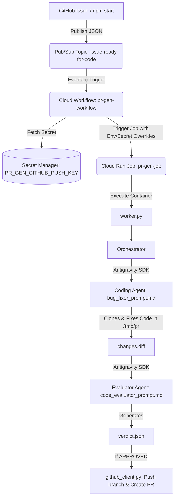

# Project Context & Developer Reference Manual

This document serves as the complete, authoritative reference guide for the **Gemini CLI Issue-to-PR Code Generation Pipeline** (`gcli-intern-project-2026`). It contains all necessary architectural details, operational workflows, troubleshooting rules, and service definitions required for a new agent or developer to assist with this codebase.

---

## 🚨 Critical Rules & Assertions for AI Agents

1. **STRICT WORKSPACE BOUNDARY**:
   * **NEVER edit files outside of the `cloudrun/code_generator/` directory.**
   * All orchestrator logic, prompt templates, container build configurations, deployment scripts, and test payloads reside entirely within `cloudrun/code_generator/`.
2. **GCLOUD CLI PROJECT SCOPE**:
   * The local development terminal defaults to `cloudtop-prod-us-east` if `--project` is omitted.
   * **Always append `--project=gcli-intern-project-2026` to all `gcloud` commands.**
3. **DO NOT MODIFY PERMISSION ROLES ON 403 ERRORS**:
   * If a `403 Permission Denied` error occurs (e.g. `aiplatform.endpoints.predict`, `storage.objects.get`, or `workflows.invoker`), **DO NOT attempt to elevate roles (e.g. DO NOT upgrade `objectViewer` to `Admin`)**.
   * See [The 403 Errors & The Reaper](#-the-403-errors--the-reaper) below for the exact root cause and fix.

---

## 💀 The 403 Errors & The Reaper

### What is the Reaper?
The GCP project `gcli-intern-project-2026` runs in an intern sandbox environment governed by an automated background **Reaper process**. The Reaper enforces a periodic security compliance sweep that automatically strips custom or newly granted IAM role bindings from service accounts during idle times or long-running test cycles.

### Root Cause of 403 Errors
When an orchestration run fails with a 403 error:
* `aiplatform.endpoints.predict denied`: The Reaper removed `roles/aiplatform.user` or `roles/cloudaicompanion.user` from `code-gen-job-execution-sa`.
* `storage.objects.get denied`: The Reaper removed `roles/storage.objectViewer` or `roles/artifactregistry.writer` from `279944320243-compute@developer.gserviceaccount.com`.
* `workflows.invoker denied`: The Reaper removed `roles/workflows.invoker` from `triaged-issue-ingestion`.

### The Solution
When a 403 error happens, **do not change the code or alter role definitions**. Simply re-run the permissions provisioning script to restore all IAM role bindings:
```bash
cd cloudrun/code_generator
./setup_permissions.sh gcli-intern-project-2026
```

---

## 🏗️ High-Level System Architecture

The project implements an autonomous, event-driven AI agent pipeline that receives triaged GitHub issue specifications, generates code patches using headless Gemini agents in a sandbox, evaluates the changes against linters/tests, and automatically creates a Pull Request.

### End-to-End Workflow Diagram


### Key Architectural Phases
1. **Triggering**: A message containing the issue spec JSON is published to the Pub/Sub topic `issue-ready-for-code`.
2. **Workflow Orchestration**: Eventarc trigger `trigger-pr-generator` routes the Pub/Sub message to Cloud Workflow `pr-gen-workflow`, running under the service account `triaged-issue-ingestion@gcli-intern-project-2026.iam.gserviceaccount.com`.
3. **Secret Access**: The workflow reads `PR_GEN_GITHUB_PUSH_KEY` from Secret Manager and launches Cloud Run Job `pr-gen-job`.
4. **Execution & Dual-Agent Loop**:
   * `pr-gen-job` runs under identity `code-gen-job-execution-sa@gcli-intern-project-2026.iam.gserviceaccount.com`.
   * **Coding Agent**: Uses `bug_fixer_prompt.md` to clone the target repository to `/tmp/pr/gemini-cli-clone`, inspect files, implement bug fixes, and run unit tests.
   * **Evaluator Agent**: Uses `code_evaluator_prompt.md` to clone repository to `/tmp/eval/gemini-cli-clone`, apply `changes.diff`, run lint checks, and output `verdict.json`.
5. **PR Creation**: If the verdict is `APPROVED`, `github_client.py` pushes the branch to `joneba-google/gemini-cli-clone` and submits a Pull Request.

---

## 🛠️ Standard Developer Workflow & Commands

All commands should be executed from the `cloudrun/code_generator/` directory.

### 1. Provision / Restore Permissions
Run this whenever permissions have been stripped by the Reaper or a 403 error occurs:
```bash
./setup_permissions.sh gcli-intern-project-2026
```

### 2. Update and Deploy the Pipeline
Run this after making any edits to Python files, prompt templates, `Dockerfile`, or `workflow.yaml`:
```bash
./update_deployment.sh gcli-intern-project-2026 us-central1
```
*What this script does:*
1. Runs `gcloud builds submit` to build the container and push it to `us-central1-docker.pkg.dev/gcli-intern-project-2026/pr-gen-repo/jetski-worker:latest`.
2. Deploys/updates Cloud Run Job `pr-gen-job`.
3. Deploys Cloud Workflow `pr-gen-workflow`.

### 3. Send a Test Message (Trigger the Pipeline)
Publish `example_firestore.json` to the Pub/Sub topic to initiate an end-to-end run:
```bash
npm start gcli-intern-project-2026
```

### 4. Monitor Cloud Workflow Executions
```bash
# List recent workflow runs
gcloud workflows executions list pr-gen-workflow \
  --location=us-central1 \
  --project=gcli-intern-project-2026 \
  --limit=5

# Describe a specific execution
gcloud workflows executions describe <EXECUTION_ID> \
  --workflow=pr-gen-workflow \
  --location=us-central1 \
  --project=gcli-intern-project-2026
```

### 5. Monitor Cloud Run Job Executions
```bash
# List recent Cloud Run Job runs
gcloud beta run jobs executions list \
  --job=pr-gen-job \
  --region=us-central1 \
  --project=gcli-intern-project-2026 \
  --limit=5

# Describe execution status
gcloud beta run jobs executions describe <EXECUTION_NAME> \
  --region=us-central1 \
  --project=gcli-intern-project-2026
```

### 6. View and Download Execution Logs
```bash
# Stream/Read latest 100 log lines from Cloud Logging
gcloud logging read 'resource.type="cloud_run_job" AND resource.labels.job_name="pr-gen-job" AND labels."run.googleapis.com/execution_name"="<EXECUTION_NAME>"' \
  --project=gcli-intern-project-2026 \
  --limit=100 \
  --order=asc \
  --format="value(textPayload)"

# Download full execution log to a local file
gcloud logging read 'resource.type="cloud_run_job" AND resource.labels.job_name="pr-gen-job" AND labels."run.googleapis.com/execution_name"="<EXECUTION_NAME>"' \
  --project=gcli-intern-project-2026 \
  --limit=2000 \
  --order=asc \
  --format="value(textPayload)" > execution_logs.txt
```

---

## 📁 File Breakdown (`cloudrun/code_generator/`)

| File / Directory | Purpose |
| :--- | :--- |
| **`Dockerfile`** | Container definition for `pr-gen-job`. Installs Node.js 20, Python 3.13, Git, npm CLI tools, and Antigravity Agent binaries. |
| **`package.json`** | NPM configuration containing `@google-cloud/pubsub` dependencies and the `npm start` trigger script. |
| **`publish_test_message.ts`** | TypeScript script invoked by `npm start` that parses `example_firestore.json` and publishes it to `issue-ready-for-code`. |
| **`example_firestore.json`** | Sample Firestore issue document containing the task description, issue title, repository URL, and test reproduction hints. |
| **`setup_permissions.sh`** | Provisions service accounts and grants IAM roles across Pub/Sub, Workflows, Cloud Run, Secret Manager, Storage, and Vertex AI. |
| **`update_deployment.sh`** | Automates Cloud Build image compilation, Cloud Run Job deployment (`pr-gen-job`), and Workflow deployment (`pr-gen-workflow`). |
| **`workflow.yaml`** | Google Cloud Workflow definition. Receives Pub/Sub events, decodes payloads, accesses `PR_GEN_GITHUB_PUSH_KEY`, and triggers `pr-gen-job`. |
| **`job.yaml`** | Cloud Run Job specification declaring 8Gi RAM, 2 CPUs, 3600s timeout, environment variables, and secret references. |
| **`agent_prompts/bug_fixer_prompt.md`** | System instructions for the **Coding Agent**. Instructs it to read the issue spec, inspect code, modify files, and run tests. |
| **`agent_prompts/code_evaluator_prompt.md`** | System instructions for the **Evaluator Agent**. Instructs it to inspect `changes.diff`, run lint checks, and generate `verdict.json`. |
| **`agent_prompts/code_revision_prompt.md`** | System instructions for the Revision loop if the Evaluator requests code corrections. |
| **`code_generation_orchestrator/worker.py`** | Main entrypoint for the Cloud Run container. Configures logging filters (dropping noisy `RAW WS MSG` logs) and executes the orchestrator. |
| **`code_generation_orchestrator/orchestrator.py`** | Core orchestration engine. Manages the dual-agent loop, checks verdicts, and invokes `github_client.py`. |
| **`code_generation_orchestrator/agent_runner.py`** | Antigravity SDK connection wrapper. Configures `LocalAgentConfig` with explicit `workspaces=[repo_path]` to prevent sandbox policy denials. |
| **`code_generation_orchestrator/config.py`** | Environmental configuration parser (`FIRESTORE_DOC`, `REPO_URL`, `GIT_TOKEN`, `MODEL_NAME`, `GOOGLE_CLOUD_PROJECT`). |
| **`code_generation_orchestrator/command_executor.py`** | Subprocess helper for executing shell commands and tests synchronously or asynchronously. |
| **`code_generation_orchestrator/github_client.py`** | GitHub API wrapper for creating branches, committing patches, and opening Pull Requests. |
| **`code_generation_orchestrator/preflight_filter.py`** | Parses test runner output to filter out known environment-specific root test failures. |

---

## ☁️ Google Cloud Services & Infrastructure Map

### 1. Active Production Services & Resources

| Service Name / ID | GCP Service Type | Purpose |
| :--- | :--- | :--- |
| **`triaged-issue-ingestion`** | IAM Service Account | Identity for `pr-gen-workflow` & Eventarc trigger. (`triaged-issue-ingestion@gcli-intern-project-2026.iam.gserviceaccount.com`). |
| **`code-gen-job-execution-sa`** | IAM Service Account | Runtime identity for `pr-gen-job`. Has Vertex AI (`roles/aiplatform.user`), logging, and Secret Manager access. |
| **`pr-gen-job`** | Cloud Run Job (`us-central1`) | Headless dual-agent code generation & evaluation worker job. |
| **`pr-gen-workflow`** | Cloud Workflow (`us-central1`) | Workflow triggered by Eventarc that coordinates secret fetching and Cloud Run Job execution. |
| **`PR_GEN_GITHUB_PUSH_KEY`** | Secret Manager Secret | GitHub Personal Access Token (PAT) used by the orchestrator to push branches and create PRs. |
| **`pr-gen-repo`** | Artifact Registry (`us-central1`) | Docker repository storing `jetski-worker:latest` container images. |
| **`trigger-pr-generator`** | Eventarc Trigger (`us-central1`) | Listens to Pub/Sub topic `issue-ready-for-code` and triggers `pr-gen-workflow`. |
| **`issue-ready-for-code`** | Pub/Sub Topic | Ingestion topic receiving triaged issue payloads. |

### 2. Supporting & Auxiliary Project Resources

| Resource Name | GCP Type | Purpose |
| :--- | :--- | :--- |
| **`incoming-issues`** | Pub/Sub Topic | Webhook ingestion topic for raw GitHub issues. |
| **`incoming-issues-dlq`** | Pub/Sub Topic | Dead-letter queue for unprocessable incoming issues. |
| **`egress-actions`** | Pub/Sub Topic | Outgoing webhook/notification dispatch topic. |
| **`triage-worker`** | Cloud Run Job (`us-west1`) | Issue triage evaluation worker job. |
| **`triage-worker-workflow`** | Cloud Workflow (`us-west1`) | Workflow orchestrating issue triage. |
| **`egress-service`** | Cloud Run Service (`us-west1`) | GitHub API egress dispatcher. |
| **`gcli-intern-project-git`** | Cloud Run Service (`us-west1`) | Developer Connect integration service. |
| **`GEMINI_API_KEY`** | Secret Manager Secret | API key for Vertex AI / Gemini model calls. |
| **`gs://gcli-intern-project-2026_cloudbuild`** | Cloud Storage Bucket | Temporary staging bucket for Cloud Build source archives. |
| **`gs://triage_debug_logs`** | Cloud Storage Bucket | Storage bucket for triage debug and execution logs. |

---

## 💡 Important Tips for Difficult Tasks in Fresh Context

1. **Antigravity SDK Workspace Scoping**:
   * The Antigravity Agent SDK enforces a `workspace_only` policy by default.
   * In [agent_runner.py](file:///usr/local/google/home/joneba/ssr-prototype/gcli-intern-project/cloudrun/code_generator/code_generation_orchestrator/agent_runner.py), `LocalAgentConfig` **must** include `workspaces=[repo_path]`. Without this, the agent defaults to `/app` and will be blocked from reading or editing files inside `/tmp/pr/gemini-cli-clone`.
2. **Deterministic Preflight Bypass**:
   * In [orchestrator.py](file:///usr/local/google/home/joneba/ssr-prototype/gcli-intern-project/cloudrun/code_generator/code_generation_orchestrator/orchestrator.py), the `_run_regression_checks()` call is commented out and defaults to `approved = True`. This is intentional to prevent local unit test environment discrepancies (e.g. root privilege checks) from blocking PR creation.
3. **Filtering Verbose WebSocket Logs**:
   * [worker.py](file:///usr/local/google/home/joneba/ssr-prototype/gcli-intern-project/cloudrun/code_generator/code_generation_orchestrator/worker.py) attaches `IgnoreRawWsMsgFilter` to the root logger to drop `RAW WS MSG` logs. Keep this filter in place to maintain readable logs in Cloud Logging.
