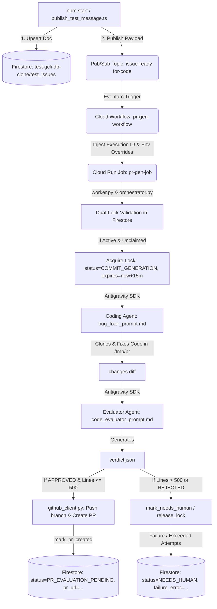

# Project Context & Developer Reference Manual

This document serves as the complete, authoritative reference guide for the **Gemini CLI Issue-to-PR Code Generation Pipeline** (`gcli-intern-project-2026`). It contains all necessary architectural details, operational workflows, Firestore database integration specifications, troubleshooting rules, and service definitions required for a new agent or developer to assist with this codebase.

---

## 🚨 Critical Rules & Assertions for AI Agents

1. **STRICT WORKSPACE BOUNDARY**:
   * **NEVER edit files outside of the `cloudrun/code_generator/` directory.**
   * All orchestrator logic, prompt templates, container build configurations, deployment scripts, and test payloads reside entirely within `cloudrun/code_generator/`.
2. **GCLOUD CLI PROJECT SCOPE**:
   * The local development terminal defaults to `cloudtop-prod-us-east` if `--project` is omitted.
   * **Always append `--project=gcli-intern-project-2026` to all `gcloud` commands.**
3. **DO NOT MODIFY PERMISSION ROLES ON 403 ERRORS**:
   * If a `403 Permission Denied` error occurs (e.g. `aiplatform.endpoints.predict`, `storage.objects.get`, `datastore.databases.get`, or `workflows.invoker`), **DO NOT attempt to elevate roles (e.g. DO NOT upgrade `objectViewer` to `Admin`)**.
   * See [The 403 Errors & The Reaper](#-the-403-errors--the-reaper) below for the exact root cause and fix.

---

## 💀 The 403 Errors & The Reaper

### What is the Reaper?
The GCP project `gcli-intern-project-2026` runs in an intern sandbox environment governed by an automated background **Reaper process**. The Reaper enforces a periodic security compliance sweep that automatically strips custom or newly granted IAM role bindings from service accounts during idle times or long-running test cycles.

### Root Cause of 403 Errors
When an orchestration run fails with a 403 error:
* `aiplatform.endpoints.predict denied`: The Reaper removed `roles/aiplatform.user` or `roles/cloudaicompanion.user` from `code-gen-job-execution-sa`.
* `storage.objects.get denied`: The Reaper removed `roles/storage.objectViewer` or `roles/artifactregistry.writer` from `279944320243-compute@developer.gserviceaccount.com`.
* `workflows.invoker denied`: The Reaper removed `roles/workflows.invoker` from `triaged-issue-ingestion`.
* `datastore.* denied`: The Reaper removed `roles/datastore.user` from `triaged-issue-ingestion` or `code-gen-job-execution-sa`.

### The Solution
When a 403 error happens, **do not change the code or alter role definitions**. Simply re-run the permissions provisioning script to restore all IAM role bindings:
```bash
cd cloudrun/code_generator
./setup_permissions.sh gcli-intern-project-2026
```

---

## 🏗️ High-Level System Architecture

The project implements an autonomous, event-driven AI agent pipeline that receives triaged GitHub issue specifications, synchronizes them to Firestore, enforces transactional concurrency locks, generates code patches using headless Gemini agents in a sandbox, evaluates changes against linters/tests, and automatically creates a Pull Request.

### End-to-End Workflow Diagram


---

## 🗄️ Firestore Schema & Concurrency Dual-Lock Model

The orchestrator interfaces with Firestore (`test-gcli-db-clone/test_issues` or `(default)/issues`) to prevent race conditions and maintain observability.

### Canonical Firestore Document Schema
```json
{
  "status": "UNTRIAGED" | "TRIAGING" | "NEEDS_INFO" | "TRIAGED" | "COMMIT_GENERATION" | "PR_VALIDATION_PENDING" | "PR_EVALUATION_PENDING" | "PR_REVISION" | "NEEDS_HUMAN" | "AUTO_CLOSE",
  "firestore_id": "github_google-gemini_gemini-cli_25693",
  "triage_attempts": 0,
  "workable_spec": {
    "implementation_plan": {
      "files_to_modify": ["packages/core/src/skills/skillLoader.ts"],
      "steps": ["..."]
    },
    "issue_id": "google-gemini/gemini-cli#25693",
    "summary": {
      "context": "...",
      "problem": "...",
      "root_cause": "..."
    },
    "testing_strategy": {
      "expected_behavior": "...",
      "framework": "Vitest",
      "test_file": "packages/core/src/skills/skillLoader.test.ts",
      "verification_steps": ["..."]
    }
  },
  "lock": {
    "holder": "string | null",       // Workflow Execution ID
    "expires_at": "Timestamp | null" // Concurrency timeout timestamp (now + 15 min)
  },
  "created_at": "Timestamp",
  "updated_at": "Timestamp",
  "github_metadata": {
    "owner": "google-gemini",
    "repo": "gemini-cli",
    "issue_number": 25693,
    "title": "Issue title string",
    "pr_url": "https://github.com/..."
  },
  "failure_error": ""
}
```

### Concurrency Dual-Lock Rules & Lifecycle

1. **Step 1 & 2: Dual-Lock Validation (`acquire_lock`)**:
   * Whenever a Cloud Run Job starts, it validates the lock fields in Firestore using the workflow's `execution_id`:
     * **If `lock.expires_at` is `Null` or elapsed**: No worker currently holds the lock &rarr; workflow proceeds.
     * **If `lock.expires_at` has not elapsed, but `lock.holder == current execution_id`**: The previous instance crashed and was re-issued with the same execution ID &rarr; workflow proceeds.
     * **Else (`lock.expires_at` active and `lock.holder != current execution_id`)**: Another active worker is processing this issue. The transaction commits without changes and exits cleanly with `ClaimAction.SKIP`.
   * **Terminal Status Protection**: If the issue status is `NEEDS_INFO`, `NEEDS_HUMAN`, or `AUTO_CLOSE`, `acquire_lock` returns `ClaimAction.SKIP`.
   * **Max Attempts**: If `triage_attempts >= 2`, `acquire_lock` sets status to `NEEDS_HUMAN` and returns `ClaimAction.NEEDS_HUMAN`.

2. **Step 3: State Transition to `COMMIT_GENERATION`**:
   * Upon acquiring the lock, the transaction updates:
     * `status` &rarr; `"COMMIT_GENERATION"`
     * `triage_attempts` &rarr; `triage_attempts + 1`
     * `lock.holder` &rarr; `execution_id`
     * `lock.expires_at` &rarr; `now + 15 minutes` (900 seconds)

3. **Step 8: PR Submission, Size Checks & Status Resolution**:
   * **Approved Patch with <= 500 Modified Lines**:
     * Push branch to GitHub and create Pull Request.
     * Call `mark_pr_created`: Updates `status` to `PR_EVALUATION_PENDING`, records `github_metadata.pr_url`, and resets concurrency lock fields (`lock.holder: null`, `lock.expires_at: null`).
   * **Approved Patch with > 500 Modified Lines**:
     * Deterministically bars the commit from being pushed.
     * Call `mark_needs_human`: Updates `status` to `NEEDS_HUMAN`, records `failure_error: "Commit modifications exceed 500 lines limit"`, and releases the lock.
   * **Rejected / Max Iteration Attempts Exceeded**:
     * Call `release_lock(success=False)`: Sets status to `NEEDS_HUMAN`, records failure message in `failure_error`, and releases concurrency locks.

---

## ☁️ Cloud Workflow Orchestration & Error Catching

The Cloud Workflow definition ([workflow.yaml](file:///usr/local/google/home/joneba/ssr-prototype/gcli-intern-project/cloudrun/code_generator/workflow.yaml)) coordinates the Pub/Sub message reception and Cloud Run Job execution.

### Execution ID Injection
Cloud Workflows dynamically retrieves its execution ID using the standard built-in function:
```yaml
workflow_execution_id: '${sys.get_env("GOOGLE_CLOUD_WORKFLOW_EXECUTION_ID")}'
```
This value is passed into the Cloud Run container overrides under environment variables `EXECUTION_ID` and `GOOGLE_CLOUD_WORKFLOW_EXECUTION_ID`.

### Workflow-Level Exception Catching & Firestore Patching
If the Cloud Run Job crashes, times out, or encounters an unhandled container exception, the workflow's `try/except` block catches the error and executes `googleapis.firestore.v1.projects.databases.documents.patch`:
* Updates `status` to `"NEEDS_HUMAN"`.
* Sets `failure_error` to `"Cloud Run Job execution failed: <error_details>"`.
* Clears concurrency locks (`holder: null`, `expires_at: null`).

---

## 📁 Detailed File & Component Breakdown

| File / Directory | Purpose & Key Details |
| :--- | :--- |
| **`workflow/db/db_interface.py`** | Central Firestore database module. Implements [get_firestore_id](file:///usr/local/google/home/joneba/ssr-prototype/gcli-intern-project/cloudrun/code_generator/workflow/db/db_interface.py#L73-L99) (prioritizing `FIRESTORE_ID` env var), [acquire_lock](file:///usr/local/google/home/joneba/ssr-prototype/gcli-intern-project/cloudrun/code_generator/workflow/db/db_interface.py#L248-L266) (15-min dual-lock validation), [release_lock](file:///usr/local/google/home/joneba/ssr-prototype/gcli-intern-project/cloudrun/code_generator/workflow/db/db_interface.py#L321-L346), [mark_pr_created](file:///usr/local/google/home/joneba/ssr-prototype/gcli-intern-project/cloudrun/code_generator/workflow/db/db_interface.py#L349-L368), [mark_needs_human](file:///usr/local/google/home/joneba/ssr-prototype/gcli-intern-project/cloudrun/code_generator/workflow/db/db_interface.py#L371-L389), and [update_status](file:///usr/local/google/home/joneba/ssr-prototype/gcli-intern-project/cloudrun/code_generator/workflow/db/db_interface.py#L406-L424). |
| **`workflow/db/__init__.py`** | Re-exports all DB helper functions, `IssueStatus` enum, `ClaimAction` enum, and `ReleaseAction` enum. |
| **`example_firestore.json`** | Canonical sample issue document matching the updated schema (`status: TRIAGED`, `firestore_id`, `workable_spec`, `lock`, `github_metadata`, `failure_error`). Used by `npm start` for testing. |
| **`example_firestore_old.json`** | Archived previous format of `example_firestore.json` preserved for reference. |
| **`publish_test_message.ts`** | Dual-action TypeScript script invoked via `npm start`. Given a target JSON file or folder, it checks Firestore database `test-gcli-db-clone` / collection `test_issues`: adds new documents if missing, or overwrites existing documents to match the local file, and then publishes the payload to Pub/Sub topic `issue-ready-for-code`. |
| **`seed_firestore.py`** | Standalone Python CLI utility to upload JSON files to Firestore with configurable database, collection, and project ID arguments. |
| **`workflow.yaml`** | Cloud Workflow definition. Decodes Pub/Sub messages, resolves document ID, retrieves `PR_GEN_GITHUB_PUSH_KEY`, passes `${sys.get_env("GOOGLE_CLOUD_WORKFLOW_EXECUTION_ID")}` to the Cloud Run container, and catches failures to patch Firestore with `NEEDS_HUMAN`. |
| **`update_deployment.sh`** | Automated deployment script. Executes Cloud Build for `jetski-worker:latest`, updates Cloud Run Job (`pr-gen-job`) with 8Gi RAM, 2 CPUs, and Firestore env vars (`FIRESTORE_DATABASE=test-gcli-db-clone`, `FIRESTORE_COLLECTION=test_issues`), and deploys `pr-gen-workflow`. |
| **`setup_permissions.sh`** | Provisions IAM roles across Pub/Sub, Workflows, Cloud Run, Secret Manager, Storage, and Vertex AI. Includes `roles/datastore.user` for both `triaged-issue-ingestion` and `code-gen-job-execution-sa`. |
| **`Dockerfile`** | Container specification for `pr-gen-job`. Installs Node.js 20, Python 3.11, Git, `google-cloud-firestore`, `google-antigravity`, and `google-genai`. Copies `workflow/` into `/app/workflow/`. |
| **`job.yaml`** | Declarative Cloud Run Job specification with resource limits and Firestore environment variables. |
| **`package.json`** | NPM configuration containing `@google-cloud/pubsub`, `@google-cloud/firestore`, `ts-node`, and the `npm start` script. |
| **`workflow/orchestrator.py`** | State machine running the iterative dual-agent loop. Manages Firestore lock validation, 500-line diff limits, git commits, and PR creation. |
| **`workflow/worker.py`** | Container entrypoint configuring logging filters and executing the orchestrator. |
| **`workflow/config.py`** | Environment variable parser (`FIRESTORE_DOC`, `EXECUTION_ID`, `FIRESTORE_ID`, `REPO_URL`, `GIT_TOKEN`). |

---

## 🛠️ Standard Developer Workflow & Commands

All commands should be executed from the `cloudrun/code_generator/` directory.

### 1. Provision / Restore Permissions
Run this whenever permissions have been stripped by the Reaper or a 403 error occurs:
```bash
./setup_permissions.sh gcli-intern-project-2026
```

### 2. Update and Deploy the Entire Pipeline
Run this after making any edits to Python files, prompt templates, `Dockerfile`, or `workflow.yaml`:
```bash
./update_deployment.sh gcli-intern-project-2026 us-central1
```

### 3. Send a Test Message (Sync Firestore & Trigger Pipeline)
Runs `publish_test_message.ts` to upsert `example_firestore.json` into Firestore (`test-gcli-db-clone/test_issues`) and publish it to the Pub/Sub topic:
```bash
npm start gcli-intern-project-2026
```

### 4. Monitor Cloud Workflow Executions
```bash
# List recent workflow runs
gcloud workflows executions list pr-gen-workflow \
  --location=us-central1 \
  --project=gcli-intern-project-2026 \
  --limit=5

# Describe a specific execution
gcloud workflows executions describe <EXECUTION_ID> \
  --workflow=pr-gen-workflow \
  --location=us-central1 \
  --project=gcli-intern-project-2026
```

### 5. Monitor Cloud Run Job Executions
```bash
# List recent Cloud Run Job runs
gcloud beta run jobs executions list \
  --job=pr-gen-job \
  --region=us-central1 \
  --project=gcli-intern-project-2026 \
  --limit=5
```

### 6. View Execution Logs in Cloud Logging
```bash
# Stream/Read latest 100 log lines from Cloud Logging
gcloud logging read 'resource.type="cloud_run_job" AND resource.labels.job_name="pr-gen-job" AND labels."run.googleapis.com/execution_name"="<EXECUTION_NAME>"' \
  --project=gcli-intern-project-2026 \
  --limit=100 \
  --order=asc \
  --format="value(textPayload)"
```
