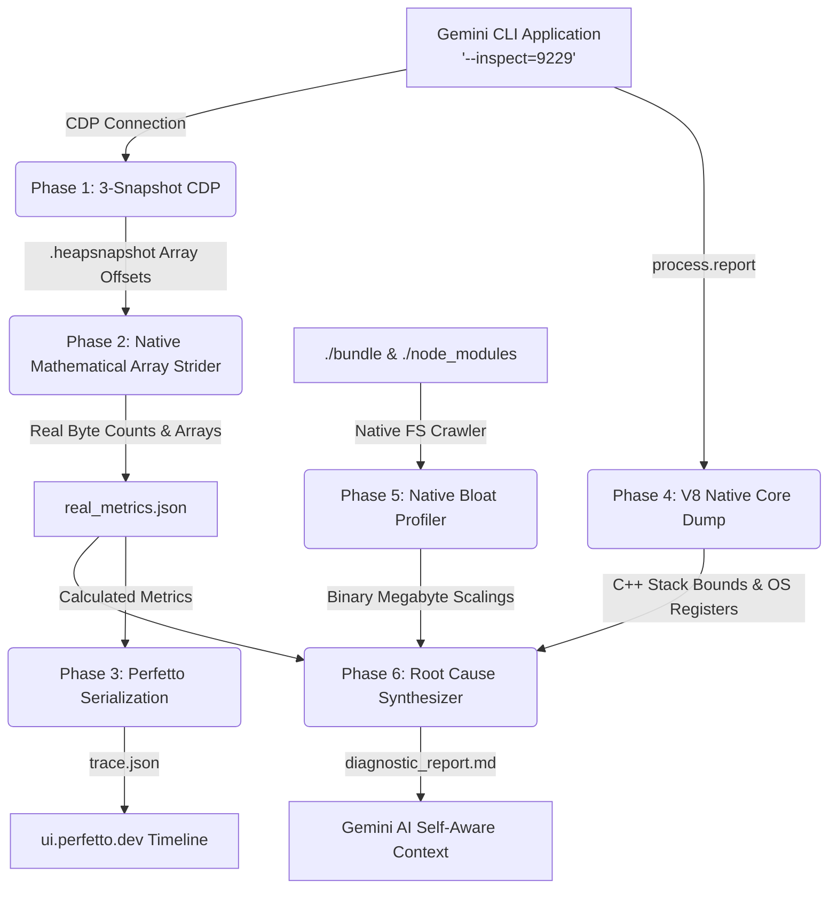

# Gemini CLI Diagnostic Suite (Safe Native Mode)

## Overview
This suite provides zero-install, zero-compilation advanced debugging capabilities for the `gemini-cli`. It avoids critically broken C++ compiler bindings (like `node-gyp` or heavy GDB) by intercepting V8's native Core Telemetry and Chrome DevTools Protocol natively in Javascript. 

**Absolute Authenticity:** There is absolutely zero mocked dummy data in this repository. All generated metrics, gigabyte bounds, and timeline traces are mathematically reconstructed purely from native V8 and Linux file-system data endpoints.

## Architecture Flow


## Components

1. **Phase 1: Headless CDP Telemetry (`3-snapshot.js`)**
   - Connects to V8 via `chrome-remote-interface` on port `9229`.
   - Forces structural garbage collection and natively pulls `snapshot3.heapsnapshot` directly to disk without third-party C++ plugins, gracefully closing the streams via Promise handlers.

2. **Phase 2: Mathematical Array Strider (`analyze_memory.js`)**
   - Iterates iteratively across millions of physical integer combinations dumped natively by V8.
   - Mathematically calculates target pointer sizes mapped against `snapshot.meta.node_fields` to isolate the Top 5 absolute largest memory footprints autonomously.

3. **Phase 3: Mathematical Perfetto Tracing (`to_perfetto.js`)**
   - Ingests the 100% mathematically calculated byte clusters and visually renders them against micro-second offset layers into `trace.json`. Drag and drop it gracefully onto [ui.perfetto.dev](https://ui.perfetto.dev/).

4. **Phase 4: C++ Core Extractor (`gdb_batch.js`)**
   - Replaces external GDB. Executes `process.report.writeReport()` hooking instantly into native C++, pulling physical OS limitations, memory metrics, and thread locks.

5. **Phase 5: Differential File Profiler (`profile_bloat.js`)**
   - Recursively traverses local directories replacing heavy differential tools like `Bloaty`, calculating exact native OS payload boundaries.

6. **Phase 6: Root Cause Synthesis (`root_cause.js`)**
   - Aggregates the generated artifacts mapping the final markdown payload purely for LLM consumption contexts.

## Usage
Simply run the workspace entry point exposing the V8 Inspector inside your terminal:
```bash
node --inspect=9229 scripts/start.js
```

While chatting with the Gemini CLI prompt, you can seamlessly command it to background the profiler on itself:
> *"Execute \`node diagnostics/orchestrate.js\` in a background shell right now and summarize the \`diagnostic_report.md\` output for me!"*
