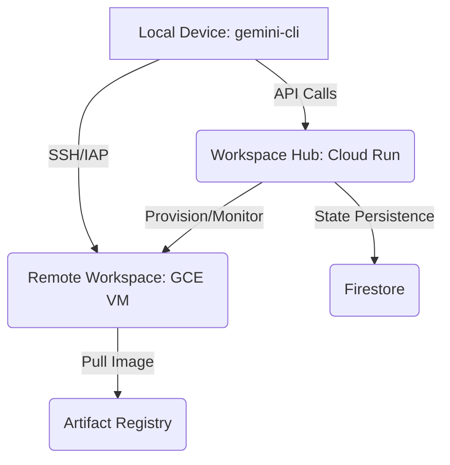

# Gemini CLI Workspaces: High-Level Architecture Overview

## 1. Introduction
Gemini CLI Workspaces provides a distributed, persistent, and multi-device compute layer for `gemini-cli`. It enables developers to provision, manage, and "teleport" into remote execution environments hosted on GCP.

## 2. Core Vision
- **Persistence:** Sessions survive local device disconnects or terminal restarts.
- **Portability:** Start a task on one device (e.g., Laptop) and seamlessly re-attach from another (e.g., Surface/Tablet).
- **Scale:** Offload heavy compute (builds, tests, evals) to remote GCE instances.
- **Consistency:** Pre-built container images ensure every workspace has the exact same tools and environment.

## 3. High-Level Architecture
The architecture is centered around a **Workspace Hub**, which acts as the fleet manager, and **Remote Workspaces**, which are containerized GCE VMs.

## 4. Multi-Tenancy Models
The Workspace Hub is a self-service, deployable feature that supports several grains of multi-tenancy:

### A. Per-User (Personal Cloud)
- **Deployment:** Each developer deploys their own Workspace Hub in a personal GCP project.
- **Isolation:** Absolute. All VMs and secrets belong to the individual.

### B. Per-Team (Shared Infrastructure)
- **Deployment:** A single Hub managed by a team/org.
- **Tenancy:** Identity-based partitioning. The Hub filters instances based on the authenticated user's Google ID.
- **Isolation:** Instances are tagged with `owner_id`. Users can only manage their own environments.

### C. Per-Repository (Project Environments)
- **Deployment:** Tied to a specific repo (e.g., for PR reviews or ephemeral test envs).
- **Tenancy:** Project-context isolation. Users can connect to any workspace associated with the repository context.

## 5. Multi-Device Portability
Since the Workspace Hub stores the state centrally (Firestore), any device with the authenticated `gemini-cli` can:
1.  Query the Hub for the list of active workspaces.
2.  Initiate a connection to a remote VM started by *another* device.
3.  Sync its local `~/.gemini` settings and GitHub PAT to ensure a consistent experience on the remote side.
