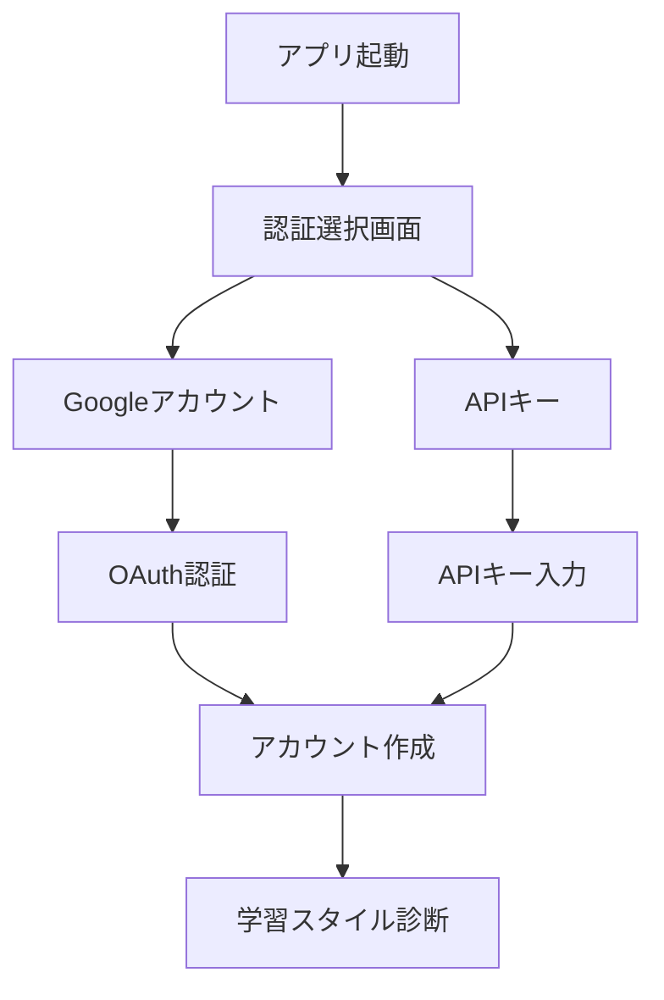
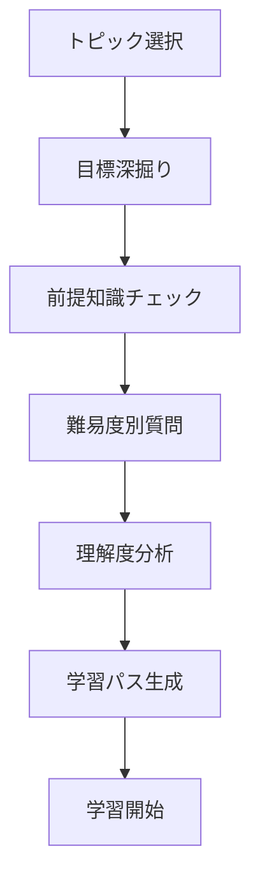
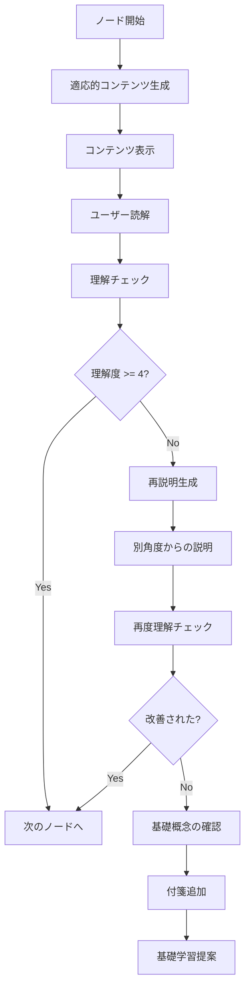
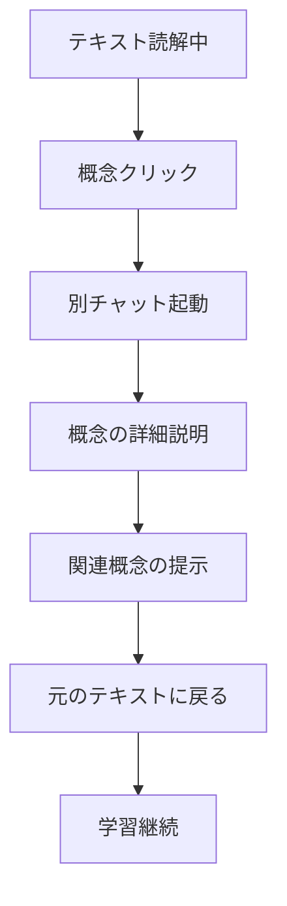
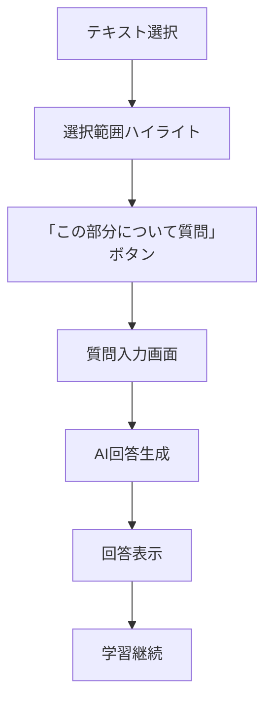
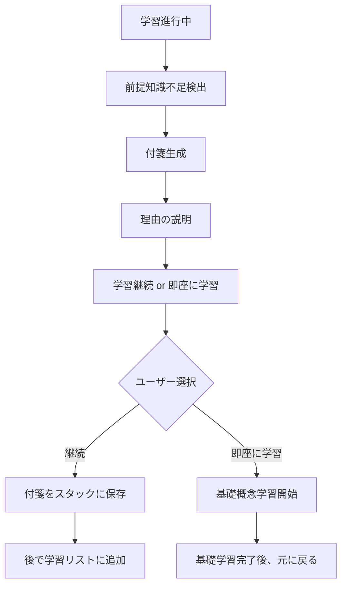
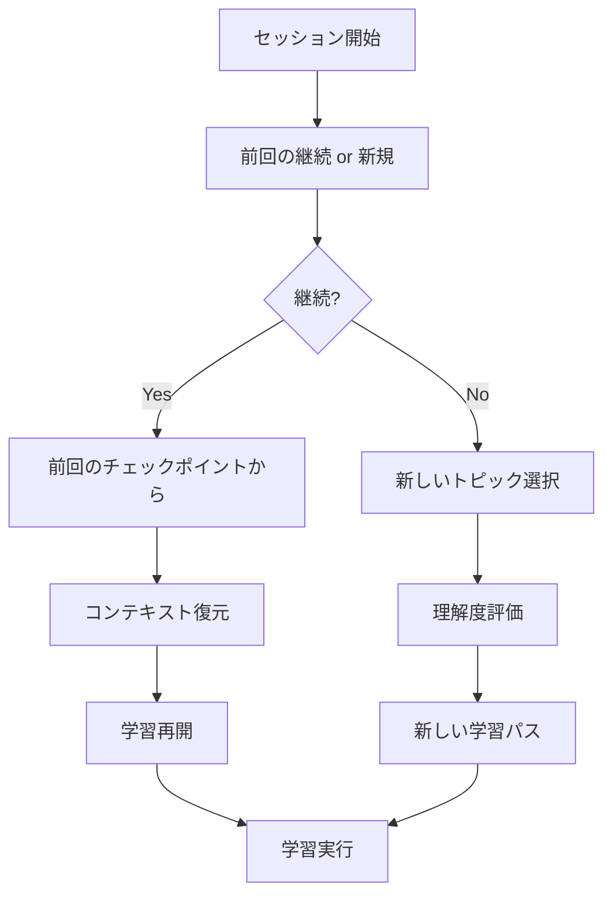
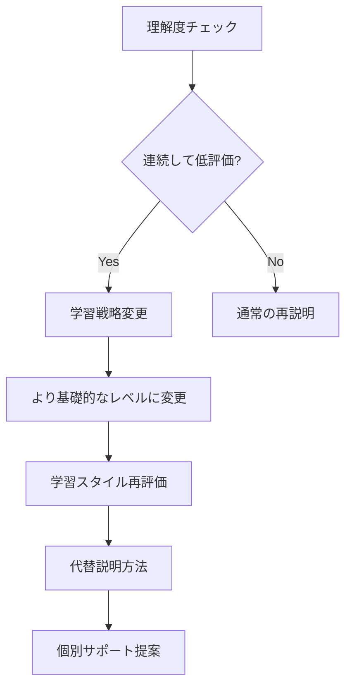
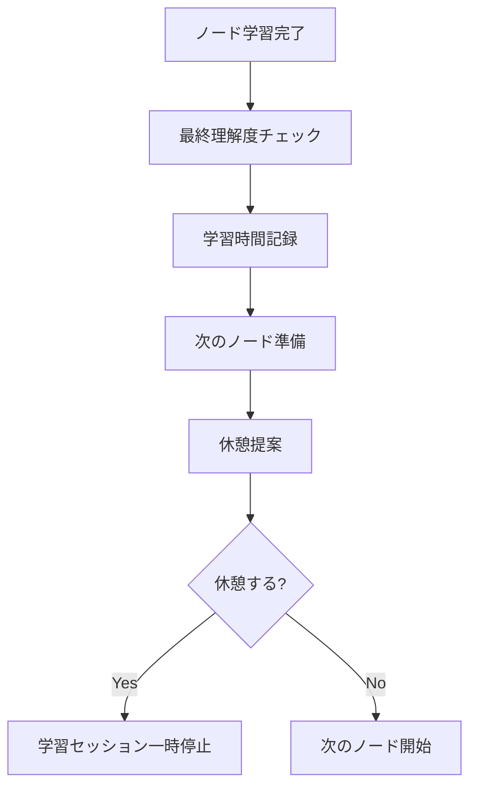

# Sensei-AI ユーザーフロー設計

## 概要

Sensei-AIにおけるユーザーの学習体験を、段階別に詳細に定義します。各フローは、ユーザーの理解度に適応し、最適な学習体験を提供することを目的としています。

## 1. 初回利用フロー

### 1.1 アカウント作成・認証


**具体的な流れ:**
1. **認証方法選択**
   - 「Googleアカウントでログイン」
   - 「APIキーを使用」
   - 認証完了後、基本プロフィール作成

2. **学習スタイル診断（5分）**
   ```
   質問例:
   - 新しいことを学ぶ時、どちらを好みますか？
     A) まず全体像を理解してから詳細に入る
     B) 具体例から始めて徐々に理論を学ぶ
   
   - 説明の長さはどれくらいが好みですか？
     A) 簡潔で要点のみ
     B) 適度に詳しく
     C) 詳細で例が豊富
   ```

### 1.2 初回学習トピック設定
```
画面: 学習したいトピックを教えてください
入力例: "線形代数を学びたい"

→ AI: 「線形代数を学ぶ理由を教えてください」
回答例: "機械学習を理解するため"

→ AI: 「機械学習のどの分野に興味がありますか？」
→ 目標の明確化を継続
```

## 2. 学習開始フロー

### 2.1 理解度評価フェーズ


**詳細ステップ:**

1. **目標深掘り（3-5分）**
   ```
   AI: 「線形代数を学ぶ最終的な目標は何ですか？」
   ユーザー: "機械学習アルゴリズムを理解したい"
   
   AI: 「どのくらいの期間で習得したいですか？」
   AI: 「どの程度の深さまで学びたいですか？」
   ```

2. **前提知識チェック（5-10分）**
   ```
   段階的質問:
   - 基礎数学: "方程式 2x + 3 = 7 を解けますか？"
   - 関数の概念: "f(x) = x² + 1 のグラフをイメージできますか？"
   - ベクトルの概念: "ベクトルという言葉を聞いたことがありますか？"
   ```

3. **難易度別評価（10-15分）**
   ```
   beginner_questions:
   - "2つの数の組み合わせ (3, 4) をベクトルと呼びます。これは理解できますか？"
   
   intermediate_questions:
   - "ベクトル (2, 3) と (1, 4) の内積を計算できますか？"
   
   advanced_questions:
   - "線形変換の概念について説明できますか？"
   ```

### 2.2 学習パス生成
```typescript
// 生成される学習パス例
const linearAlgebraPath = {
  goal: "機械学習に必要な線形代数の習得",
  estimatedHours: 40,
  userLevel: "beginner-intermediate",
  nodes: [
    {
      title: "ベクトルの基本概念",
      estimatedMinutes: 30,
      concepts: ["ベクトル", "成分", "大きさ"],
      difficulty: "beginner"
    },
    {
      title: "ベクトルの演算",
      estimatedMinutes: 45,
      concepts: ["加法", "スカラー倍", "内積"],
      difficulty: "beginner"
    },
    {
      title: "行列の導入",
      estimatedMinutes: 60,
      concepts: ["行列", "行列演算", "転置"],
      difficulty: "intermediate"
    }
    // ... 続く
  ]
};
```

## 3. 学習実行フロー

### 3.1 コンテンツ学習フェーズ


**具体例: ベクトル概念の説明**

```markdown
# ベクトルの基本概念

## あなたの理解レベルに合わせた説明

ベクトルは、**方向と大きさ**を持つ量です。

### 日常の例で理解しよう
- あなたが「東に3km歩く」と言った場合
  - 方向: 東
  - 大きさ: 3km
  - これがベクトルの考え方です

### 数学的な表現
ベクトルは括弧を使って (3, 4) のように書きます。
- 最初の数字: x方向の大きさ
- 2番目の数字: y方向の大きさ

### 視覚的なイメージ
```
    ↑ y軸
    |
    |  • (3,4)
    | /|
    |/
────┼────→ x軸
    |
```

[概念チェックポイント]
```

### 3.2 チェックポイント実行
```typescript
interface CheckpointFlow {
  trigger: "paragraph_end" | "concept_introduction" | "manual";
  questions: [
    {
      type: "self_assessment",
      question: "ベクトルの基本概念の理解度を5段階で評価してください",
      options: [
        "1 - 全くわからない",
        "2 - あまりわからない", 
        "3 - なんとなくわかる",
        "4 - だいたいわかる",
        "5 - 完全に理解した"
      ]
    }
  ];
}

// 理解度3以下の場合の追加質問
const clarificationQuestions = [
  "どの部分が最も難しく感じましたか？",
  "「方向と大きさ」という概念は理解できましたか？",
  "具体例の「東に3km歩く」は納得できましたか？"
];
```

### 3.3 適応的再説明
```markdown
# 別角度からの説明（理解度3以下の場合）

## より身近な例で考えてみましょう

### 荷物の配達で考える
- 配達員が「A地点からB地点に荷物を運ぶ」
- 重要なのは:
  1. **どの方向**に行くか (北、南、東、西)
  2. **どのくらいの距離**か (1km、2km、3km)

### 座標で表現すると
- スタート地点を (0, 0) とする
- 「東に3、北に4」移動 = ベクトル (3, 4)

### なぜ重要？
機械学習では、データの特徴を方向と大きさで表現することが多いです。
例: 身長と体重のデータ → ベクトル (身長, 体重)
```

## 4. 高度な学習機能フロー

### 4.1 概念ハイパーテキスト


**実装例:**
```markdown
線形代数では、[ベクトル](#concept-vector)と[行列](#concept-matrix)が重要です。

// ユーザーが「ベクトル」をクリック
→ 新しいチャット画面で詳細説明
→ 「戻る」で元の学習に復帰
```

### 4.2 範囲選択チャット


**ユーザー操作:**
```
1. テキストの一部を選択
   選択例: "ベクトルは括弧を使って (3, 4) のように書きます"

2. 質問入力
   例: "なぜ括弧を使うのですか？"

3. 適応的回答生成
   → ユーザーの理解レベルに応じた説明
```

### 4.3 付箋機能フロー


**具体例:**
```
学習中: "固有値と固有ベクトル"

AI検出: ユーザーが「行列式」を理解していない

付箋生成: 
┌─────────────────────────────┐
│ 📌 付箋が追加されました          │
│                             │
│ トピック: 行列式              │
│ 理由: 固有値の計算に必要       │
│ 推定時間: 30分              │
│                             │
│ [今すぐ学習] [後で学習]        │
└─────────────────────────────┘
```

## 5. 複数トピック管理フロー

### 5.1 トピック切り替え
```typescript
// スラッシュコマンド例
const topicCommands = {
  "/topics": () => showTopicList(),
  "/switch 線形代数": () => switchToTopic("線形代数"),
  "/switch 日本の歴史": () => switchToTopic("日本の歴史"),
  "/new 微積分": () => startNewTopic("微積分")
};

// 表示される画面
const topicListView = `
現在の学習トピック:
┌─────────────────────────────────────┐
│ 📊 線形代数 (進捗: 65%)              │
│   └── 最後の学習: 2時間前            │
│                                    │
│ 📚 日本の歴史 (進捗: 30%)            │
│   └── 最後の学習: 1日前             │
│                                    │
│ 🧮 微積分 (進捗: 10%)               │
│   └── 最後の学習: 3日前             │
└─────────────────────────────────────┘
`;
```

### 5.2 学習セッション管理


## 6. エラー・例外処理フロー

### 6.1 理解困難時の対応


### 6.2 学習中断・復帰
```typescript
// 自動保存機能
const autoSave = {
  interval: 30000, // 30秒ごと
  triggers: [
    "checkpoint_completed",
    "content_generated", 
    "user_input_received"
  ],
  
  saveData: {
    currentPosition: "node-id",
    readingProgress: 0.75,
    partialUnderstanding: {},
    timeSpent: 1200 // 20分
  }
};

// 復帰時の処理
const resumeFlow = `
おかえりなさい！

前回の学習状況:
- トピック: 線形代数
- 進捗: ベクトルの演算 (75%完了)
- 最後のチェックポイント: 理解度4

[続きから学習] [復習から開始] [新しいトピック]
`;
```

## 7. 学習完了・評価フロー

### 7.1 ノード完了


### 7.2 トピック完了
```markdown
# 🎉 おめでとうございます！

「線形代数」の学習が完了しました。

## 学習統計
- 総学習時間: 42時間15分
- 完了したノード: 24個
- 平均理解度: 4.2/5
- チェックポイント通過率: 85%

## 習得した概念
✅ ベクトルの基本操作
✅ 行列の演算
✅ 線形変換
✅ 固有値・固有ベクトル
✅ 主成分分析

## 次のステップ提案
1. 🤖 機械学習の基礎 (推奨)
2. 📊 統計学の基礎
3. 🧮 微積分の復習

## 振り返り
最も難しかった概念: 固有ベクトル
最も興味深かった概念: 主成分分析
```

この詳細なユーザーフロー設計により、Sensei-AIは各ユーザーの学習スタイルと理解度に完全に適応した、パーソナライズされた学習体験を提供できます。