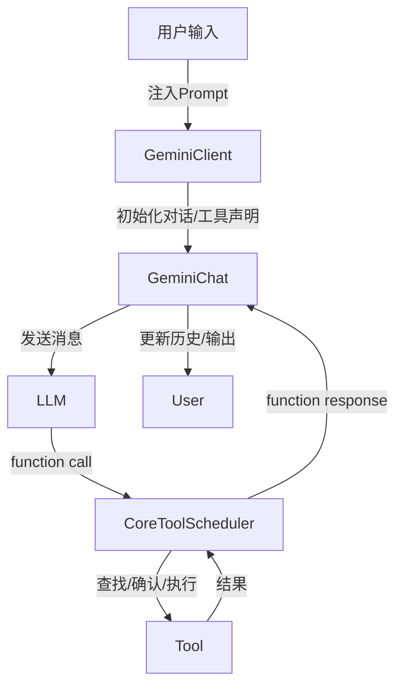

# @/core 目录功能分层详解

本文件详细梳理了 core 目录下 prompt&LLM 以及工具调用/选择的实现机制，分为架构层次、主要流程、关键模块与交互说明。

---

## 1. 总体架构分层

- **配置层（Config）**
  - 负责全局参数、模型、工具注册、目录、代理、用户记忆等配置。
  - 主要文件：`config/config.ts`
- **核心逻辑层（Core）**
  - LLM 客户端、对话管理、Prompt 生成、Token 限制、回合管理、工具调度。
  - 主要文件：`core/client.ts`、`core/geminiChat.ts`、`core/prompts.ts`、`core/coreToolScheduler.ts`、`core/turn.ts`
- **工具层（Tools）**
  - 具体工具实现（如读写文件、搜索、shell、MCP工具等）、工具注册与发现。
  - 主要文件：`tools/` 目录下各工具实现、`tools/tool-registry.ts`、`tools/tools.ts`
- **服务层（Services）**
  - 文件发现、Git服务等。
  - 主要文件：`services/fileDiscoveryService.ts`、`services/gitService.ts`
- **辅助层（Utils）**
  - 路径、校验、错误处理、文件内容处理等。
  - 主要文件：`utils/` 目录

---

## 2. Prompt & LLM 交互机制

### 2.1 Prompt 生成与系统指令
- 由 `core/prompts.ts` 的 `getCoreSystemPrompt` 生成，内容包括：
  - 交互规范、代码风格、工具使用、操作流程、输出格式、项目约束等。
  - 支持自定义 system prompt（通过环境变量或配置文件）。
- Prompt 会在对话初始化时注入到 LLM 的历史记录中，作为系统指令。

### 2.2 LLM 客户端与对话管理
- `core/client.ts`（GeminiClient）：
  - 初始化 LLM 生成器与对话（GeminiChat），管理历史、环境上下文、模型选择。
  - 支持全量上下文注入（如读取全部文件内容）。
- `core/geminiChat.ts`：
  - 负责与 LLM 的消息流交互，管理历史、流式响应、API 日志、错误处理。
  - 支持"思考"内容（thoughts）与结构化响应。
- `core/turn.ts`：
  - 管理一次完整的 agentic 回合，处理 LLM 响应、工具调用、事件流。

---

## 3. 工具调用与选择机制

### 3.1 工具注册与发现
- 工具通过 `tools/tool-registry.ts` 注册，支持：
  - 内置工具（如读写文件、搜索、shell 等）。
  - 动态发现工具（如通过命令行、MCP 服务器自动发现并注册）。
- 每个工具实现自定义参数校验、执行逻辑、确认机制。

### 3.2 工具声明与 LLM 集成
- 工具以 FunctionDeclaration 形式暴露给 LLM，LLM 可通过 function call 方式请求工具。
- `GeminiClient` 初始化时，将所有工具声明注入到 LLM 对话上下文。

### 3.3 工具调度与执行
- `core/coreToolScheduler.ts` 负责：
  - 解析 LLM 的工具调用请求，调度对应工具。
  - 支持工具调用的确认、执行、状态跟踪、输出更新、错误处理。
  - 支持多种工具调用状态（待确认、执行中、成功、失败、取消等）。
- 工具执行流程：
  1. LLM 生成 function call 请求。
  2. ToolScheduler 解析请求，查找并调度工具。
  3. 工具参数校验、可选用户确认。
  4. 工具执行，结果回传 LLM。
  5. 支持流式输出、错误处理、回合管理。

### 3.4 典型工具实现
- 读文件（read-file.ts）：校验路径、范围，读取内容，支持分页。
- 编辑文件（edit.ts）：精确文本替换，严格参数校验，支持多处替换。
- Shell 命令（shell.ts）：支持目录、命令校验、输出捕获、进程管理。
- MCP 工具（mcp-client.ts, mcp-tool.ts）：支持远程工具发现与调用，支持信任与确认。

---

## 4. 关键交互流程图（简要）

---

## 5. 总结
- @/core 目录实现了 LLM 驱动的智能 CLI agent，具备强大的 prompt 管理、对话上下文、工具注册与调度、动态工具发现、MCP 扩展等能力。
- 架构分层清晰，便于扩展和维护。
