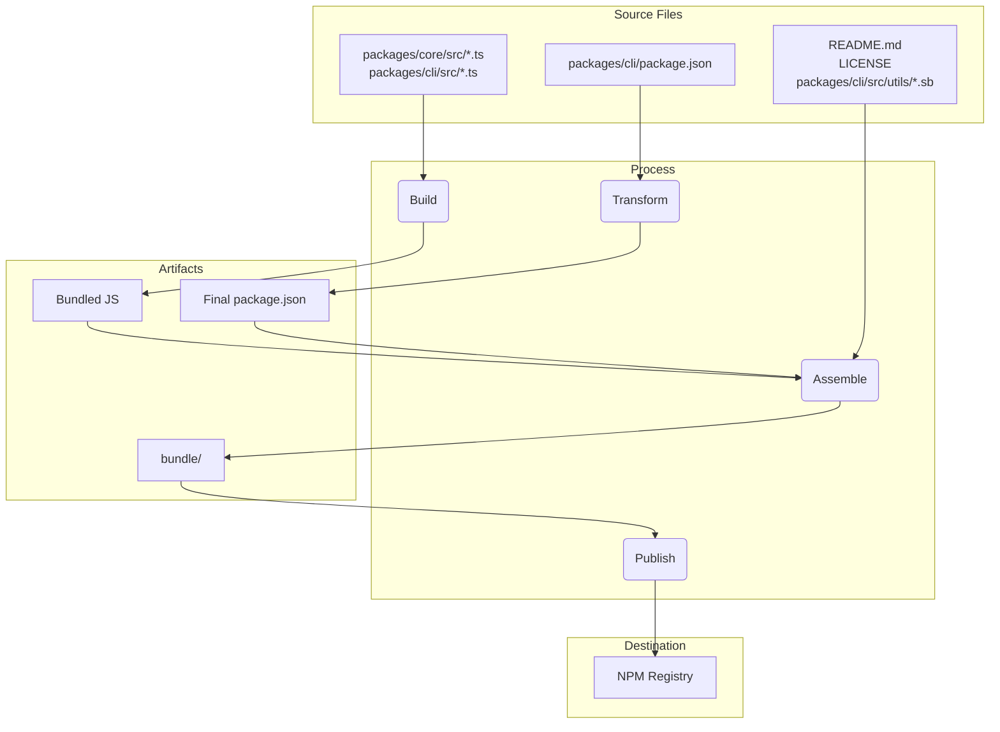

# Gemini CLI Releases

## Release Cadence and Tags

We will follow https://semver.org/ as closely as possible but will call out when or if we have to deviate from it. Our weekly releases will be minor version increments and any bug or hotfixes between releases will go out as patch versions on the most recent release.

### Preview

New preview releases will be published each week at UTC 2359 on Tuesdays. These releases will not have been fully vetted and may contain regressions or other outstanding issues. Please help us test and install with `preview` tag.

```bash
npm install -g @google/gemini-cli@preview
```

### Stable

- New stable releases will be published each week at UTC 2000 on Tuesdays, this will be the full promotion of last week's release + any bug fixes and validations. Use `latest` tag.

```bash
npm install -g @google/gemini-cli@latest
```

### Nightly

- New releases will be published each week at UTC 0000 each day, This will be all changes from the main branch as represted at time of release. It should be assumed there are pending validations and issues. Use `nightly` tag.

```bash
npm install -g @google/gemini-cli@nightly
```

# Release Process

Our release cadence is new releases are sent to a preview channel for a week and then promoted to stable after a week. Version numbers will follow SemVer with weekly releases incrementing the minor version. Patches and bug fixes to both preview and stable releases will increment the patch version.

## Nightly Release

Each night at UTC 0000 we will auto deploy a nightly release from `main`. This will be a version of the next production release, x.y.z, with the nightly tag.

## Weekly Release Promotion

Each Tuesday, the on-call engineer will trigger the "Promote Release" workflow. This single action automates the entire weekly release process:

1.  **Promotes Preview to Stable:** The workflow identifies the latest `preview` release and promotes it to `stable`. This becomes the new `latest` version on npm.
2.  **Promotes Nightly to Preview:** The latest `nightly` release is then promoted to become the new `preview` version.
3.  **Prepares for next Nightly:** A pull request is automatically created and merged to bump the version in `main` in preparation for the next nightly release.

This process ensures a consistent and reliable release cadence with minimal manual intervention.

### Source of Truth for Versioning

To ensure the highest reliability, the release promotion process uses the **NPM registry as the single source of truth** for determining the current version of each release channel (`stable`, `preview`, and `nightly`).

1.  **Fetch from NPM:** The workflow begins by querying NPM's `dist-tags` (`latest`, `preview`, `nightly`) to get the exact version strings for the packages currently available to users.
2.  **Cross-Check for Integrity:** For each version retrieved from NPM, the workflow performs a critical integrity check:
    - It verifies that a corresponding **git tag** exists in the repository.
    - It verifies that a corresponding **GitHub Release** has been created.
3.  **Halt on Discrepancy:** If either the git tag or the GitHub Release is missing for a version listed on NPM, the workflow will immediately fail. This strict check prevents promotions from a broken or incomplete previous release and alerts the on-call engineer to a release state inconsistency that must be manually resolved.
4.  **Calculate Next Version:** Only after these checks pass does the workflow proceed to calculate the next semantic version based on the trusted version numbers retrieved from NPM.

This NPM-first approach, backed by integrity checks, makes the release process highly robust and prevents the kinds of versioning discrepancies that can arise from relying solely on git history or API outputs.

## Manual Releases

For situations requiring a release outside of the regular nightly and weekly promotion schedule (e.g., a critical hotfix), you can use the `Release: Manual` workflow. This workflow provides a direct way to publish a specific version from any branch, tag, or commit SHA.

This process replaces the previous multi-step patching procedure, offering a single, streamlined workflow for all manual release needs.

### How to Create a Manual Release

1.  Navigate to the **Actions** tab of the repository.
2.  Select the **Release: Manual** workflow from the list.
3.  Click the **Run workflow** dropdown button.
4.  Fill in the required inputs:
    -   **Version**: The exact version to release (e.g., `v0.6.1`). This must be a valid semantic version with a `v` prefix.
    -   **Ref**: The branch, tag, or full commit SHA to release from.
    -   **NPM Channel**: The npm tag to publish with. Select `stable` for a general release, `preview` for a pre-release, or `none` to skip publishing to npm entirely.
    -   **Dry Run**: Leave as `true` to run all steps without publishing, or set to `false` to perform a live release.
    -   **Force Skip Tests**: Set to `true` to skip the test suite. This is not recommended for production releases.
5.  Click **Run workflow**.

The workflow will then proceed to test (if not skipped), build, and publish the release. If the workflow fails during a non-dry run, it will automatically create a GitHub issue with the failure details.


### Docker

We also run a Google cloud build called [release-docker.yml](../.gcp/release-docker.yml). Which publishes the sandbox docker to match your release. This will also be moved to GH and combined with the main release file once service account permissions are sorted out.

## Release Validation

After pushing a new release smoke testing should be performed to ensure that the packages are working as expected. This can be done by installing the packages locally and running a set of tests to ensure that they are functioning correctly.

- `npx -y @google/gemini-cli@latest --version` to validate the push worked as expected if you were not doing a rc or dev tag
- `npx -y @google/gemini-cli@<release tag> --version` to validate the tag pushed appropriately
- _This is destructive locally_ `npm uninstall @google/gemini-cli && npm uninstall -g @google/gemini-cli && npm cache clean --force &&  npm install @google/gemini-cli@<version>`
- Smoke testing a basic run through of exercising a few llm commands and tools is recommended to ensure that the packages are working as expected. We'll codify this more in the future.

## Local Testing and Validation: Changes to the Packaging and Publishing Process

If you need to test the release process without actually publishing to NPM or creating a public GitHub release, you can trigger the workflow manually from the GitHub UI.

1.  Go to the [Actions tab](https://github.com/google-gemini/gemini-cli/actions/workflows/release-manual.yml) of the repository.
2.  Click on the "Run workflow" dropdown.
3.  Leave the `dry_run` option checked (`true`).
4.  Click the "Run workflow" button.

This will run the entire release process but will skip the `npm publish` and `gh release create` steps. You can inspect the workflow logs to ensure everything is working as expected.

It is crucial to test any changes to the packaging and publishing process locally before committing them. This ensures that the packages will be published correctly and that they will work as expected when installed by a user.

To validate your changes, you can perform a dry run of the publishing process. This will simulate the publishing process without actually publishing the packages to the npm registry.

```bash
npm_package_version=9.9.9 SANDBOX_IMAGE_REGISTRY="registry" SANDBOX_IMAGE_NAME="thename" npm run publish:npm --dry-run
```

This command will do the following:

1.  Build all the packages.
2.  Run all the prepublish scripts.
3.  Create the package tarballs that would be published to npm.
4.  Print a summary of the packages that would be published.

You can then inspect the generated tarballs to ensure that they contain the correct files and that the `package.json` files have been updated correctly. The tarballs will be created in the root of each package's directory (e.g., `packages/cli/google-gemini-cli-0.1.6.tgz`).

By performing a dry run, you can be confident that your changes to the packaging process are correct and that the packages will be published successfully.

## Release Deep Dive

The main goal of the release process is to take the source code from the packages/ directory, build it, and assemble a
clean, self-contained package in a temporary `bundle` directory at the root of the project. This `bundle` directory is what
actually gets published to NPM.

Here are the key stages:

Stage 1: Pre-Release Sanity Checks and Versioning

- What happens: Before any files are moved, the process ensures the project is in a good state. This involves running tests,
  linting, and type-checking (npm run preflight). The version number in the root package.json and packages/cli/package.json
  is updated to the new release version.
- Why: This guarantees that only high-quality, working code is released. Versioning is the first step to signify a new
  release.

Stage 2: Building the Source Code

- What happens: The TypeScript source code in packages/core/src and packages/cli/src is compiled into JavaScript.
- File movement:
  - packages/core/src/\*_/_.ts -> compiled to -> packages/core/dist/
  - packages/cli/src/\*_/_.ts -> compiled to -> packages/cli/dist/
- Why: The TypeScript code written during development needs to be converted into plain JavaScript that can be run by
  Node.js. The core package is built first as the cli package depends on it.

Stage 3: Assembling the Final Publishable Package

This is the most critical stage where files are moved and transformed into their final state for publishing. A temporary
`bundle` folder is created at the project root to house the final package contents.

1.  The `package.json` is Transformed:
    - What happens: The package.json from packages/cli/ is read, modified, and written into the root `bundle`/ directory.
    - File movement: packages/cli/package.json -> (in-memory transformation) -> `bundle`/package.json
    - Why: The final package.json must be different from the one used in development. Key changes include:
      - Removing devDependencies.
      - Removing workspace-specific "dependencies": { "@gemini-cli/core": "workspace:\*" } and ensuring the core code is
        bundled directly into the final JavaScript file.
      - Ensuring the bin, main, and files fields point to the correct locations within the final package structure.

2.  The JavaScript Bundle is Created:
    - What happens: The built JavaScript from both packages/core/dist and packages/cli/dist are bundled into a single,
      executable JavaScript file.
    - File movement: packages/cli/dist/index.js + packages/core/dist/index.js -> (bundled by esbuild) -> `bundle`/gemini.js (or a
      similar name).
    - Why: This creates a single, optimized file that contains all the necessary application code. It simplifies the package
      by removing the need for the core package to be a separate dependency on NPM, as its code is now included directly.

3.  Static and Supporting Files are Copied:
    - What happens: Essential files that are not part of the source code but are required for the package to work correctly
      or be well-described are copied into the `bundle` directory.
    - File movement:
      - README.md -> `bundle`/README.md
      - LICENSE -> `bundle`/LICENSE
      - packages/cli/src/utils/\*.sb (sandbox profiles) -> `bundle`/
    - Why:
      - The README.md and LICENSE are standard files that should be included in any NPM package.
      - The sandbox profiles (.sb files) are critical runtime assets required for the CLI's sandboxing feature to
        function. They must be located next to the final executable.

Stage 4: Publishing to NPM

- What happens: The npm publish command is run from inside the root `bundle` directory.
- Why: By running npm publish from within the `bundle` directory, only the files we carefully assembled in Stage 3 are uploaded
  to the NPM registry. This prevents any source code, test files, or development configurations from being accidentally
  published, resulting in a clean and minimal package for users.

Summary of File Flow



This process ensures that the final published artifact is a purpose-built, clean, and efficient representation of the
project, rather than a direct copy of the development workspace.
