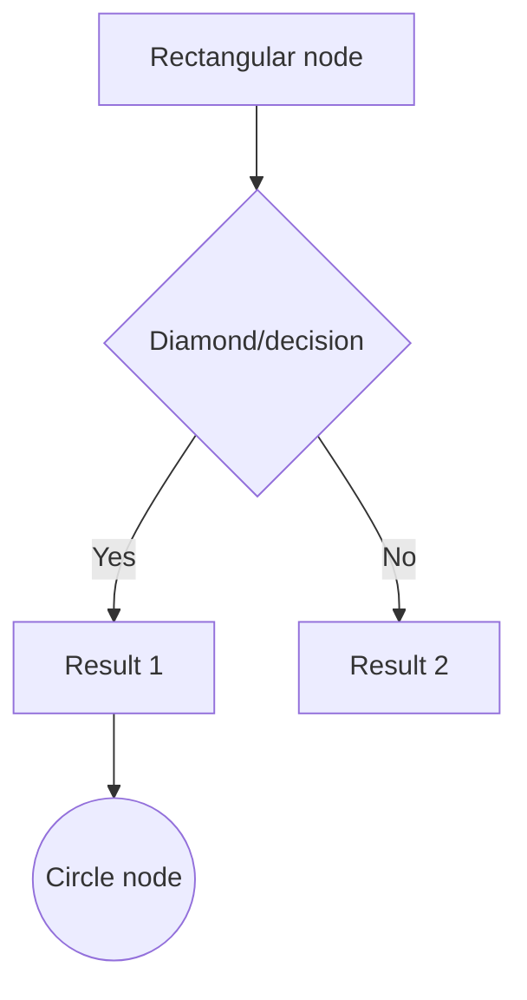
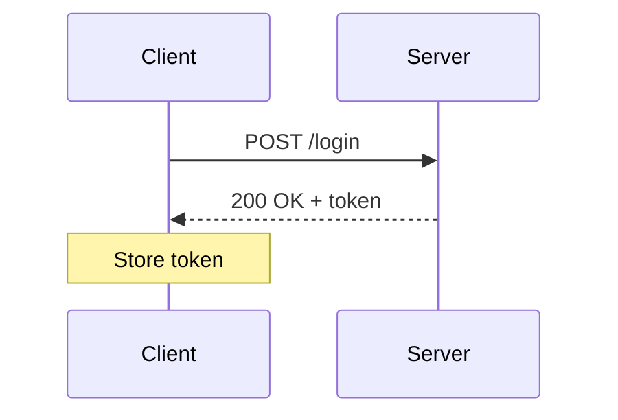
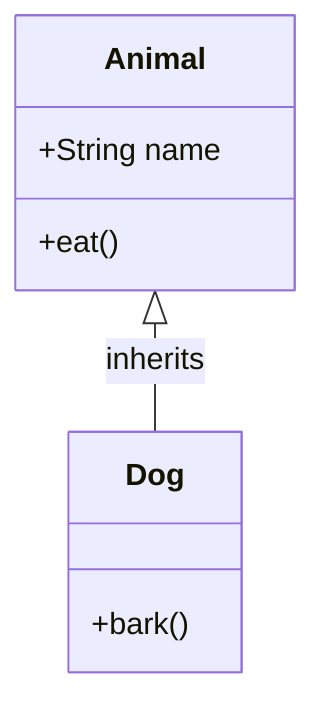
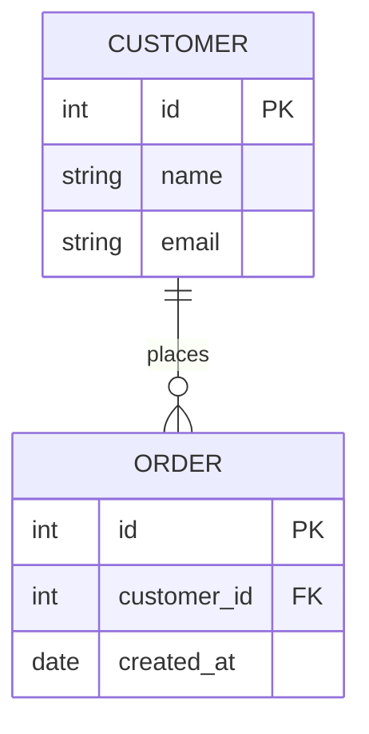

# Generative Architecture & UI Visualization

Gemini CLI can generate and render architecture diagrams, flowcharts, sequence
diagrams, class diagrams, and entity-relationship diagrams **directly in your
terminal** — no browser or external tool required.

Diagrams are rendered as ASCII/Unicode art using box-drawing characters and are
cached for fast re-display.

---

## Quick start

```text
/visualize flowchart user authentication flow
/visualize sequence OAuth2 authorization code flow
/visualize class e-commerce domain model
/visualize erd blog database schema
/visualize deps
/visualize git
```

---

## Commands

### `/visualize flowchart <description>`

Generates a **flowchart** or process-flow diagram.

```text
/visualize flowchart CI/CD pipeline from commit to production
```

Example output:

```
┌───────────┐
│  Commit   │
└─────┬─────┘
      │
      ▼
┌───────────┐
│   Build   │
└─────┬─────┘
      │
      ▼
┌───────────┐
│   Tests   │
└─────┬─────┘
      ...
```

### `/visualize sequence <description>`

Generates a **sequence diagram** showing interactions between actors over time.

```text
/visualize sequence REST API request/response with auth middleware
```

### `/visualize class <description>`

Generates a **class diagram** for OOP design and code architecture.

```text
/visualize class repository pattern with unit of work
```

### `/visualize erd <description>`

Generates an **entity-relationship diagram** for database schemas.

```text
/visualize erd social media platform with users, posts, comments, and likes
```

### `/visualize deps`

Automatically reads your project's dependency file (`package.json`,
`requirements.txt`, `Cargo.toml`, `go.mod`, or `pom.xml`) and generates a
**dependency graph**.

```text
/visualize deps
```

### `/visualize git`

Reads recent git history with `git log` and renders a **branch/commit graph**.

```text
/visualize git
/visualize git feature branches only
```

---

## How it works

1. `/visualize` sends a structured prompt to Gemini asking it to generate valid
   [Mermaid](https://mermaid.js.org/) diagram syntax.
2. Gemini calls the built-in `visualize` tool with the Mermaid definition.
3. The tool parses the Mermaid syntax and renders it as ASCII art using Unicode
   box-drawing characters (`┌ ┐ └ ┘ │ ─ ┬ ┴ ─►`).
4. The rendered diagram appears inline in the terminal history.

---

## Using the `visualize` tool directly

You can also invoke the `visualize` tool directly via a prompt:

```text
Call the visualize tool with this Mermaid diagram:
  diagram_type: flowchart
  content: |
    graph TD
      A[User] --> B{Logged in?}
      B -->|Yes| C[Dashboard]
      B -->|No| D[Login Page]
  title: Authentication Flow
```

### Tool parameters

| Parameter      | Type   | Required | Description                                               |
| -------------- | ------ | -------- | --------------------------------------------------------- |
| `diagram_type` | string | Yes      | One of: `flowchart`, `sequence`, `class`, `erd`           |
| `content`      | string | Yes      | Mermaid diagram definition string                         |
| `title`        | string | No       | Optional human-readable title shown in the diagram header |

---

## Mermaid syntax reference

### Flowchart



Direction: `TD` (top-down) or `LR` (left-right).

### Sequence diagram



### Class diagram



### ERD



---

## Terminal compatibility

The renderer uses standard Unicode box-drawing characters supported by all
modern terminals. No special terminal protocols (Sixel, iTerm2, Kitty) are
required. The `detectTerminalCapabilities()` function from
`@google/gemini-cli-core` reports the detected protocol for reference.

---

## Aliases

The `/visualize` command also responds to `/viz` and `/diagram` for convenience.
