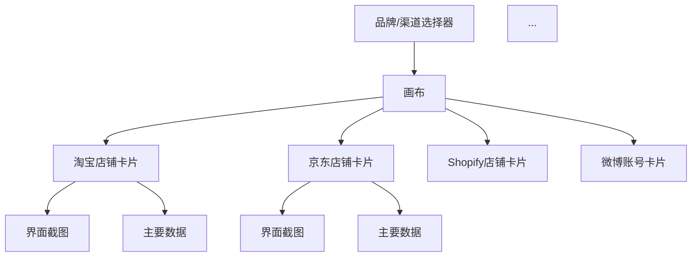

# 多品牌电商渠道统一展示平台设计方案

## 1. 需求拆解
- 数据源整合：支持电商平台（如淘宝、京东、拼多多、Shopify）、社交媒体（如微博、微信、Instagram、Facebook）等多渠道账号信息、界面、图片的抓取与聚合。
- 界面架构化展示：以"画布"方式，将各渠道的界面内容结构化、可视化地组织和展示。
- 可扩展性：支持后续增加新渠道、新品牌。
- 品牌/渠道切换：支持多品牌、多渠道的快速切换与对比。
- 数据更新：支持定时或手动刷新数据。

## 2. 技术架构设计
### 2.1 前端
- 技术栈：React + TypeScript + Canvas（如fabric.js、Konva.js）/SVG
- 主要页面：
  - 画布总览页（所有渠道界面聚合展示）
  - 渠道/品牌切换控件
  - 详情弹窗（点击某个渠道/店铺可查看详细信息）
- 组件设计：
  - 渠道卡片组件（展示logo、名称、截图、主要数据等）
  - 画布布局组件（支持拖拽、缩放、分组）
  - 数据刷新与加载状态组件

### 2.2 后端
- 技术栈：Node.js + Express/Koa + TypeScript
- 主要功能：
  - 多渠道API聚合（调用各平台API或爬虫获取数据）
  - 统一数据结构转换
  - 图片与界面截图缓存
  - 用户与品牌管理
- 数据存储：MongoDB（适合存储结构化与非结构化数据）

### 2.3 数据流
1. 后端定时/按需抓取各渠道数据，存入数据库。
2. 前端请求后端API，获取所有渠道的结构化数据。
3. 前端将数据以画布方式渲染，支持交互。

## 3. 关键技术点
- 多渠道API对接/爬虫：需处理不同平台的API认证、数据结构差异、反爬机制。
- 界面截图：可用 puppeteer/headless chrome 自动化截图。
- 画布交互：采用canvas库实现拖拽、缩放、分组等操作。
- 数据安全与隐私：妥善处理账号信息、API密钥等敏感数据。

## 4. 文件结构建议
```
/ecom-visualizer
  /backend
    /src
      controllers/
      services/
      models/
      utils/
      app.ts
    package.json
  /frontend
    /src
      components/
      pages/
      App.tsx
      index.tsx
    package.json
  /docs
    设计方案.md
```

## 5. 画布展示示意


## 6. 交互流程
1. 用户选择品牌/渠道
2. 系统加载所有相关渠道信息
3. 画布上以卡片形式展示各渠道界面与数据
4. 支持点击卡片查看详情、拖拽调整布局 