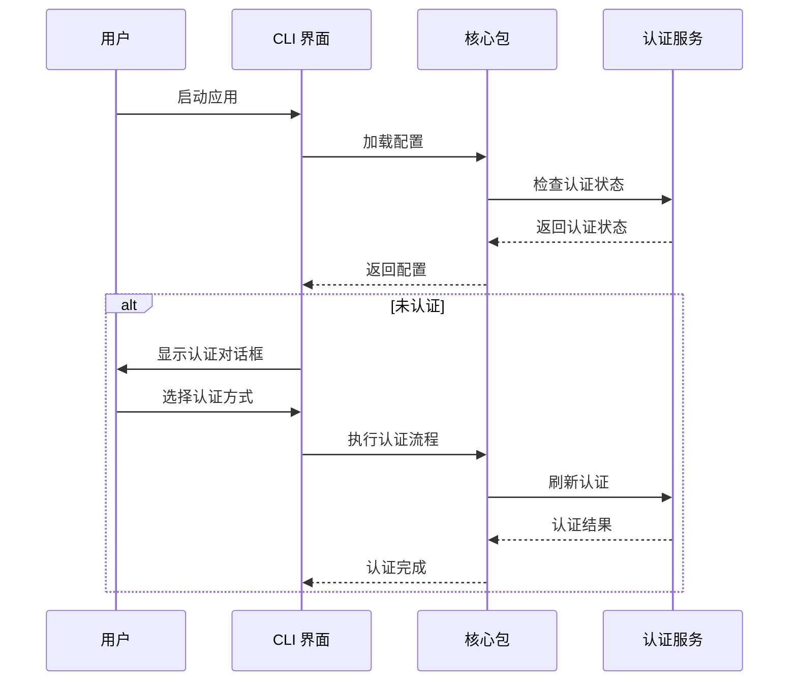

# Gemini CLI 项目账户体系深度分析报告

## 项目概述

Gemini CLI 是一个基于 Google Gemini AI 的命令行工具，采用模块化架构设计，主要包含两个核心包：
- `@google/gemini-cli-core`: 核心功能包，提供 AI 服务集成、工具管理、配置管理等
- `@google/gemini-cli`: CLI 界面包，提供用户交互界面和命令行功能

## 目录结构分析

### 整体架构
```
packages/
├── core/                    # 核心功能包
│   ├── src/
│   │   ├── core/           # 核心业务逻辑
│   │   ├── config/         # 配置管理
│   │   ├── services/       # 服务层
│   │   ├── tools/          # 工具集成
│   │   ├── utils/          # 工具函数
│   │   └── telemetry/      # 遥测功能
│   └── package.json
└── cli/                    # CLI 界面包
    ├── src/
    │   ├── ui/             # 用户界面组件
    │   ├── config/         # CLI 配置
    │   ├── utils/          # CLI 工具函数
    │   └── generated/      # 生成的代码
    └── package.json
```

## 账户体系架构分析

### 1. 认证类型 (AuthType)

项目支持三种认证方式：

```typescript
export enum AuthType {
  LOGIN_WITH_GOOGLE_PERSONAL = 'oauth-personal',    // Google OAuth2 个人账户
  USE_GEMINI = 'gemini-api-key',                   // Gemini API 密钥
  USE_VERTEX_AI = 'vertex-ai',                     // Vertex AI 服务
}
```

#### 1.1 Google OAuth2 个人账户
- **用途**: 个人用户使用 Google 账户登录
- **特点**: 免费额度，适合个人开发者
- **配置**: 无需额外配置，通过浏览器 OAuth2 流程认证

#### 1.2 Gemini API 密钥
- **用途**: 使用 AI Studio 生成的 API 密钥
- **特点**: 付费服务，有更高的使用限制
- **配置**: 需要设置 `GEMINI_API_KEY` 环境变量

#### 1.3 Vertex AI 服务
- **用途**: 企业级 AI 服务
- **特点**: 企业级功能，支持自定义模型
- **配置**: 需要 Google Cloud 项目配置

### 2. 配置管理系统

#### 2.1 配置层级结构

```typescript
interface ConfigParameters {
  sessionId: string;                    // 会话标识
  embeddingModel?: string;              // 嵌入模型
  model: string;                        // 主模型
  authType?: AuthType;                  // 认证类型
  targetDir: string;                    // 目标目录
  debugMode: boolean;                   // 调试模式
  // ... 其他配置参数
}
```

#### 2.2 设置管理 (Settings)

项目采用双层设置管理：

```typescript
export enum SettingScope {
  User = 'User',        // 用户级设置 (~/.gemini/settings.json)
  Workspace = 'Workspace' // 工作区设置 (.gemini/settings.json)
}
```

**设置文件位置**:
- 用户设置: `~/.gemini/settings.json`
- 工作区设置: `./.gemini/settings.json`

**设置合并策略**: 工作区设置覆盖用户设置

### 3. 认证流程分析

#### 3.1 认证初始化流程



#### 3.2 认证验证流程

```typescript
// 认证方法验证
export const validateAuthMethod = (authMethod: string): string | null => {
  switch (authMethod) {
    case AuthType.LOGIN_WITH_GOOGLE_PERSONAL:
      return null; // 无需额外验证
      
    case AuthType.USE_GEMINI:
      if (!process.env.GEMINI_API_KEY) {
        return 'GEMINI_API_KEY environment variable not found';
      }
      return null;
      
    case AuthType.USE_VERTEX_AI:
      const hasVertexConfig = !!process.env.GOOGLE_CLOUD_PROJECT && 
                             !!process.env.GOOGLE_CLOUD_LOCATION;
      const hasGoogleApiKey = !!process.env.GOOGLE_API_KEY;
      if (!hasVertexConfig && !hasGoogleApiKey) {
        return 'Must specify Vertex AI configuration';
      }
      return null;
  }
  return 'Invalid auth method selected';
};
```

### 4. 核心组件分析

#### 4.1 GeminiClient 类

**职责**: 管理 Gemini AI 客户端，处理 API 调用和会话管理

**核心功能**:
- 聊天会话管理
- 内容生成
- 嵌入向量处理
- 工具集成
- 错误处理和重试

**关键方法**:
```typescript
class GeminiClient {
  async initialize(contentGeneratorConfig: ContentGeneratorConfig)
  async startChat(extraHistory?: Content[]): Promise<GeminiChat>
  async generateContent(contents: Content[], config: GenerateContentConfig)
  async generateEmbedding(texts: string[]): Promise<number[][]>
  async resetChat(): Promise<void>
}
```

#### 4.2 ContentGenerator 接口

**职责**: 抽象内容生成功能，支持多种 AI 服务

**实现类型**:
- Gemini API 生成器
- Vertex AI 生成器
- Code Assist 生成器

**核心方法**:
```typescript
interface ContentGenerator {
  generateContent(request: GenerateContentParameters): Promise<GenerateContentResponse>
  generateContentStream(request: GenerateContentParameters): Promise<AsyncGenerator<GenerateContentResponse>>
  countTokens(request: CountTokensParameters): Promise<CountTokensResponse>
  embedContent(request: EmbedContentParameters): Promise<EmbedContentResponse>
}
```

#### 4.3 Config 类

**职责**: 集中管理应用配置，提供配置访问接口

**核心功能**:
- 配置参数管理
- 工具注册表管理
- 认证状态管理
- 会话管理

**关键方法**:
```typescript
class Config {
  async refreshAuth(authMethod: AuthType)
  getSessionId(): string
  getModel(): string
  setModel(newModel: string): void
  getToolRegistry(): Promise<ToolRegistry>
  getUserMemory(): string
  setUserMemory(newUserMemory: string): void
}
```

### 5. 用户界面组件

#### 5.1 AuthDialog 组件

**功能**: 提供认证方式选择界面

**特性**:
- 支持三种认证方式选择
- 实时验证认证配置
- 错误信息显示
- 用户友好的交互界面

**组件结构**:
```typescript
interface AuthDialogProps {
  onSelect: (authMethod: string | undefined, scope: SettingScope) => void
  onHighlight: (authMethod: string | undefined) => void
  settings: LoadedSettings
  initialErrorMessage?: string | null
}
```

#### 5.2 useAuthCommand Hook

**功能**: 管理认证命令的状态和逻辑

**状态管理**:
- 认证对话框状态
- 认证进行中状态
- 错误状态管理

**核心方法**:
```typescript
const useAuthCommand = (settings, setAuthError, config) => {
  const openAuthDialog = useCallback(() => setIsAuthDialogOpen(true))
  const handleAuthSelect = useCallback(async (authMethod, scope) => {
    await clearCachedCredentialFile()
    settings.setValue(scope, 'selectedAuthType', authMethod)
  })
  const cancelAuthentication = useCallback(() => setIsAuthenticating(false))
}
```

### 6. 安全机制

#### 6.1 凭证管理

- **缓存清理**: 支持清除缓存的凭证文件
- **环境变量**: 敏感信息通过环境变量传递
- **沙箱模式**: 支持 Docker/Podman 沙箱隔离

#### 6.2 错误处理

- **认证错误**: 详细的认证错误信息
- **重试机制**: 网络错误自动重试
- **降级策略**: 支持模型降级和回退

### 7. 数据流分析

#### 7.1 认证数据流

```
用户输入 → 配置加载 → 认证检查 → 认证流程 → 凭证存储 → 服务访问
```

#### 7.2 配置数据流

```
环境变量 → 用户设置 → 工作区设置 → 配置合并 → 应用配置
```

#### 7.3 会话数据流

```
会话创建 → 历史管理 → 上下文维护 → 工具调用 → 响应处理
```

### 8. 扩展性设计

#### 8.1 工具扩展

- **MCP 服务器**: 支持 Model Context Protocol 服务器
- **自定义工具**: 支持动态工具发现和注册
- **插件系统**: 支持扩展功能

#### 8.2 模型扩展

- **多模型支持**: 支持 Gemini 1.5/2.0/2.5 系列模型
- **模型切换**: 支持会话中动态切换模型
- **回退机制**: 支持模型降级和回退

### 9. 性能优化

#### 9.1 内存管理

- **自动内存配置**: 根据系统内存自动配置 Node.js 堆大小
- **聊天压缩**: 支持聊天历史压缩
- **令牌限制**: 智能令牌计数和限制

#### 9.2 网络优化

- **代理支持**: 支持 HTTP 代理配置
- **重试机制**: 指数退避重试策略
- **流式处理**: 支持流式响应处理

### 10. 监控和遥测

#### 10.1 遥测配置

```typescript
interface TelemetrySettings {
  enabled?: boolean
  target?: TelemetryTarget
  otlpEndpoint?: string
  logPrompts?: boolean
}
```

#### 10.2 使用统计

- **会话统计**: 记录会话使用情况
- **错误统计**: 收集错误和异常信息
- **性能指标**: 监控响应时间和资源使用

## 总结

Gemini CLI 项目采用现代化的模块化架构设计，具有以下特点：

### 优势
1. **灵活的认证体系**: 支持多种认证方式，满足不同用户需求
2. **分层配置管理**: 用户级和工作区级配置分离，便于管理
3. **模块化设计**: 核心功能和界面分离，便于维护和扩展
4. **完善的错误处理**: 多层次错误处理和用户友好的错误信息
5. **性能优化**: 智能内存管理和网络优化

### 架构亮点
1. **类型安全**: 全面使用 TypeScript，提供良好的类型检查
2. **可扩展性**: 支持插件和工具扩展
3. **安全性**: 完善的凭证管理和沙箱隔离
4. **用户体验**: 直观的命令行界面和交互设计

### 技术栈
- **后端**: Node.js + TypeScript
- **前端**: React + Ink (终端 UI 框架)
- **AI 服务**: Google Gemini API + Vertex AI
- **构建工具**: Vite + Vitest
- **包管理**: npm + 工作区

该项目的账户体系设计充分考虑了不同用户场景和安全性需求，是一个设计良好的企业级 CLI 工具。 