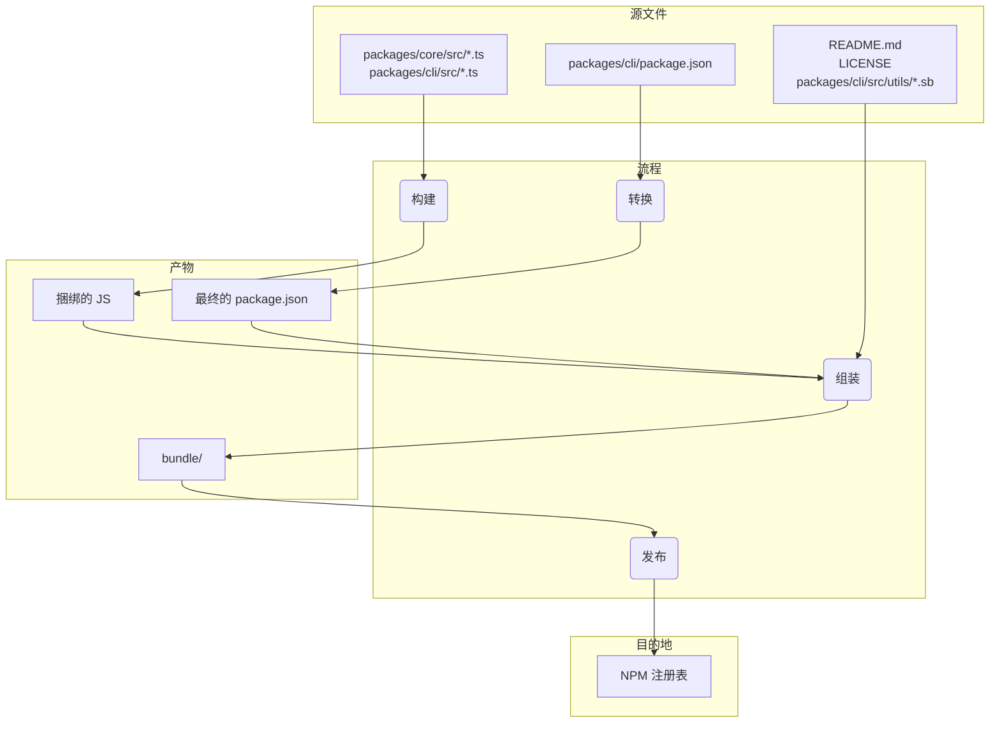

# 软件包概述

<p align="center">
  简体中文 | <a href="../../../docs/npm.md">🌐 English</a>
</p>

此 monorepo 包含两个主要软件包：`@google/gemini-cli` 和 `@google/gemini-cli-core`。

## `@google/gemini-cli`

这是 Gemini CLI 的主要软件包。它负责用户界面、命令解析以及所有其他面向用户的功能。

当此软件包发布时，它会被捆绑成一个可执行文件。此捆绑包包含其所有依赖项，包括 `@google/gemini-cli-core`。这意味着，无论用户是使用 `npm install -g @google/gemini-cli` 安装该软件包，还是使用 `npx @google/gemini-cli` 直接运行它，他们使用的都是这个单一的、自包含的可执行文件。

## `@google/gemini-cli-core`

此软件包包含与 Gemini API 交互的核心逻辑。它负责发出 API 请求、处理身份验证和管理本地缓存。

此软件包不会被捆绑。发布时，它会作为一个标准的 Node.js 软件包发布，并带有自己的依赖项。这使得它可以在需要时作为独立软件包在其他项目中使用。`dist` 文件夹中所有已转译的 js 代码都包含在软件包中。

# 发布流程

此项目遵循结构化的发布流程，以确保所有软件包都正确版本化和发布。该流程旨在尽可能自动化。

## 如何发布

发布通过 [release.yml](https://github.com/google-gemini/gemini-cli/actions/workflows/release.yml) GitHub Actions 工作流进行管理。要为补丁或修补程序执行手动发布：

1.  导航到存储库的 **Actions** 选项卡。
2.  从列表中选择 **Release** 工作流。
3.  单击 **Run workflow** 下拉按钮。
4.  填写所需的输入：
    - **Version**：要发布的确切版本（例如 `v0.2.1`）。
    - **Ref**：要从中发布的分支或提交 SHA（默认为 `main`）。
    - **Dry Run**：保留为 `true` 以测试工作流而不发布，或设置为 `false` 以执行实时发布。
5.  单击 **Run workflow**。

## 每夜构建版本

除了手动发布外，此项目还有一个自动化的每夜构建发布流程，以提供最新的“前沿”版本用于测试和开发。

### 流程

每天午夜 UTC，[Release 工作流](https://github.com/google-gemini/gemini-cli/actions/workflows/release.yml) 会按计划自动运行。它执行以下步骤：

1.  从 `main` 分支签出最新代码。
2.  安装所有依赖项。
3.  运行完整的 `preflight` 检查和集成测试套件。
4.  如果所有测试都成功，它会计算下一个每夜构建版本号（例如 `v0.2.1-nightly.20230101`）。
5.  然后，它会构建软件包并使用 `nightly` dist-tag 将其发布到 npm。
6.  最后，它会为每夜构建版本创建一个 GitHub Release。

### 故障处理

如果每夜构建工作流中的任何步骤失败，它将自动在存储库中创建一个带有 `bug` 和 `nightly-failure` 标签的新问题。该问题将包含指向失败工作流运行的链接，以便于调试。

### 如何使用每夜构建版本

要安装最新的每夜构建版本，请使用 `@nightly` 标签：

```bash
npm install -g @google/gemini-cli@nightly
```

我们还运行一个名为 [release-docker.yml](../../../.gcp/release-docker.yaml) 的 Google Cloud Build。它会发布沙盒 docker 以匹配您的版本。一旦服务帐户权限得到解决，这也将移至 GH 并与主发布文件合并。

### 发布后

工作流成功完成后，您可以在 [GitHub Actions 选项卡](https://github.com/google-gemini/gemini-cli/actions/workflows/release.yml)中监控其进度。完成后，您应该：

1.  转到存储库的[拉取请求页面](https://github.com/google-gemini/gemini-cli/pulls)。
2.  从 `release/vX.Y.Z` 分支创建一个到 `main` 的新拉取请求。
3.  审查拉取请求（它应该只包含 `package.json` 文件中的版本更新）并合并它。这可以使 `main` 中的版本保持最新。

## 发布验证

推送新版本后，应执行冒烟测试以确保软件包按预期工作。这可以通过在本地安装软件包并运行一组测试来完成，以确保它们正常运行。

- `npx -y @google/gemini-cli@latest --version` 用于验证推送是否按预期工作（如果您没有使用 rc 或 dev 标签）。
- `npx -y @google/gemini-cli@<release tag> --version` 用于验证标签是否已正确推送。
- _这在本地是破坏性的_ `npm uninstall @google/gemini-cli && npm uninstall -g @google/gemini-cli && npm cache clean --force &&  npm install @google/gemini-cli@<version>`
- 建议对一些 llm 命令和工具进行基本的冒烟测试，以确保软件包按预期工作。我们将来会对此进行更详细的规定。

## 何时合并版本更改，何时不合并？

上述从当前或旧提交创建补丁或修补程序版本的模式会使存储库处于以下状态：

1.  标签 (`vX.Y.Z-patch.1`)：此标签正确指向 main 上包含您打算发布的稳定代码的原始提交。这至关重要。任何签出此标签的人都会获得已发布的确切代码。
2.  分支 (`release-vX.Y.Z-patch.1`)：此分支在已标记的提交之上包含一个新提交。该新提交仅包含 package.json（以及其他相关文件，如 package-lock.json）中的版本号更改。

这种分离是好的。它使您的主分支历史记录保持干净，直到您决定合并它们为止，而不会因特定于发布的版本颠簸而受到影响。

这是一个关键决定，完全取决于发布的性质。

### 为稳定补丁和修补程序合并回来

对于任何稳定的补丁或修补程序版本，您几乎总是希望将 `release-<tag>` 分支合并回 `main`。

- 为什么？主要原因是为了更新 main 的 package.json 中的版本。如果您从旧的提交发布 v1.2.1 但从未将版本颠簸合并回来，那么您的主分支的 package.json 仍将显示“version”：“1.2.0”。为下一个功能版本 (v1.3.0) 开始工作的下一个开发人员将从一个版本号不正确、较旧的代码库中分支。这会导致混淆，并需要在以后手动进行版本颠簸。
- 流程：在创建 release-v1.2.1 分支并成功发布软件包后，您应该打开一个拉取请求以将 release-v1.2.1 合并到 main 中。此 PR 将仅包含一个提交：“chore: bump version to v1.2.1”。这是一个干净、简单的集成，可使您的主分支与最新发布的版本保持同步。

### 不要为预发布版本（RC、Beta、Dev）合并回来

您通常不会将预发布版本的发布分支合并回 `main`。

- 为什么？预发布版本（例如 v1.3.0-rc.1、v1.3.0-rc.2）根据定义是不稳定的并且是临时的。您不希望用一系列候选版本的版本颠簸来污染您的主分支的历史记录。main 中的 package.json 应反映最新的稳定版本，而不是 RC。
- 流程：创建 release-v1.3.0-rc.1 分支，发生 npm publish --tag rc，然后……该分支已达到其目的。您可以简单地删除它。RC 的代码已经在 main（或功能分支）上，因此不会丢失任何功能代码。发布分支只是版本号的临时载体。

## 本地测试和验证：打包和发布流程的更改

如果您需要在不实际发布到 NPM 或创建公共 GitHub 版本的情况下测试发布流程，您可以从 GitHub UI 手动触发工作流。

1.  转到存储库的 [Actions 选项卡](https://github.com/google-gemini/gemini-cli/actions/workflows/release.yml)。
2.  单击“Run workflow”下拉菜单。
3.  将 `dry_run` 选项保留为选中状态 (`true`)。
4.  单击“Run workflow”按钮。

这将运行整个发布流程，但会跳过 `npm publish` 和 `gh release create` 步骤。您可以检查工作流日志以确保一切按预期工作。

在提交对打包和发布流程的任何更改之前，在本地对其进行测试至关重要。这可确保软件包将正确发布，并且在用户安装时它们将按预期工作。

要验证您的更改，您可以执行发布的试运行。这将模拟发布过程，而无需实际将软件包发布到 npm 注册表。

```bash
npm_package_version=9.9.9 SANDBOX_IMAGE_REGISTRY="registry" SANDBOX_IMAGE_NAME="thename" npm run publish:npm --dry-run
```

此命令将执行以下操作：

1.  构建所有软件包。
2.  运行所有 prepublish 脚本。
3.  创建将发布到 npm 的软件包 tarball。
4.  打印将发布的软件包的摘要。

然后，您可以检查生成的 tarball 以确保它们包含正确的文件，并且 `package.json` 文件已正确更新。tarball 将在每个软件包目录的根目录中创建（例如 `packages/cli/google-gemini-cli-0.1.6.tgz`）。

通过执行试运行，您可以确信您对打包流程的更改是正确的，并且软件包将成功发布。

## 发布深入探讨

发布流程的主要目标是从 packages/ 目录中获取源代码，对其进行构建，并在项目根目录的临时 `bundle` 目录中组装一个干净、自包含的软件包。这个 `bundle` 目录是实际发布到 NPM 的内容。

以下是关键阶段：

阶段 1：预发布健全性检查和版本控制

- 会发生什么：在移动任何文件之前，该过程会确保项目处于良好状态。这包括运行测试、linting 和类型检查 (npm run preflight)。根 package.json 和 packages/cli/package.json 中的版本号会更新为新的发布版本。
- 为什么：这保证了只发布高质量、可工作的代码。版本控制是表示新发布的第一步。

阶段 2：构建源代码

- 会发生什么：packages/core/src 和 packages/cli/src 中的 TypeScript 源代码被编译成 JavaScript。
- 文件移动：
  - packages/core/src/\*\*/\*.ts -> 编译为 -> packages/core/dist/
  - packages/cli/src/\*\*/\*.ts -> 编译为 -> packages/cli/dist/
- 为什么：在开发过程中编写的 TypeScript 代码需要转换为可以由 Node.js 运行的普通 JavaScript。核心软件包首先构建，因为 cli 软件包依赖于它。

阶段 3：组装最终的可发布软件包

这是最关键的阶段，文件被移动并转换为其最终状态以供发布。在项目根目录创建一个临时的 `bundle` 文件夹来存放最终的软件包内容。

1.  `package.json` 被转换：
    - 会发生什么：从 packages/cli/ 读取 package.json，进行修改，然后写入根 `bundle`/ 目录。
    - 文件移动：packages/cli/package.json -> (内存中转换) -> `bundle`/package.json
    - 为什么：最终的 package.json 必须与开发中使用的不同。关键更改包括：
      - 删除 devDependencies。
      - 删除特定于工作区的“dependencies”：{ “@gemini-cli/core”：“workspace:*” } 并确保核心代码直接捆绑到最终的 JavaScript 文件中。
      - 确保 bin、main 和 files 字段指向最终软件包结构中的正确位置。

2.  创建 JavaScript 捆绑包：
    - 会发生什么：来自 packages/core/dist 和 packages/cli/dist 的已构建 JavaScript 被捆绑成一个单一的、可执行的 JavaScript 文件。
    - 文件移动：packages/cli/dist/index.js + packages/core/dist/index.js -> (由 esbuild 捆绑) -> `bundle`/gemini.js (或类似名称)。
    - 为什么：这会创建一个包含所有必要应用程序代码的单一、优化的文件。它通过消除核心软件包作为 NPM 上的单独依赖项的需要来简化软件包，因为其代码现在直接包含在内。

3.  复制静态和支持文件：
    - 会发生什么：对于软件包正常工作或得到良好描述所必需但不是源代码一部分的基本文件被复制到 `bundle` 目录中。
    - 文件移动：
      - README.md -> `bundle`/README.md
      - LICENSE -> `bundle`/LICENSE
      - packages/cli/src/utils/*.sb (沙盒配置文件) -> `bundle`/
    - 为什么：
      - README.md 和 LICENSE 是应包含在任何 NPM 软件包中的标准文件。
      - 沙盒配置文件 (.sb 文件) 是 CLI 沙盒功能正常运行所需的关键运行时资产。它们必须位于最终可执行文件旁边。

阶段 4：发布到 NPM

- 会发生什么：npm publish 命令从根 `bundle` 目录内部运行。
- 为什么：通过从 `bundle` 目录中运行 npm publish，只有我们在阶段 3 中精心组装的文件才会被上传到 NPM 注册表。这可以防止任何源代码、测试文件或开发配置被意外发布，从而为用户提供一个干净、最小的软件包。

文件流摘要



此流程可确保最终发布的产物是项目的专用、干净且高效的表示，而不是开发工作区的直接副本。

## NPM 工作区

此项目使用 [NPM 工作区](https://docs.npmjs.com/cli/v10/using-npm/workspaces) 来管理此 monorepo 中的软件包。这通过允许我们从项目根目录管理多个软件包的依赖项和运行脚本来简化开发。

### 工作原理

根 `package.json` 文件定义了此项目的工作区：

```json
{
  "workspaces": ["packages/*"]
}
```

这告诉 NPM，`packages` 目录中的任何文件夹都是一个单独的软件包，应作为工作区的一部分进行管理。

### 工作区的好处

- **简化的依赖项管理**：从项目根目录运行 `npm install` 将安装工作区中所有软件包的所有依赖项并将它们链接在一起。这意味着您无需在每个软件包的目录中运行 `npm install`。
- **自动链接**：工作区中的软件包可以相互依赖。当您运行 `npm install` 时，NPM 将自动在软件包之间创建符号链接。这意味着当您对一个软件包进行更改时，这些更改会立即对依赖于它的其他软件包可用。
- **简化的脚本执行**：您可以使用 `--workspace` 标志从项目根目录在任何软件包中运行脚本。例如，要在 `cli` 软件包中运行 `build` 脚本，您可以运行 `npm run build --workspace @google/gemini-cli`。
