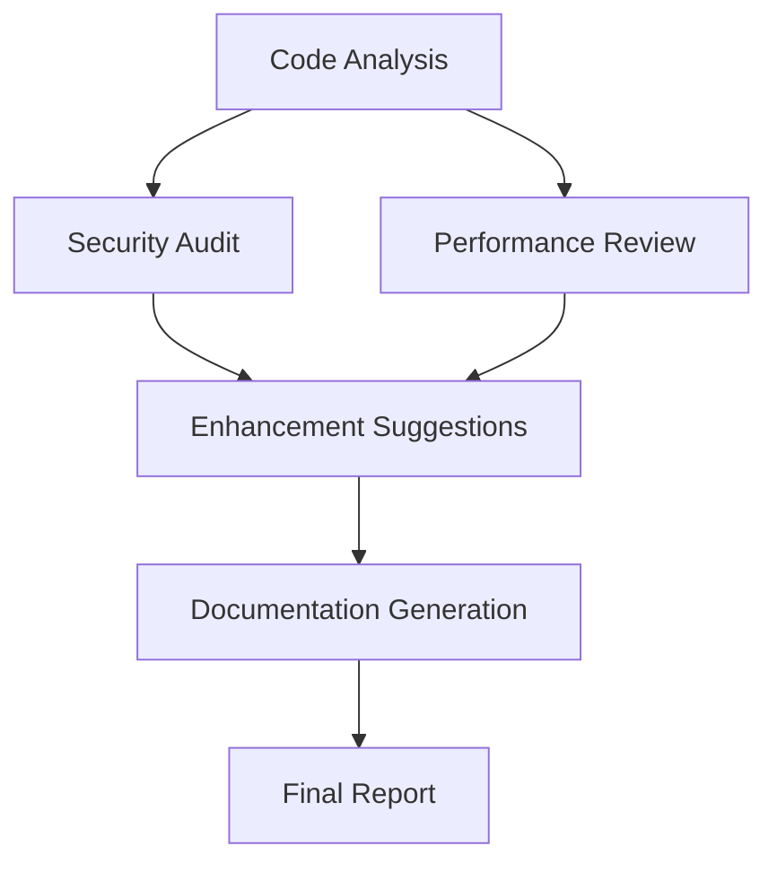

# Code Review Workflow Documentation

## Overview

The Code Review Workflow is a comprehensive automated code review system built with Mastra that leverages Claude Code's advanced capabilities to perform thorough code analysis, security audits, performance reviews, and generate actionable improvement recommendations.

## Features

### 🔍 **Comprehensive Analysis**
- **Code Quality Assessment**: Analyzes code structure, maintainability, and adherence to best practices
- **Security Vulnerability Scanning**: Identifies potential security issues including SQL injection, XSS, and authentication problems
- **Performance Analysis**: Detects performance bottlenecks, algorithm complexity issues, and optimization opportunities
- **Enhancement Recommendations**: Provides prioritized, actionable improvement suggestions

### 🛡️ **Security Focus**
- SQL injection detection
- Cross-site scripting (XSS) identification
- Authentication and authorization review
- Input validation analysis
- Cryptographic weakness detection
- Sensitive data exposure checks

### ⚡ **Performance Optimization**
- Algorithm complexity analysis (Big O)
- Memory usage pattern detection
- I/O operation efficiency review
- Database query optimization suggestions
- Caching strategy recommendations

### 📖 **Documentation Generation**
- Automatic API documentation
- Usage examples generation
- Parameter and return value descriptions
- Integration guides

## Workflow Architecture

The Code Review Workflow consists of six main steps:



### Step Details

1. **Code Analysis Step**
   - Analyzes code structure and quality
   - Detects language and complexity
   - Identifies strengths and issues

2. **Security Audit Step** (Parallel)
   - Scans for security vulnerabilities
   - Calculates security score
   - Provides compliance notes

3. **Performance Review Step** (Parallel)
   - Identifies performance bottlenecks
   - Analyzes algorithm complexity
   - Suggests optimizations

4. **Enhancement Suggestions Step**
   - Generates prioritized recommendations
   - Creates refactoring plan
   - Defines next steps

5. **Documentation Generation Step**
   - Creates API documentation
   - Generates usage examples
   - Produces developer guides

6. **Final Report Step**
   - Compiles comprehensive results
   - Calculates overall scores
   - Formats output

## Usage

### Basic Usage

```typescript
import { mastra } from './mastra/index.js';

async function runCodeReview() {
  const workflow = mastra.getWorkflow('code-review-workflow');
  const run = await workflow.createRunAsync();

  const result = await run.start({
    inputData: {
      codeContent: 'function getUserData(userId) { /* code */ }',
      filePath: 'src/user-service.js',
      language: 'javascript',
      reviewType: 'full',
      includeDocumentation: true,
    },
  });

  if (result.status === 'success') {
    console.log('Overall Score:', result.result.summary.overallScore);
    console.log('Issues Found:', result.result.summary.issuesFound);
  }
}
```

### Input Parameters

| Parameter | Type | Required | Default | Description |
|-----------|------|----------|---------|-------------|
| `codeContent` | string | Yes | - | The source code to review |
| `filePath` | string | No | - | Optional file path for context |
| `language` | string | No | auto-detect | Programming language |
| `reviewType` | enum | No | 'full' | Type of review ('full', 'security', 'performance', 'style') |
| `includeDocumentation` | boolean | No | true | Whether to generate documentation |

### Review Types

#### Full Review (`reviewType: 'full'`)
Performs comprehensive analysis including:
- Code quality assessment
- Security vulnerability scanning
- Performance analysis
- Documentation generation
- Enhancement recommendations

#### Security Review (`reviewType: 'security'`)
Focuses exclusively on security aspects:
- Vulnerability detection
- Security best practices verification
- Compliance checking
- Risk assessment

#### Performance Review (`reviewType: 'performance'`)
Concentrates on performance optimization:
- Algorithm complexity analysis
- Memory usage review
- Performance bottleneck identification
- Optimization suggestions

#### Style Review (`reviewType: 'style'`)
Emphasizes code style and maintainability:
- Coding standards compliance
- Readability assessment
- Documentation quality
- Maintainability scoring

## Output Structure

```typescript
{
  summary: {
    overallScore: number,        // 0-10 overall quality score
    issuesFound: number,         // Total issues detected
    recommendations: number,     // Number of suggestions
    language: string            // Detected programming language
  },
  analysis: {
    codeQuality: {
      score: number,            // 0-10 quality score
      issues: string[],         // List of quality issues
      strengths: string[]       // Code strengths identified
    },
    securityFindings: [{
      severity: 'low'|'medium'|'high'|'critical',
      issue: string,            // Issue description
      recommendation: string,    // Fix recommendation
      lineNumber?: number       // Optional line reference
    }],
    performanceIssues: [{
      type: string,             // Issue category
      description: string,      // Detailed description
      impact: 'low'|'medium'|'high',
      suggestion: string        // Optimization suggestion
    }]
  },
  recommendations: [{
    category: 'code-quality'|'performance'|'security'|'maintainability',
    priority: 'low'|'medium'|'high',
    description: string,        // Recommendation text
    example?: string           // Optional code example
  }],
  documentation?: {
    generatedDocs?: string,     // Generated documentation
    apiDocumentation?: string,  // API-specific docs
    usageExamples?: string     // Usage examples
  }
}
```

## Advanced Usage

### Streaming Workflow

```typescript
async function streamCodeReview() {
  const workflow = mastra.getWorkflow('code-review-workflow');
  const run = await workflow.createRunAsync();

  const streamResult = await run.stream({
    inputData: {
      codeContent: sourceCode,
      reviewType: 'full'
    }
  });

  for await (const chunk of streamResult.stream) {
    if (chunk.type === 'step-start') {
      console.log(`Starting: ${chunk.stepId}`);
    } else if (chunk.type === 'step-complete') {
      console.log(`Completed: ${chunk.stepId}`);
    }
  }
}
```

### Batch Processing

```typescript
async function batchCodeReview(files: Array<{path: string, content: string}>) {
  const workflow = mastra.getWorkflow('code-review-workflow');
  const results = [];

  for (const file of files) {
    const run = await workflow.createRunAsync();
    const result = await run.start({
      inputData: {
        codeContent: file.content,
        filePath: file.path,
        reviewType: 'full'
      }
    });
    results.push({ file: file.path, result });
  }

  return results;
}
```

### Error Handling

```typescript
async function robustCodeReview(code: string) {
  try {
    const workflow = mastra.getWorkflow('code-review-workflow');
    const run = await workflow.createRunAsync();
    
    const result = await run.start({
      inputData: { codeContent: code }
    });

    switch (result.status) {
      case 'success':
        return result.result;
      case 'failed':
        console.error('Workflow failed:', result.error);
        return null;
      case 'suspended':
        console.log('Workflow suspended at:', result.suspended);
        // Handle suspension logic
        return null;
    }
  } catch (error) {
    console.error('Unexpected error:', error);
    return null;
  }
}
```

## Configuration

### Environment Variables

```bash
# Required
ANTHROPIC_API_KEY=your-anthropic-api-key

# Optional Claude Code configuration
CLAUDE_CODE_MODEL=claude-3-sonnet-20240229
CLAUDE_CODE_MAX_TURNS=20
CLAUDE_CODE_PERMISSION_MODE=default
```

### Workflow Customization

You can customize the workflow behavior by modifying the tool execution parameters:

```typescript
// Custom security-focused configuration
const securityResult = await claudeCodeTool.execute({
  context: {
    prompt: securityPrompt,
    options: {
      customSystemPrompt: "You are a cybersecurity expert...",
      maxTurns: 25,
      allowedTools: ["read", "grep", "web_search"],
      permissionMode: "default"
    }
  }
});
```

## Best Practices

### 1. Code Preparation
- **Clean Code**: Ensure code is properly formatted before review
- **Context**: Provide file paths when available for better context
- **Language**: Specify the programming language for accurate analysis

### 2. Review Type Selection
- Use **'security'** for security-critical applications
- Use **'performance'** for high-performance requirements  
- Use **'full'** for comprehensive reviews
- Use **'style'** for code quality and maintainability focus

### 3. Result Interpretation
- **Priority Focus**: Address high-priority recommendations first
- **Security First**: Always prioritize critical and high-severity security issues
- **Iterative Improvement**: Use results for continuous code quality improvement

### 4. Integration Patterns

#### CI/CD Integration
```typescript
// Example GitHub Actions integration
async function ciCodeReview() {
  const changedFiles = await getChangedFiles();
  const results = await Promise.all(
    changedFiles.map(file => runCodeReview(file))
  );
  
  const criticalIssues = results.flatMap(r => 
    r.result.analysis.securityFindings.filter(f => 
      f.severity === 'critical'
    )
  );
  
  if (criticalIssues.length > 0) {
    process.exit(1); // Fail the build
  }
}
```

#### IDE Integration
```typescript
// Example VS Code extension integration
async function ideCodeReview(document: TextDocument) {
  const result = await runCodeReview(document.getText());
  
  // Display issues as diagnostics
  const diagnostics = result.analysis.securityFindings.map(finding => ({
    range: new Range(finding.lineNumber || 0, 0, finding.lineNumber || 0, 0),
    message: finding.issue,
    severity: mapSeverityToDiagnostic(finding.severity)
  }));
  
  diagnosticCollection.set(document.uri, diagnostics);
}
```

## Supported Languages

The workflow supports analysis for multiple programming languages:

- **JavaScript/TypeScript**: Full support with framework-specific analysis
- **Python**: Comprehensive security and performance analysis
- **Java**: Enterprise-focused security and performance review
- **C/C++**: Memory safety and performance optimization
- **Go**: Concurrency and performance analysis
- **Rust**: Memory safety and performance review
- **PHP**: Web security-focused analysis
- **Ruby**: Framework-specific analysis
- **And more**: Auto-detection for other languages

## Performance Considerations

### Execution Time
- **Full Review**: 30-60 seconds for typical files
- **Security Only**: 15-30 seconds
- **Performance Only**: 15-30 seconds
- **Large Files**: May require longer processing time

### Rate Limits
- Respects Claude Code API rate limits
- Implements automatic retry with exponential backoff
- Supports batch processing with rate limiting

### Resource Usage
- Memory efficient step-by-step processing
- Parallel execution for independent analysis steps
- Streaming support for real-time feedback

## Troubleshooting

### Common Issues

1. **Authentication Errors**
   ```
   Error: ANTHROPIC_API_KEY environment variable is required
   ```
   **Solution**: Set your Anthropic API key in environment variables

2. **Rate Limit Exceeded**
   ```
   Error: Rate limit or quota exceeded
   ```
   **Solution**: Implement delays between requests or upgrade API plan

3. **Large File Timeout**
   ```
   Error: Workflow execution timeout
   ```
   **Solution**: Break large files into smaller chunks or increase timeout

4. **Invalid Code Input**
   ```
   Error: Unable to analyze code structure
   ```
   **Solution**: Ensure code is valid and properly formatted

### Debug Mode

Enable debug mode for detailed execution logs:

```typescript
const result = await run.start({
  inputData: {
    codeContent: code,
    options: {
      debug: true  // Enable detailed logging
    }
  }
});
```

### Support and Contributing

- **Issues**: Report bugs and request features via GitHub issues
- **Documentation**: Contribute to documentation improvements
- **Code**: Submit pull requests for enhancements
- **Community**: Join discussions and share use cases

## Examples

For complete working examples, see:
- `src/examples/code-review-workflow-example.ts` - Basic usage examples
- `src/workflows/code-review-workflow.test.ts` - Test cases and edge cases
- `docs/api-reference.md` - Detailed API documentation

## License

Copyright 2025 Google LLC - Licensed under Apache 2.0