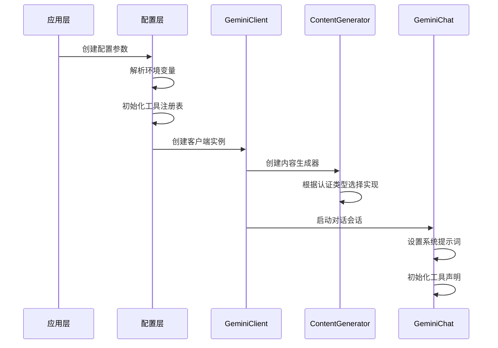
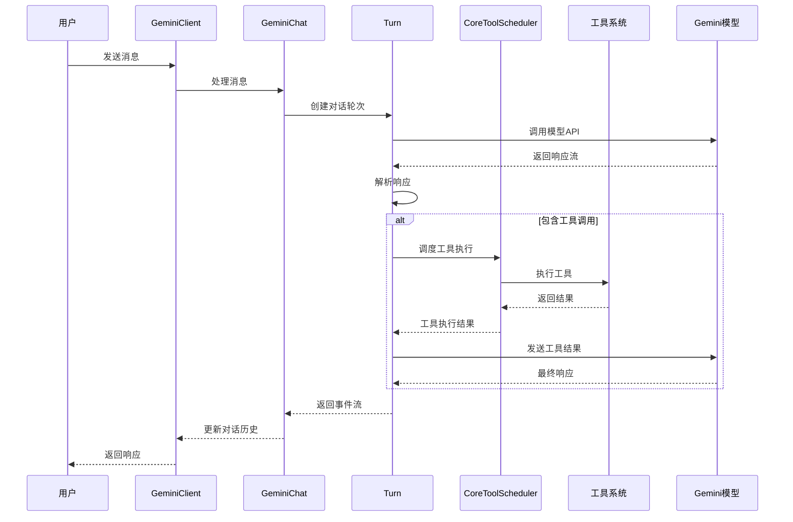
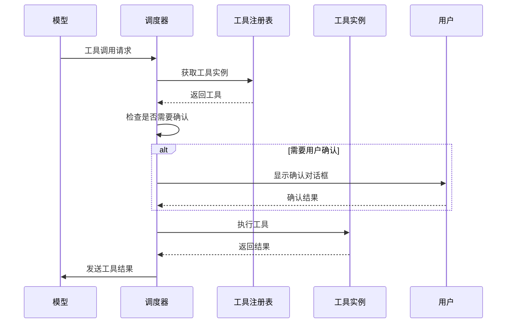

# Gemini CLI Core - 模型调用逻辑业务流程与设计方式分析

## 概述

Gemini CLI Core 是一个基于 Google Gemini 模型的智能命令行工具，采用分层架构设计，支持多种认证方式、工具调用、流式响应等高级功能。本文档深度分析其模型调用的逻辑业务流程和设计方式。

## 1. 架构层次分析

### 1.1 整体架构层次

```
┌─────────────────────────────────────────────────────────────┐
│                    应用层 (Application Layer)                │
├─────────────────────────────────────────────────────────────┤
│                    服务层 (Service Layer)                   │
├─────────────────────────────────────────────────────────────┤
│                    核心层 (Core Layer)                      │
├─────────────────────────────────────────────────────────────┤
│                    工具层 (Tools Layer)                     │
├─────────────────────────────────────────────────────────────┤
│                    配置层 (Config Layer)                    │
├─────────────────────────────────────────────────────────────┤
│                    基础设施层 (Infrastructure Layer)         │
└─────────────────────────────────────────────────────────────┘
```

### 1.2 核心组件关系图

```
GeminiClient
    ├── ContentGenerator (模型调用抽象)
    ├── GeminiChat (对话管理)
    ├── CoreToolScheduler (工具调度)
    └── Turn (对话轮次管理)
    
ContentGenerator
    ├── GoogleGenAI (官方SDK)
    ├── CodeAssistContentGenerator (OAuth认证)
    └── VertexAI (企业版)
    
CoreToolScheduler
    ├── ToolRegistry (工具注册)
    ├── Tool Execution (工具执行)
    └── Approval System (审批系统)
```

## 2. 模型调用核心流程

### 2.1 初始化流程



### 2.2 消息处理流程



## 3. 核心组件详细分析

### 3.1 GeminiClient - 客户端核心

**职责**: 对外提供统一的模型调用接口，管理对话生命周期

**关键特性**:
- 支持流式和非流式响应
- 自动环境上下文构建
- 工具声明管理
- 对话历史管理
- 错误处理和重试机制

**核心方法**:
```typescript
class GeminiClient {
  // 流式消息发送
  async *sendMessageStream(
    request: PartListUnion,
    signal: AbortSignal,
    turns: number = this.MAX_TURNS
  ): AsyncGenerator<ServerGeminiStreamEvent, Turn>
  
  // 生成JSON响应
  async generateJson(
    contents: Content[],
    schema: SchemaUnion,
    abortSignal: AbortSignal
  ): Promise<Record<string, unknown>>
  
  // 生成嵌入向量
  async generateEmbedding(texts: string[]): Promise<number[][]>
}
```

### 3.2 ContentGenerator - 模型调用抽象

**职责**: 抽象不同认证方式和模型服务的调用接口

**支持的认证类型**:
- `LOGIN_WITH_GOOGLE_PERSONAL`: OAuth个人认证
- `USE_GEMINI`: Gemini API密钥认证  
- `USE_VERTEX_AI`: Vertex AI企业认证

**实现策略**:
```typescript
export async function createContentGenerator(
  config: ContentGeneratorConfig
): Promise<ContentGenerator> {
  if (config.authType === AuthType.LOGIN_WITH_GOOGLE_PERSONAL) {
    return createCodeAssistContentGenerator(httpOptions, config.authType);
  }
  
  if (config.authType === AuthType.USE_GEMINI || 
      config.authType === AuthType.USE_VERTEX_AI) {
    const googleGenAI = new GoogleGenAI({
      apiKey: config.apiKey,
      vertexai: config.vertexai,
      httpOptions,
    });
    return googleGenAI.models;
  }
}
```

### 3.3 GeminiChat - 对话管理

**职责**: 管理对话会话状态，处理消息发送和响应解析

**核心功能**:
- 对话历史管理
- 消息验证和清理
- 流式响应处理
- 工具调用响应处理
- 错误处理和重试

**关键设计**:
```typescript
export class GeminiChat {
  // 发送消息并返回流式响应
  async sendMessageStream(
    params: SendMessageParameters
  ): Promise<AsyncGenerator<GenerateContentResponse>>
  
  // 验证响应有效性
  private isValidResponse(response: GenerateContentResponse): boolean
  
  // 提取有效历史记录
  private extractCuratedHistory(comprehensiveHistory: Content[]): Content[]
}
```

### 3.4 CoreToolScheduler - 工具调度器

**职责**: 管理工具调用的生命周期，包括调度、执行、审批和结果处理

**工具调用状态机**:
```
validating → scheduled → executing → success/error/cancelled
     ↓
awaiting_approval → confirmed/denied → executing → success/error/cancelled
```

**核心功能**:
- 工具调用状态管理
- 并行执行调度
- 用户审批流程
- 错误处理和恢复
- 实时输出更新

**关键方法**:
```typescript
export class CoreToolScheduler {
  // 调度工具调用
  async schedule(
    request: ToolCallRequestInfo | ToolCallRequestInfo[],
    signal: AbortSignal
  ): Promise<void>
  
  // 处理用户确认
  async handleConfirmationResponse(
    callId: string,
    outcome: ToolConfirmationOutcome,
    signal: AbortSignal
  ): Promise<void>
  
  // 执行已调度的调用
  private attemptExecutionOfScheduledCalls(signal: AbortSignal): void
}
```

### 3.5 Turn - 对话轮次管理

**职责**: 管理单次对话轮次，处理模型响应和工具调用

**事件类型**:
- `Content`: 文本内容
- `ToolCallRequest`: 工具调用请求
- `ToolCallResponse`: 工具调用响应
- `ToolCallConfirmation`: 工具调用确认
- `Thought`: 思考过程
- `Error`: 错误信息
- `UsageMetadata`: 使用统计

**核心流程**:
```typescript
export class Turn {
  async *run(
    req: PartListUnion,
    signal: AbortSignal
  ): AsyncGenerator<ServerGeminiStreamEvent> {
    // 1. 发送消息到模型
    const responseStream = await this.chat.sendMessageStream({...})
    
    // 2. 处理响应流
    for await (const resp of responseStream) {
      // 3. 解析思考过程
      if (thoughtPart?.thought) {
        yield { type: GeminiEventType.Thought, value: thought }
        continue
      }
      
      // 4. 处理工具调用
      if (functionCall) {
        yield { type: GeminiEventType.ToolCallRequest, value: toolCall }
      }
      
      // 5. 处理文本内容
      if (text) {
        yield { type: GeminiEventType.Content, value: text }
      }
    }
  }
}
```

## 4. 工具系统设计

### 4.1 工具注册机制

**ToolRegistry**: 统一的工具注册和管理中心

**工具类型**:
- 内置工具: 文件操作、搜索、编辑等
- 发现工具: 通过命令发现的项目工具
- MCP工具: Model Context Protocol工具

**注册流程**:
```typescript
export class ToolRegistry {
  // 注册工具
  registerTool(tool: Tool): void
  
  // 发现项目工具
  async discoverTools(): Promise<void>
  
  // 获取函数声明
  getFunctionDeclarations(): FunctionDeclaration[]
  
  // 获取工具实例
  getTool(name: string): Tool | undefined
}
```

### 4.2 工具执行流程



### 4.3 内置工具类型

**文件操作工具**:
- `ReadFileTool`: 读取文件内容
- `WriteFileTool`: 写入文件
- `EditTool`: 编辑文件
- `ReadManyFilesTool`: 批量读取文件
- `GlobTool`: 文件模式匹配
- `GrepTool`: 文本搜索

**系统工具**:
- `ShellTool`: 执行shell命令
- `LSTool`: 列出目录内容
- `MemoryTool`: 记忆管理

**网络工具**:
- `WebFetchTool`: 网络请求
- `WebSearchTool`: 网络搜索

## 5. 配置系统设计

### 5.1 配置层次结构

```
Config
├── 基础配置 (模型、认证、工作目录)
├── 工具配置 (工具列表、发现命令)
├── 安全配置 (沙箱、代理)
├── 用户体验配置 (审批模式、可访问性)
└── 遥测配置 (日志、统计)
```

### 5.2 配置参数详解

**模型配置**:
- `model`: 使用的模型名称
- `embeddingModel`: 嵌入模型名称
- `authType`: 认证类型

**工具配置**:
- `coreTools`: 核心工具列表
- `excludeTools`: 排除的工具
- `toolDiscoveryCommand`: 工具发现命令
- `mcpServers`: MCP服务器配置

**安全配置**:
- `sandbox`: 沙箱配置
- `proxy`: 代理设置
- `approvalMode`: 审批模式

## 6. 错误处理与恢复机制

### 6.1 错误分类

**API错误**:
- 认证错误 (401/403)
- 限流错误 (429)
- 服务错误 (5xx)

**工具执行错误**:
- 工具不存在
- 参数验证失败
- 执行超时
- 权限不足

**网络错误**:
- 连接超时
- 网络中断
- DNS解析失败

### 6.2 重试策略

**指数退避重试**:
```typescript
export async function retryWithBackoff<T>(
  fn: () => Promise<T>,
  maxRetries: number = 3,
  baseDelay: number = 1000
): Promise<T>
```

**模型降级策略**:
- 当遇到429错误时，自动降级到Flash模型
- 支持自定义降级处理器

### 6.3 错误恢复

**对话恢复**:
- 保存对话状态
- 支持断点续传
- 错误后重新初始化

**工具恢复**:
- 工具调用状态持久化
- 失败重试机制
- 部分成功处理

## 7. 性能优化策略

### 7.1 并发处理

**并行工具执行**:
- 独立的工具调用可以并行执行
- 使用Promise.all进行批量处理
- 避免不必要的串行等待

**流式处理**:
- 支持流式响应，减少延迟
- 实时输出更新
- 增量内容处理

### 7.2 缓存策略

**对话历史缓存**:
- 智能历史压缩
- 基于token限制的缓存管理
- 重要信息保留策略

**工具结果缓存**:
- 相同参数的工具调用缓存
- 缓存失效策略
- 内存使用优化

### 7.3 资源管理

**连接池管理**:
- HTTP连接复用
- 连接超时设置
- 资源清理机制

**内存管理**:
- 大文件分块处理
- 流式数据处理
- 垃圾回收优化

## 8. 安全设计

### 8.1 认证安全

**多认证方式支持**:
- OAuth 2.0个人认证
- API密钥认证
- 企业级Vertex AI认证

**密钥管理**:
- 环境变量存储
- 运行时密钥验证
- 敏感信息保护

### 8.2 执行安全

**沙箱执行**:
- Docker容器隔离
- 文件系统限制
- 网络访问控制

**工具权限控制**:
- 工具白名单
- 参数验证
- 执行确认机制

### 8.3 数据安全

**数据传输安全**:
- HTTPS加密传输
- 代理支持
- 证书验证

**本地数据保护**:
- 临时文件清理
- 敏感信息过滤
- 日志脱敏

## 9. 扩展性设计

### 9.1 插件架构

**工具扩展**:
- 标准工具接口
- 动态工具发现
- MCP协议支持

**模型扩展**:
- 多模型支持
- 模型切换机制
- 自定义模型适配器

### 9.2 配置扩展

**分层配置**:
- 全局配置
- 项目配置
- 用户配置

**环境适配**:
- 多平台支持
- 环境变量配置
- 运行时配置更新

## 10. 监控与遥测

### 10.1 性能监控

**API调用监控**:
- 响应时间统计
- 成功率监控
- 错误率分析

**资源使用监控**:
- 内存使用情况
- CPU使用率
- 网络流量统计

### 10.2 用户行为分析

**使用模式分析**:
- 工具使用频率
- 模型选择偏好
- 错误模式分析

**体验优化**:
- 响应时间优化
- 错误率降低
- 用户满意度提升

## 总结

Gemini CLI Core 采用了现代化的分层架构设计，通过清晰的职责分离和模块化设计，实现了高度可扩展、可维护的模型调用系统。其核心优势包括：

1. **灵活的认证机制**: 支持多种认证方式，适应不同使用场景
2. **强大的工具系统**: 内置丰富工具，支持动态扩展
3. **智能的对话管理**: 支持流式响应、工具调用、历史管理
4. **完善的错误处理**: 多层次错误处理和恢复机制
5. **优秀的性能表现**: 并发处理、缓存优化、资源管理
6. **严格的安全设计**: 沙箱执行、权限控制、数据保护
7. **良好的扩展性**: 插件架构、配置分层、环境适配

这种设计使得 Gemini CLI Core 能够作为一个强大而灵活的AI助手平台，为用户提供高质量的智能交互体验。
