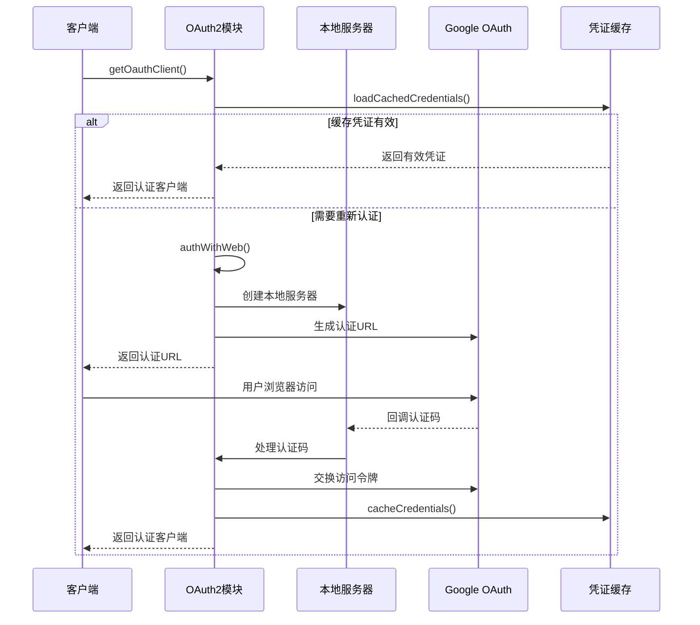
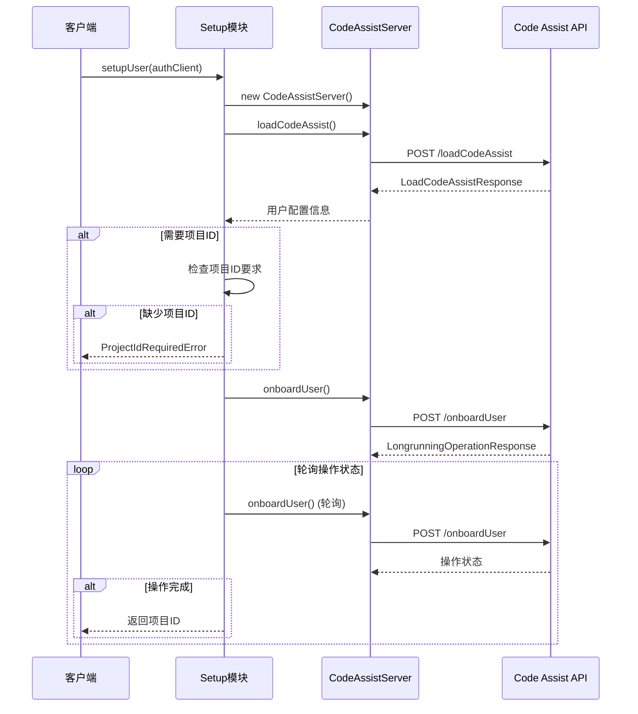
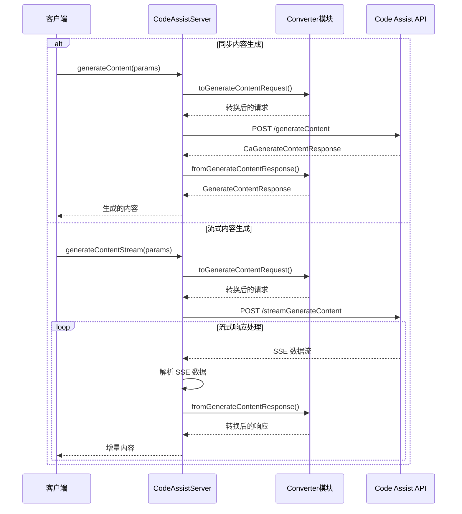

# Code Assist 包深度分析文档

## 概述

`/code_assist` 包是 Gemini CLI 的核心组件，负责与 Google Cloud Code Assist API 进行交互，提供代码生成、用户认证、项目管理等功能。该包采用模块化设计，实现了完整的 OAuth2 认证流程和 API 调用机制。

## 架构设计

### 核心模块

1. **codeAssist.ts** - 工厂模式入口点
2. **server.ts** - API 服务器实现
3. **oauth2.ts** - OAuth2 认证管理
4. **setup.ts** - 用户设置和项目配置
5. **converter.ts** - 请求/响应数据转换
6. **types.ts** - 类型定义和接口

### 设计模式

- **工厂模式**: `createCodeAssistContentGenerator()` 创建内容生成器
- **适配器模式**: `converter.ts` 转换不同 API 格式
- **策略模式**: 不同认证类型和 API 端点处理
- **观察者模式**: 流式响应处理

## 业务逻辑分析

### 1. 认证流程 (Authentication Flow)



**关键特性:**
- 支持凭证缓存和自动刷新
- 本地服务器处理 OAuth 回调
- 安全的 state 参数验证
- 自动打开浏览器进行认证

### 2. 用户设置流程 (User Setup Flow)



**关键特性:**
- 自动检测用户层级 (tier)
- 支持长期运行操作轮询
- 项目ID验证和设置
- 用户注册和初始化

### 3. 内容生成流程 (Content Generation Flow)



**关键特性:**
- 支持同步和流式内容生成
- 自动请求/响应格式转换
- SSE (Server-Sent Events) 流处理
- 令牌计数和嵌入功能

## 核心类和方法分析

### CodeAssistServer 类

**主要职责:**
- 实现 ContentGenerator 接口
- 管理 API 调用和认证
- 处理同步和流式请求

**核心方法:**
```typescript
// 同步内容生成
async generateContent(req: GenerateContentParameters): Promise<GenerateContentResponse>

// 流式内容生成
async generateContentStream(req: GenerateContentParameters): Promise<AsyncGenerator<GenerateContentResponse>>

// 用户注册
async onboardUser(req: OnboardUserRequest): Promise<LongrunningOperationResponse>

// 加载用户配置
async loadCodeAssist(req: LoadCodeAssistRequest): Promise<LoadCodeAssistResponse>

// 令牌计数
async countTokens(req: CountTokensParameters): Promise<CountTokensResponse>
```

### OAuth2 认证模块

**主要功能:**
- OAuth2 客户端管理
- 凭证缓存和刷新
- 本地服务器处理回调
- 安全认证流程

**关键方法:**
```typescript
// 获取 OAuth 客户端
export async function getOauthClient(): Promise<OAuth2Client>

// 清除缓存凭证
export async function clearCachedCredentialFile()

// 获取可用端口
export function getAvailablePort(): Promise<number>
```

### 数据转换器 (Converter)

**转换函数:**
```typescript
// 请求转换
export function toGenerateContentRequest(req: GenerateContentParameters, project?: string): CAGenerateContentRequest
export function toCountTokenRequest(req: CountTokensParameters): CaCountTokenRequest

// 响应转换
export function fromGenerateContentResponse(res: CaGenerateContentResponse): GenerateContentResponse
export function fromCountTokenResponse(res: CaCountTokenResponse): CountTokensResponse
```

## 数据流分析

### 请求处理流程

1. **输入验证**: 验证请求参数和认证状态
2. **格式转换**: 将标准格式转换为 API 特定格式
3. **API 调用**: 发送 HTTP 请求到 Code Assist API
4. **响应处理**: 处理 API 响应和错误
5. **格式转换**: 将 API 响应转换为标准格式
6. **结果返回**: 返回处理后的结果

### 流式处理机制

```typescript
// SSE 数据流解析
for await (const line of rl) {
  if (line === '') {
    if (bufferedLines.length === 0) continue;
    yield JSON.parse(bufferedLines.join('\n')) as T;
    bufferedLines = [];
  } else if (line.startsWith('data: ')) {
    bufferedLines.push(line.slice(6).trim());
  }
}
```

## 错误处理机制

### 错误类型

1. **认证错误**: OAuth 认证失败、凭证过期
2. **网络错误**: API 连接失败、超时
3. **业务错误**: 项目ID缺失、用户层级不匹配
4. **格式错误**: 请求/响应格式转换失败

### 错误处理策略

- **重试机制**: 网络错误自动重试
- **降级处理**: 认证失败时引导重新认证
- **用户友好**: 提供清晰的错误信息和解决建议
- **日志记录**: 详细的错误日志用于调试

## 性能优化

### 缓存策略

- **凭证缓存**: OAuth 凭证本地缓存
- **连接复用**: HTTP 连接池管理
- **响应缓存**: 适当的响应缓存机制

### 并发处理

- **异步操作**: 全异步 API 设计
- **流式处理**: 支持大内容流式传输
- **超时控制**: 请求超时和取消机制

## 安全考虑

### 认证安全

- **OAuth2 标准**: 遵循 OAuth2 安全标准
- **State 验证**: 防止 CSRF 攻击
- **凭证管理**: 安全的凭证存储和传输

### 数据安全

- **HTTPS 传输**: 所有 API 调用使用 HTTPS
- **数据验证**: 输入输出数据严格验证
- **敏感信息保护**: 避免敏感信息泄露

## 扩展性设计

### 模块化架构

- **接口分离**: 清晰的接口定义
- **依赖注入**: 松耦合的组件设计
- **插件化**: 支持不同认证方式和 API 端点

### 配置管理

- **环境变量**: 支持环境变量配置
- **动态配置**: 运行时配置更新
- **多环境支持**: 开发、测试、生产环境

## 测试策略

### 单元测试

- **模块测试**: 各模块独立测试
- **接口测试**: 接口契约验证
- **错误测试**: 异常情况处理测试

### 集成测试

- **API 集成**: 与 Code Assist API 集成测试
- **认证流程**: OAuth 认证流程测试
- **端到端测试**: 完整业务流程测试

## 总结

`/code_assist` 包是一个设计良好的模块化组件，具有以下特点：

1. **完整的认证体系**: 支持 OAuth2 认证和凭证管理
2. **灵活的 API 调用**: 支持同步和流式内容生成
3. **健壮的错误处理**: 完善的错误处理和重试机制   
4. **良好的扩展性**: 模块化设计便于扩展和维护
5. **安全性考虑**: 遵循安全最佳实践

该包为 Gemini CLI 提供了强大的代码辅助功能，是连接用户与 Google Cloud Code Assist API 的重要桥梁。
