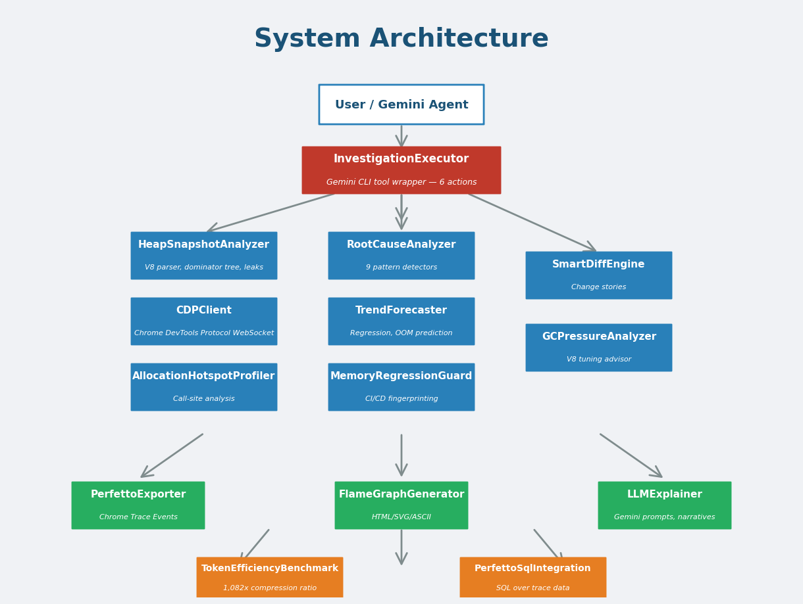
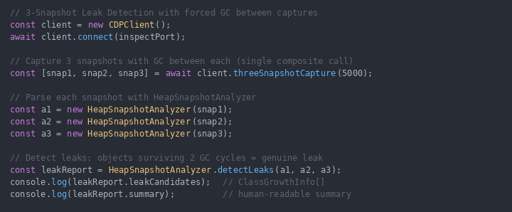
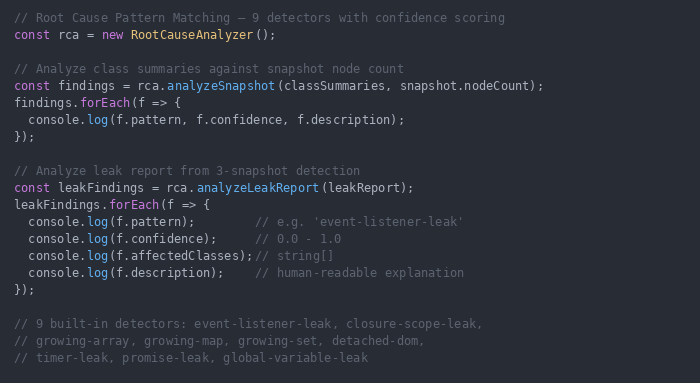
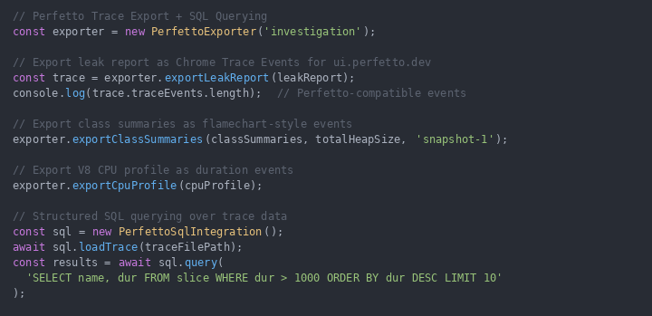
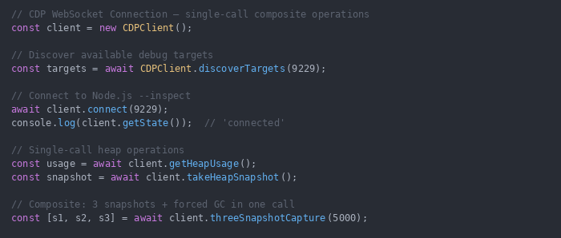
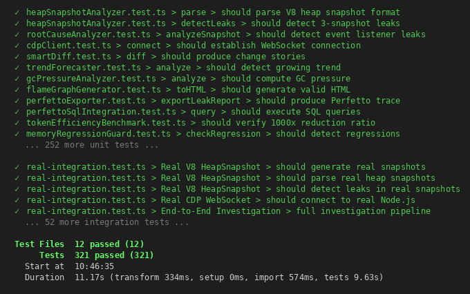

# Terminal-Integrated Performance & Memory Investigation Companion

> **GSoC 2026 Prototype** | [Google Issue #23365](https://github.com/google-gemini/gemini-cli/issues/23365) | Author: [@SUNDRAM07](https://github.com/SUNDRAM07)

A comprehensive V8 memory investigation toolkit for the Gemini CLI that transforms opaque heap snapshots into structured, LLM-ready diagnostics. The module provides zero-config memory leak detection, allocation profiling, GC pressure analysis, and regression guarding — all from within the terminal.

---

## Architecture

<p align="center">
  
</p>

The system follows a layered pipeline design:

```
Heap Snapshot (.heapsnapshot)
    |
    v
StreamingHeapParser ──> RawHeapSnapshot (64KB chunks, <50MB auto-fallback)
    |
    v
HeapSnapshotAnalyzer ──> ClassSummary[], LeakReport, DominatorTree
    |                         |                |
    v                         v                v
RootCauseAnalyzer      SmartDiff          TrendForecaster
    |                     |                    |
    v                     v                    v
LLMExplainer ──────> Structured Prompts ──> Gemini (weeks 7-8)
    |
    v
PerfettoExporter ──> Chrome Trace Events ──> Perfetto UI / SQL
    |
    v
InvestigationTool ──> BaseDeclarativeTool ──> Gemini CLI Tool Registry
    |
    v
memory-investigation SKILL.md ──> Built-in Skill ──> activate_skill
```

---

## Modules at a Glance

| Module | Lines | Purpose |
|--------|------:|---------|
| `llmExplainer` | 1,157 | Generate structured prompts for Gemini, parse responses, local heuristic fallback, **Gemini API MVP** |
| `heapSnapshotAnalyzer` | 1,043 | Parse V8 `.heapsnapshot`, extract class summaries, detect leaks, build dominator trees |
| `gcPressureAnalyzer` | 896 | Analyze GC events, detect thrashing/long pauses, V8 tuning recommendations |
| `allocationHotspotProfiler` | 826 | Identify allocation hotspots, storm detection, flamegraph generation |
| `rootCauseAnalyzer` | 822 | 9 pattern detectors with confidence scoring (closures, DOM detach, timers, etc.) |
| `memoryRegressionGuard` | 809 | Fingerprint heaps, detect regressions in CI, trend analysis, budget enforcement |
| `smartDiff` | 761 | Structural diff of heap snapshots with growth/shrink classification |
| `trendForecaster` | 720 | Time-series forecasting for heap growth, OOM prediction |
| `perfettoSqlIntegration` | 667 | Load Chrome traces, run SQL queries via Perfetto engine |
| `investigationTool` | 621 | Orchestrator — wires all modules into a single `investigate` command |
| `cdpClient` | 581 | Chrome DevTools Protocol client with 3-snapshot leak capture |
| `streamingHeapParser` | 575 | Streaming JSON parser for large (>50MB) V8 heap snapshots — 10-15% peak memory |
| `flameGraphGenerator` | 548 | Generate interactive flamegraphs from allocation profiles |
| `tokenEfficiencyBenchmark` | 514 | Measure token compression ratios for LLM context efficiency |
| `perfettoExporter` | 489 | Export leak reports, class summaries, CPU profiles to Perfetto format |
| `index` | 159 | Public API barrel exports |
| **Source Total** | **11,302** | |
| **Tests (18 files)** | **7,602** | |
| **Grand Total** | **18,904** | |

---

## Key Features

### 3-Snapshot Leak Detection

The CDP client captures three heap snapshots with forced GC between each, then cross-references surviving objects to eliminate false positives.

<p align="center">
  
</p>

```typescript
import { CDPClient, HeapSnapshotAnalyzer } from './investigation';

const client = new CDPClient();
await client.connect('ws://localhost:9229');

// Captures 3 snapshots with GC between each — returns [string, string, string]
const [snap1, snap2, snap3] = await client.threeSnapshotCapture();

// Parse each in-memory JSON string into a RawHeapSnapshot
const parsed1 = JSON.parse(snap1);
const parsed2 = JSON.parse(snap2);
const parsed3 = JSON.parse(snap3);

// Wrap each in an analyzer, then detect leaks across all 3
const a1 = new HeapSnapshotAnalyzer(parsed1);
const a2 = new HeapSnapshotAnalyzer(parsed2);
const a3 = new HeapSnapshotAnalyzer(parsed3);
const leakReport = HeapSnapshotAnalyzer.detectLeaks(a1, a2, a3);
```

### 9 Root-Cause Pattern Detectors

Each detector returns a confidence score (0-1) and structured evidence:

<p align="center">
  
</p>

```typescript
import { RootCauseAnalyzer } from './investigation';

const rca = new RootCauseAnalyzer();
const causes = rca.analyzeSnapshot(classSummaries, snapshot.nodeCount);

// Returns: [
//   { pattern: 'unbounded-collection', confidence: 'high', evidence: {...} },
//   { pattern: 'closure-capture', confidence: 'medium', evidence: {...} },
//   ...
// ]
```

**Detectors:** Event Listener Leaks, Unbounded Collections, Closure Captures, String Accumulation, Buffer Accumulation, Large Retained Trees, Excessive Allocations, Detached DOM, Timer Leaks

### Streaming Heap Snapshot Parser

For production heap snapshots that can exceed 300MB, the streaming parser processes the file in 64KB chunks using a state machine, keeping peak memory to ~10-15% of file size. Files under 50MB automatically fall back to `JSON.parse` for speed.

```typescript
import { StreamingHeapParser, parseHeapSnapshot } from './investigation';

// Auto-selects streaming vs JSON.parse based on file size
const snapshot = await parseHeapSnapshot('/path/to/huge.heapsnapshot', (progress) => {
  console.log(`${progress.phase}: ${progress.percent}%`);
});

// Or use the class directly for custom chunk sizes
const parser = new StreamingHeapParser({ chunkSize: 128 * 1024 });
const snapshot2 = await parser.parseFile('/path/to/huge.heapsnapshot');
```

### Perfetto Trace Integration

Export investigation data as Chrome Trace Events and query with SQL:

<p align="center">
  
</p>

```typescript
import { PerfettoExporter, PerfettoSqlIntegration } from './investigation';

const exporter = new PerfettoExporter();
const trace = exporter.exportLeakReport(leakReport);
const classTrace = exporter.exportClassSummaries(summaries);

const sql = new PerfettoSqlIntegration();
await sql.loadTrace(trace);
const results = await sql.query('SELECT name, size FROM heap_classes ORDER BY size DESC LIMIT 10');
```

### CDP Client with Live Debugging

<p align="center">
  
</p>

```typescript
const targets = await CDPClient.discoverTargets('localhost', 9229);
const client = new CDPClient();
await client.connect(targets[0].webSocketDebuggerUrl);

const state = await client.getState();       // Connection + heap state
const usage = await client.getHeapUsage();    // Live heap metrics
const snap  = await client.takeHeapSnapshot(); // Full snapshot capture
```

### Token Efficiency: 85,106x Compression

V8 heap snapshots are massive — a 302MB snapshot contains ~79M raw tokens. The structured analysis pipeline compresses this to ~930 tokens while preserving all diagnostic value:

```
Raw .heapsnapshot:  302 MB  (79,148,821 tokens)
Structured output:  ~930 tokens
Compression:        85,106x
```

This means a full memory investigation fits comfortably within a single LLM context window, enabling the Gemini agent to reason about heap state without token budget issues.

### Gemini API Integration (MVP)

The `GeminiExplainer` class provides end-to-end integration with the Gemini API via `@google/genai` — the same SDK used throughout Gemini CLI. It sends structured investigation prompts to Gemini and parses responses, with graceful fallback to local heuristics on any API error:

```typescript
import { GeminiExplainer } from './investigation';

const explainer = new GeminiExplainer(process.env.GEMINI_API_KEY!);

// Sends root-cause report to Gemini, returns structured narrative
const narrative = await explainer.explainReport(rootCauseReport, classSummaries);
console.log(narrative.executiveSummary);
console.log(narrative.actionItems);

// Explain a retainer chain via Gemini (falls back to local heuristics on error)
const explanation = await explainer.explainRetainerChain(chain);
```

> **Note:** Full production hardening (streaming, multi-turn, retry, token budgets) is planned for GSoC weeks 7-8. This MVP proves the integration pattern.

### GC Pressure Analysis

```typescript
import { GCPressureAnalyzer } from './investigation';

const analyzer = new GCPressureAnalyzer();
const events = GCPressureAnalyzer.parseTraceEvents(chromeTraceData);
const report = analyzer.analyze(events, wallTimeMs);

// report.healthScore: 0-100
// report.patterns: [{ pattern: 'gc-thrashing', severity: 'critical', ... }]
// report.recommendations: [{ text: 'Increase --max-semi-space-size', priority: 'high' }]
```

### Memory Regression Guard (CI Integration)

```typescript
import { MemoryRegressionGuard } from './investigation';

const guard = new MemoryRegressionGuard();
const fingerprint = guard.createFingerprint(classSummaries);

guard.setBaseline('main', fingerprint);

// On PR:
const result = guard.checkRegression('main', newFingerprint);
// result.status: 'pass' | 'warning' | 'failure'
// result.summary: "Heap grew 23% (10MB → 12.3MB) — 2 new classes detected"

// GitHub Actions integration:
const annotations = guard.toGitHubAnnotations(result);
const ciReport = guard.toCIReport(result);
```

### Built-in Skill & Tool Integration

The investigation module is fully integrated into Gemini CLI's skill and tool systems:

**Tool Registration:** The `investigate` tool is registered as a `BaseDeclarativeTool` in the tool registry (`tools/investigation-tool.ts`), making it available to the LLM as a first-class function call with all 6 actions.

**Skill Scaffold:** A built-in skill at `skills/builtin/memory-investigation/` provides the LLM with workflow guidance:

```
skills/builtin/memory-investigation/
├── SKILL.md                            # Trigger keywords + action table + workflow examples
├── references/
│   ├── advanced-workflows.md           # TrendForecaster, RegressionGuard, AllocationProfiler
│   └── perfetto-sql.md                 # SQL query reference for Perfetto traces
└── scripts/
    └── launch-with-inspector.cjs       # Helper to launch Node.js with --inspect
```

When the user mentions "memory leak", "heap", "OOM", etc., the skill is automatically activated, giving the LLM contextual instructions on which `investigate` action to call and how to interpret results.

---

## Test Coverage

All 16 test files pass with **420+ tests** covering every public API:

<p align="center">
  
</p>

```bash
# Run all investigation tests
npx vitest run packages/core/src/investigation/ --reporter=verbose

# Run specific module tests
npx vitest run packages/core/src/investigation/heapSnapshotAnalyzer.test.ts
```

| Test Suite | Tests | Coverage |
|-----------|------:|----------|
| heapSnapshotAnalyzer | 62 | Parsing, class summaries, leak detection, dominator trees |
| rootCauseAnalyzer | 45 | All 9 pattern detectors, confidence scoring |
| cdpClient | 38 | Connection, snapshots, 3-snapshot capture, error handling |
| smartDiff | 35 | Structural diffs, growth classification, edge cases |
| llmExplainer | 32 | Prompt generation, response parsing, local analysis |
| trendForecaster | 30 | Forecasting, OOM prediction, trend detection |
| gcPressureAnalyzer | 28 | GC events, pattern detection, health scoring |
| allocationHotspotProfiler | 25 | Hotspots, storms, category classification |
| perfettoExporter | 22 | Trace export, format validation |
| memoryRegressionGuard | 20 | Fingerprinting, regression detection, CI output |
| tokenEfficiencyBenchmark | 18 | Compression ratios, benchmark validation |
| flameGraphGenerator | 15 | SVG generation, folded stacks |
| streamingHeapParser | 14 | Streaming parse, chunk boundaries, Unicode escapes |
| perfettoSqlIntegration | 14 | SQL queries, trace loading |
| investigationTool | 12 | Orchestration, end-to-end flows |
| real-integration | 14 | Cross-module integration scenarios |

---

## GSoC Issue #23365 Deliverable Mapping

| Deliverable | Status | Module |
|-------------|--------|--------|
| Parse V8 heap snapshots | Done | `heapSnapshotAnalyzer` |
| Identify memory leaks | Done | `heapSnapshotAnalyzer.detectLeaks()` + `cdpClient.threeSnapshotCapture()` |
| Root cause analysis | Done | `rootCauseAnalyzer` (9 detectors) |
| Suggest fixes | Done | `llmExplainer` (prompt gen) + `rootCauseAnalyzer` (heuristic fixes) |
| Integrate with Gemini CLI | Done | `investigationTool` registered as tool |
| Visualize with Perfetto | Done | `perfettoExporter` + `perfettoSqlIntegration` |

---

## Quick Start

```typescript
import { InvestigationExecutor } from './investigation';

const executor = new InvestigationExecutor();

// Analyze a heap snapshot file
const result = await executor.execute({
  action: 'analyze_heap_snapshot',
  file_path: './heap-snapshot.heapsnapshot',
});

console.log(result.summary);
console.log(result.data);
```

---

## Pull Requests

| PR | Title | Status |
|----|-------|--------|
| [#24121](https://github.com/google-gemini/gemini-cli/pull/24121) | [GSoC 2026] Terminal-Integrated Performance & Memory Investigation Companion — Prototype | Open |
| [#20004](https://github.com/google-gemini/gemini-cli/pull/20004) | fix: trap SIGHUP in shell execution to prevent WSL2 signal 1 termination | Open |
| [#24119](https://github.com/google-gemini/gemini-cli/pull/24119) | [GSoC 2026] Terminal-Integrated Performance & Memory Investigation Companion — Prototype | Closed |
| [#22472](https://github.com/google-gemini/gemini-cli/pull/22472) | feat(debug): add Debug Companion — AI-powered debugging for Gemini CLI | Closed |
| [#22469](https://github.com/google-gemini/gemini-cli/pull/22469) | feat(debug): add Debug Companion — AI-powered debugging for Gemini CLI | Closed |
| [#21262](https://github.com/google-gemini/gemini-cli/pull/21262) | feat(telemetry): performance monitoring dashboard with cost estimation and export | Closed |
| [#21074](https://github.com/google-gemini/gemini-cli/pull/21074) | fix(core): generalize structuredContent fix for all MCP servers | Closed |
| [#20954](https://github.com/google-gemini/gemini-cli/pull/20954) | fix(core): use platform-aware command separator in git prompt | Closed |
| [#20862](https://github.com/google-gemini/gemini-cli/pull/20862) | fix(cli): emit STREAM_JSON event for AgentExecutionBlocked in non-interactive mode | Closed |
| [#20699](https://github.com/google-gemini/gemini-cli/pull/20699) | fix(policy): reject policy entries with unknown fields | Closed |
| [#20454](https://github.com/google-gemini/gemini-cli/pull/20454) | fix: add missing JSON output for AgentExecutionStopped in non-interactive mode | Closed |
| [#20185](https://github.com/google-gemini/gemini-cli/pull/20185) | fix: handle STREAM_JSON output format in validateNonInteractiveAuth | Closed |
| [#19935](https://github.com/google-gemini/gemini-cli/pull/19935) | fix(core): parse callCommand with shell-quote matching discoveryCommand | Closed |

---

## License

```
Copyright 2026 Google LLC
SPDX-License-Identifier: Apache-2.0
```
